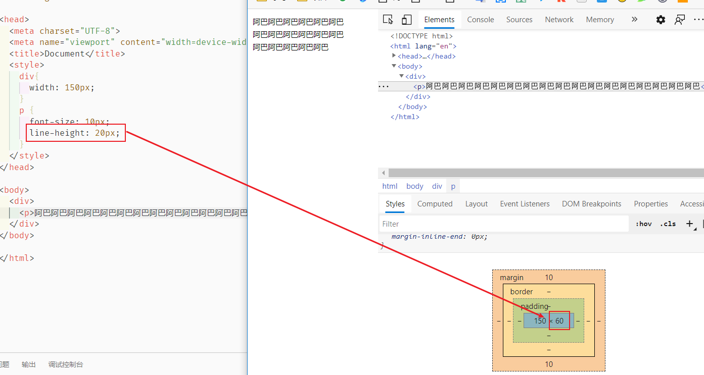
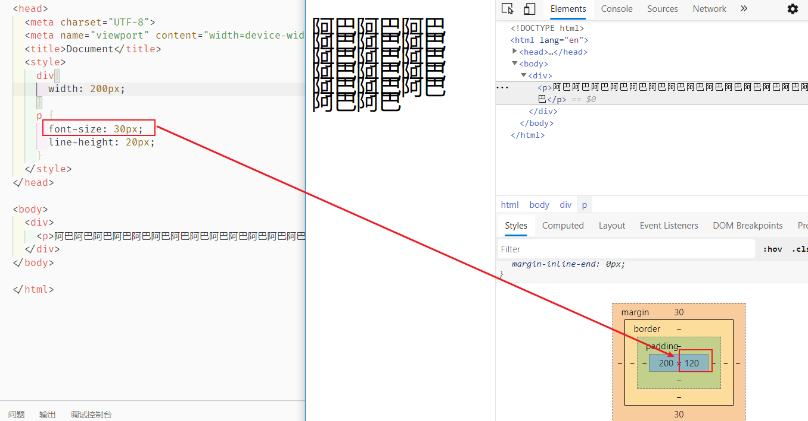
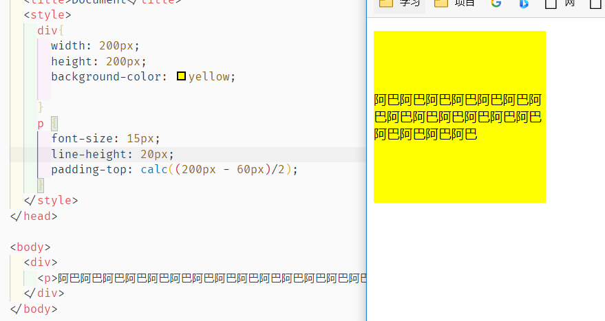

## 字体单位

### 绝对单位

1 `in`=2.54`cm`=25.4`mm`=72`pt`=6`pc`。

各种单位的含义：

- `in`：英寸Inches (1 英寸 = 2.54 厘米)
- `cm`：厘米Centimeters
- `mm`：毫米Millimeters
- `pt`：点Points，或者叫英镑 (1点 = 1/72英寸)
- `pc`：皮卡Picas (1 皮卡 = 12 点)

### 相对单位

- `px`：像素
- `em`：印刷单位相当于12个点 
- `%`：百分比，相对周围的文字的大小

## 行概念

常见的字体属性：

```css
p {
	font-size: 50px; 				/*字体大小*/
	line-height: 30px;      /*行高*/
  font-family: 幼圆,黑体; 	/*字体类型：如果没有幼圆就显示黑体，没有黑体就显示默认*/
  font-style: italic;			/*italic表示斜体，normal表示不倾斜*/
	font-weight: bold;			/*粗体*/
	font-variant: small-caps;  /*小写变大写*/
}
```

### 行高

`line-height` 用于控制行内高度。盒子模型的 `padding` 是作用于行上的。



我们的行高为 20px ，在这里被分为了三行，所有我们总行高就是 60px

当字体大于行高的时候，总行高还是根据我们设定的行高进行计算：



为了严格保证字在行里面居中，我们的工程师有一个约定： **行高、字号，一般都是偶数**。这样可以保证，它们的差一定偶数，就能够被2整除。

### 让文本垂直居中

单行文本的时候，只需要`行高=盒子高` 就可以了

多行文本的时候，可以进行计算`padding` ：（盒子高度 - 总行高）/2




另外还有 flex 等便捷方式，后面再介绍	

### vertical-align

[`vertical-align`](https://developer.mozilla.org/zh-CN/docs/Web/CSS/vertical-align)属性可用于指定**行内元素**（inline）、**行内块元素**（inline-block）、**表格的单元格**（table-cell）的垂直对齐方式。主要是用于图片、表格、文本的对齐。

## 其他属性

### 字体

- font-size  字号

- font-family  字体

- font  连写格式 `font:斜体 加粗 字号/行高 “字体”,”字体”` ，比如 `font:italic bold 12px/30px arial,sans-serif;`

  上述其他属性除了**字号和字体**，其他都可以省略

### 文本

常见属性：

- `letter-spacing: 0.5cm ;` 单个字母之间的间距
- `word-spacing: 1cm;` 单词之间的间距
- `text-decoration: none;` 字体修饰：none 去掉下划线、**underline 下划线**、line-through 中划线、overline 上划线
- `text-transform: lowercase;` 单词字体大小写。uppercase大写、lowercase小写
- `color:red;` 字体颜色
- `text-align: center;` 在当前容器中的对齐方式。属性值可以是：left、right、center（**在当前容器的中间**）、justify
- `text-transform: lowercase;` 单词的字体大小写。属性值可以是：`uppercase`（单词大写）、`lowercase`（单词小写）、`capitalize`（每个单词的首字母大写）

其他参见：


### overflow 超出内容

`overflow`属性的属性值可以是：

- `visible`：默认值。多余的内容不剪切也不添加滚动条，会全部显示出来。
- `hidden`：不显示超过对象尺寸的内容。
- `auto`：如果内容不超出，则不显示滚动条；如果内容超出，则显示滚动条。
- `scroll`：Windows 平台下，无论内容是否超出，总是显示滚动条。Mac 平台下，和 `auto` 属性相同。

