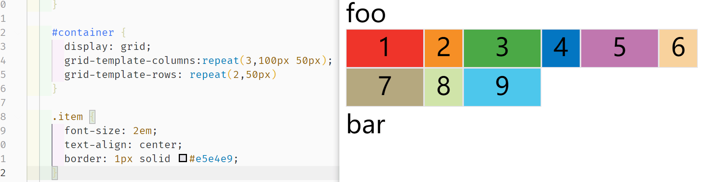
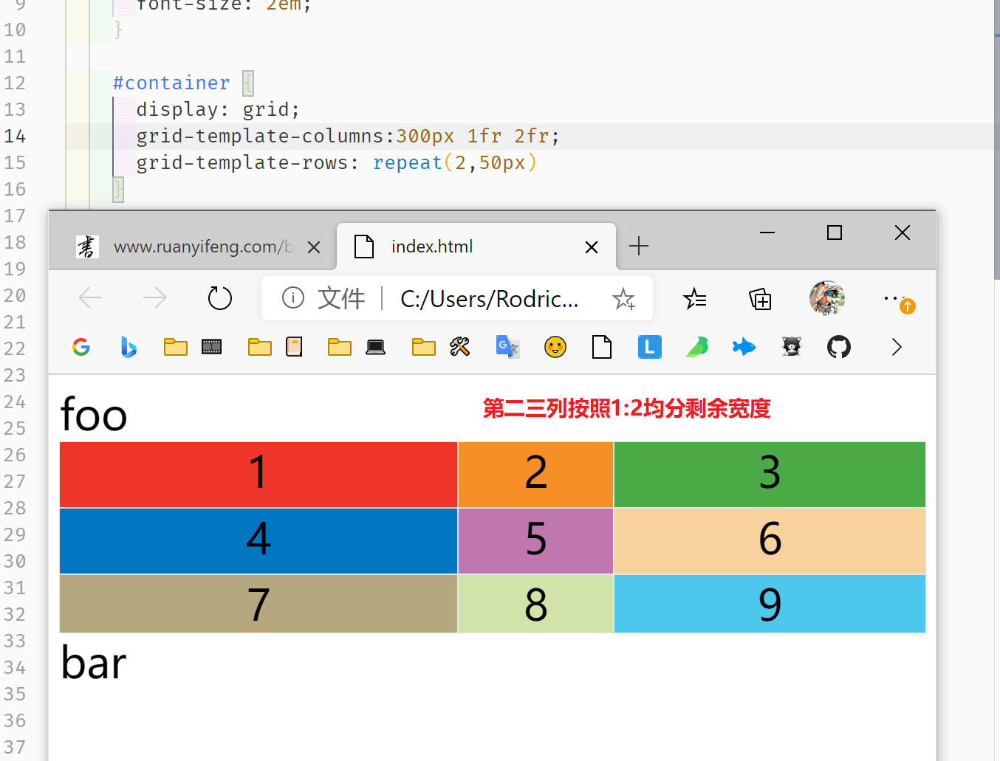
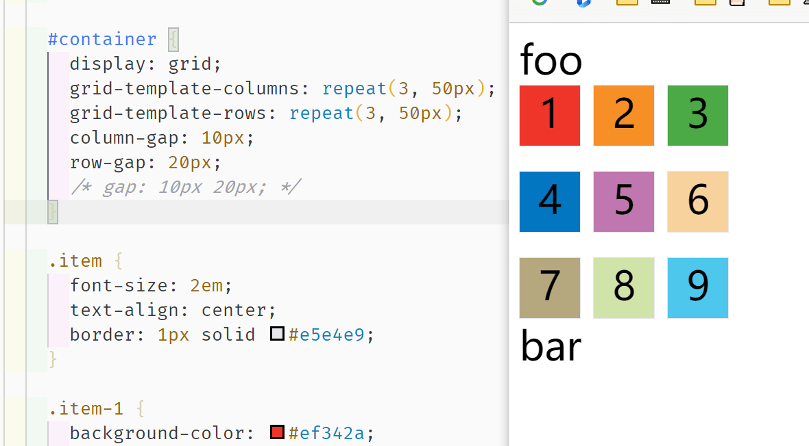

## 前言

网格布局（Grid）将网页划分成一个个网格，可以任意组合不同的网格，做出各种各样的布局。以前，只能通过复杂的 CSS 框架达到的效果，现在浏览器内置了。

但是他的兼容性相比 Flex 布局略显逊色。


Flex 布局是轴线布局，只能指定"项目"针对轴线的位置，可以看作是**一维布局**。Grid 布局则是将容器划分成"行"和"列"，产生单元格，然后指定"项目所在"的单元格，可以看作是**二维布局**。Grid 布局远比 Flex 布局强大。

## 基本概念

### 1. 容器与项目

采用 Grid 布局的区域，称为 **容器**，内部采用网格定位的元素称为 **项目**。

```html
<div>
  <div><p>1</p></div>
  <div><p>2</p></div>
  <div><p>3</p></div>
</div>
```

上面代码中，最外层的 `<div>` 元素就是容器，内层的三个 `<div>` 元素就是项目。

**注意！**项目只能是容器内的顶层元素，不能是项目的子元素，这**很重要！**

### 2. 行列与单元格


每个 Grid 内部都有**行列**的概念，如图所示。

行列交叉出的就是单元格。

### 3. 网格线

正常情况下，`n`行有`n + 1`根水平网格线，`m`列有`m + 1`根垂直网格线，比如三行就有四根水平网格线。

## 容器属性

### 1. display

我们使用 `grid` 来规定一个网格布局的容器

```css
.box {
    display: grid;
}
```

默认情况下，整个容器是 **块级元素**，可以通过 `inline-grid` 设置为行内元素

```css
.box {
    display: inline-grid;
}
```

> **注意！** Grid 容器内所有的项目的 `float`、`display: inline-block`、`display: table-cell`、`vertical-align` 和 `column-*` 等设置都将失效。

### 2. grid-template-columns/grid-template-rows 列宽/行高

```css
#container {
    display: grid;
    grid-template-columns: 50px 50px 50px ;
    grid-template-rows: 50px 50px 50px;
}
```


百分比也可以：

```css
.container {
  display: grid;
  grid-template-columns: 33.33% 33.33% 33.33%;
  grid-template-rows: 33.33% 33.33% 33.33%;
}
```


#### 2.1 repeat

如果很多行列的情况下这样写很麻烦，于是可以使用 `repeat` 

有两种模式：

1. 重复单个值
2. 重复多个值

```css
#container {
    display: grid;
    grid-template-columns:repeat(3,100px 50px);
    grid-template-rows: repeat(2,50px)
}
```



当然这样写也可以：

```css
grid-template-columns:repeat(2,100px) repeat(2,50px);
```

代表：1、2列宽 100px，3、4列是 50px

#### 2.2 auto-fill 关键字 自动填充

有时，单元格的大小是固定的，但是容器的大小不确定。如果希望每一行（或每一列）容纳尽可能多的单元格，这时可以使用 `auto-fill ` 关键字表示自动填充

```css
#container {
    display: grid;
    /* 100px 宽度填充到填不下再换行 */
    grid-template-columns:repeat(auto-fill,100px);
    grid-template-rows: repeat(2,50px)
}
```


#### 2.3 fr 关键字 相对宽高

`fr` 可以表示相对宽高，`2fr` 就代表是 `1fr` 的两倍，可以结合绝对长度一起使用：

```css
#container {
    display: grid;
    grid-template-columns:300px 1fr 2fr;
    grid-template-rows: repeat(2,50px)
}
```



图上第一列宽度固定，2、3 列按照比例 `1:2` 分宽度。

#### 2.4 minmax() 函数 长度范围

`minmax()` 产生一个长度范围，接受两个值作为最小值和最大值。

```css
grid-template-columns:repeat(2,100px) minmax(500px,1fr);
```

#### 2.5 auto 关键字

`auto` 关键字表示由浏览器自己决定长度。

```css
/* 2、3列会被均分 */
grid-template-columns:100px auto auto;
```

#### 2.6 [name] 网格线命名

可以使用 `[name]` 来给网格线命名，方便后续引用：

```css
#container {
    display: grid;
    grid-template-columns:[c1]100px[c2]auto[c3]auto;
    grid-template-rows: [r1]50px[r2]50px[r3]50px
}
```

### 3. column-gap/column-gap/gap 间隔

`row-gap`属性设置行与行的间隔（行间距），`column-gap`属性设置列与列的间隔（列间距）。

`gap` 是二者的缩写，等于 `gap: <row-gap> <column-gap>;`：

```css
#container {
    display: grid;
    grid-template-columns: repeat(3, 50px);
    grid-template-rows: repeat(3, 50px);
    column-gap: 10px;
    row-gap: 20px;
    /* gap: 10px 20px; */
}
```



如果是 `gap: 10px;` 代表行列宽都是 10px。

