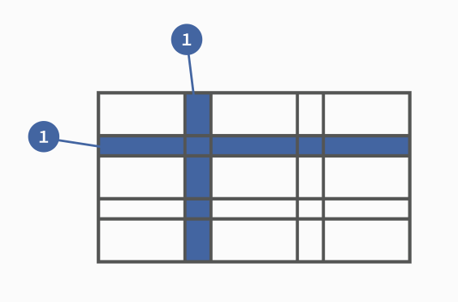

## 前言

网格布局（Grid）将网页划分成一个个网格，可以任意组合不同的网格，做出各种各样的布局。以前，只能通过复杂的 CSS 框架达到的效果，现在浏览器内置了。

但是他的兼容性相比 Flex 布局略显逊色。


Flex 布局是轴线布局，只能指定"项目"针对轴线的位置，可以看作是**一维布局**。Grid 布局则是将容器划分成"行"和"列"，产生单元格，然后指定"项目所在"的单元格，可以看作是**二维布局**。Grid 布局远比 Flex 布局强大。

## 基本概念

### 1. 容器与项目

采用 Grid 布局的区域，称为 **容器**，内部采用网格定位的元素称为 **项目**。

```html
<div>
  <div><p>1</p></div>
  <div><p>2</p></div>
  <div><p>3</p></div>
</div>
```

上面代码中，最外层的 `<div>` 元素就是容器，内层的三个 `<div>` 元素就是项目。

**注意！**项目只能是容器内的顶层元素，不能是项目的子元素，这**很重要！**

### 2. 行列



每个 Grid 内部都有行列的概念如图所示。


