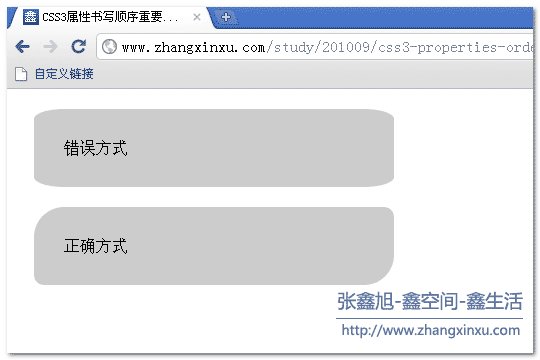

这篇主要积累一些兼容性问题，不断更新


##


 


> 鲁迅说过：「不搞 IExplorer 的兼容，就不会出现兼容问题。」

## caniuse

[caniue](https://caniuse.com/) 可以查询不同浏览器是否可以使用的属性。

## 浏览器私有前缀

CSS3在很多属性尚未成为W3C标准的一部分时，每种内核的浏览器都只能识别带有自身私有前缀的CSS3属性。

```
    -webkit-: 谷歌 苹果
    -moz-:火狐
    -ms-：IE
    -o-：欧朋
```

使用举例：

```css
    background: -webkit-linear-gradient(left, green, yellow);
    background: -moz-linear-gradient(left, green, yellow);
    background: -ms-linear-gradient(left, green, yellow);
    background: -o-linear-gradient(left, green, yellow);
    background: linear-gradient(left, green, yellow);
```

## 磨平浏览器样式

每个浏览器的CSS默认样式不尽相同，所以最简单最有效的方法就是`对其默认样式初始化`。以下贴一个各位同学都会的初始化代码。简单暴力但是不明确，`*`通配符可是有执行性能问题的。

```css
* {
    margin: 0;
    padding: 0;
}
```

以下推荐一种磨平浏览器默认样式的方法，在接入其他`css文件`前将其导入：

- [normalize.css](https://github.com/necolas/normalize.css)：懒人必备的浏览器默认样式库，接近`40k`的Star

## 优雅降级和渐进增强

**渐进增强（Progressive Enhancement）**：一开始就针对低版本浏览器进行构建页面，完成基本的功能，然后再针对高级浏览器进行效果、交互、追加功能达到更好的体验。

**优雅降级（Graceful Degradation）**：一开始就构建站点的完整功能，然后针对浏览器测试和修复。比如一开始使用 CSS3 的特性构建了一个应用，然后逐步针对各大浏览器进行 hack 使其可以在低版本浏览器上正常浏览。

```css
.transition { /*渐进增强写法*/
  -webkit-transition: all .5s;
     -moz-transition: all .5s;
       -o-transition: all .5s;
          transition: all .5s;
}
.transition { /*优雅降级写法*/
          transition: all .5s;
       -o-transition: all .5s;
     -moz-transition: all .5s;
  -webkit-transition: all .5s;
}
```

**推荐使用的是【渐进增强】的写法！**原因是因为在现代浏览器中，存在对加不加前缀的写法都支持的情况，而同一个属性在是否带有前缀的情况下达到的效果是不一样的，选一个摘自 [张旭鑫博客的示例](https://www.zhangxinxu.com/wordpress/2010/09/%E9%9C%80%E8%AD%A6%E6%83%95css3%E5%B1%9E%E6%80%A7%E7%9A%84%E4%B9%A6%E5%86%99%E9%A1%BA%E5%BA%8F/)

```css
.not-a-square {
   // 这两个家伙干的不是同一个活 
   border-radius: 30px 10px;
   -webkit-border-radius: 30px 10px;
}
```

***当属性超过一个参数值的时候，不同的属性产生的作用是不一样的。***

纯情的那种写法(border-radius: 30px 10px)，是让box左上和右下角为30像素圆弧，左下角和右上是10像素圆弧。而那种杂碎的前缀写法(-webkit-border-radius)，则box渲染为每个角都是30像素宽10像素高的圆弧。

如下图所示：
