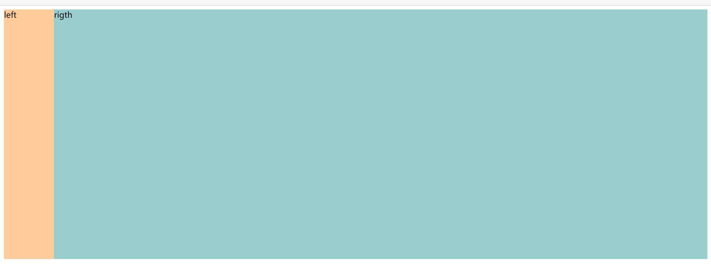
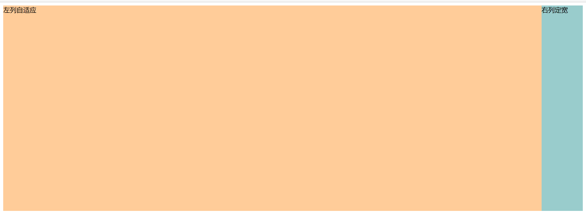
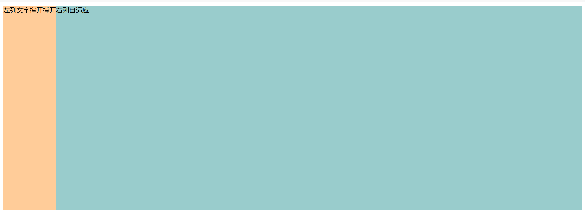
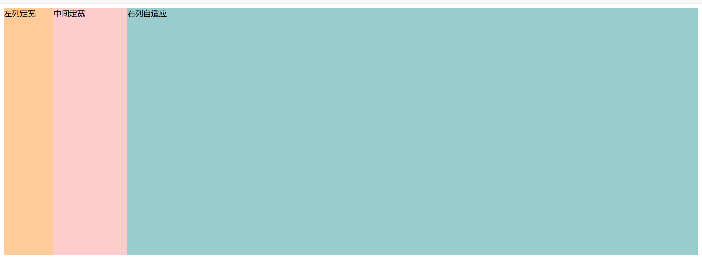

## 前言

本文中一些符号代表的意思：

- 👍 **推荐**写法，兼容性好，写法方便易于理解
- 👌 存在一些问题，兼容性不好 or 适用于特定场合 or 写法冗余
- 👎 会存在一些常用要求无法实现或者难以实现的问题，弊大于利

## 一、两列布局

### 1.1 左列定宽，右列自适应

效果：



#### ① float+margin👍

.right 的 `margin-left` 等于 .left 的宽，为了不被 .left 挡住

```html
<style>
    .left {
        background-color: #ffcc99;
        width: 100px;
        height: 500px;
        float: left;
    }

    .right {
        background-color: #99cccc;
        height: 500px;
        margin-left: 100px;
    }
</style>
<body>
  <div class="left">left</div>
  <div class="right">rigth</div>
</body>
```

#### ② float+margin(fix)👎

相比于上面的方法多了一些代码，理解麻烦，不推荐。

```html
<style>
    .left {
        background-color: #ffcc99;
        width: 100px;
        height: 500px;
        float: left;
    }

    .right-fix {
        float: right;
        width: 100%;
        margin-left: -100px; /*正值大于或等于left的宽度,才能上移一行*/
    }

    .right {
        background-color: #99cccc; /*为了不遮挡left*/
        margin-left: 100px;
        height: 500px;
    }
</style>
<body>
  <div class="left">left</div>
  <div class="right-fix">
    <div class="right">right</div>
  </div>
</body>
```

#### ③ float+overflow👍

利用了 [BFC 特性](https://www.zhangxinxu.com/wordpress/2015/02/css-deep-understand-flow-bfc-column-two-auto-layout/) 

缺点是 right BFC 以后，设置间隔方式

1. 给 right 设置 `margin-left` 的时候记得大于 left 
2. 直接给 left 设置 `margin-right` 

```html
<style>
    .left {
        background-color: #ffcc99;
        width: 100px;
        height: 500px;
        float: left;
    }


    .right {
        background-color: #99cccc;
        height: 500px;
        overflow: hidden;
    }
</style>

<body>
  <div class="left">left</div>
  <div class="right">right</div>
</body>
```

#### ④ 利用 table👎

margin 会无效，不算优选

```html
<style>
    #parent{
        width: 100%;
        display: table;
        height: 500px;
    }
    #left {
        width: 100px;
        background-color: #f00;
    }
    #right {background-color: #0f0;}
    /*利用单元格自动分配宽度*/
    #left,#right{display: table-cell;}
</style>

<body>
  <div id="parent">
    <div id="left">左列定宽</div>
    <div id="right">右列自适应</div>
</div>
</body>
```

#### ⑤ position👍

易于理解，但是脱离文档流

```html
<style>
    #parent {
        position: relative;

    }

    #left {
        position: absolute;
        left: 0;
        top: 0;
        background-color: #ffcc99;
        width: 100px;
        height: 500px;
    }


    #right {
        position: absolute;
        top: 0;
        left: 100px;
        right: 0;
        background-color: #99cccc;
        height: 500px;
    }
</style>

<body>
  <div id="parent">
    <div id="left">左列定宽</div>
    <div id="right">右列自适应</div>
  </div>
</body>
```

#### ⑥ Flex👌

[兼容性](https://caniuse.com/?search=flex)一般

```html
<style>
    #parent {
        display: flex;
        width: 100%;
    }

    #left {
        background-color: #ffcc99;
        width: 100px;
        height: 500px;
    }


    #right {
        flex:1;
        background-color: #99cccc;
        height: 500px;
    }
</style>


<body>
  <div id="parent">
    <div id="left">左列定宽</div>
    <div id="right">右列自适应</div>
  </div>
</body>
```

#### ⑦ Grid👌

[兼容性](https://caniuse.com/?search=grid)一般

```html
<style>
    #parent {
        display: grid;
        grid-template-columns: 100px auto; /* auto 换成 1fr 也行 */
        grid-template-rows: 500px 500px;
    }

    #left {
        background-color: #ffcc99;
    }

    #right {
        background-color: #99cccc;
    }
</style>

<body>
  <div id="parent">
    <div id="left">左列定宽</div>
    <div id="right">右列自适应</div>
  </div>
</body>
```

### 1.2 左列自适应，右列定宽

效果：



#### ① float+margin👌

略微难理解，margin或padding的值要对应好；浮动脱离文档流，需要手动清除浮动，否则会产生高度塌陷。

注意几个要点：

1. 一个左浮动一个右浮动
2. left 加负值 `margin-left` 空出足够空位达到让 right 上浮目的
3. parent 加正的 `padding-left` 或者 `margin-left` 把 left “挤回来” 

```html
<style>
    #parent {
        padding-left: 100px;
    }

    #left {
        float: left;
        background-color: #ffcc99;
        width: 100%;
        height: 500px;
        margin-left: -100px;
    }

    #right {
        float: right;
        width: 100px;
        height: 500px;
        background-color: #99cccc;
    }
</style>

<body>
  <div id="parent">
   	<div id="left">左列自适应</div>
    <div id="right">右列定宽</div>
  </div>
</body>
```

#### ② float+overflow👍

**将 right 书写在 left 前**，两栏的间距用 right 的 `margin-left` 控制

```html
<style>
    #parent {
        margin-left: 100px;
    }

    #left {
        background-color: #ffcc99;
        height: 500px;
        overflow: hidden;
    }

    #right {
        float: right;
        width: 100px;
        height: 500px;
        background-color: #99cccc;
        margin-left: 10px; /*两栏的间距用 right 的 `margin-left` 控制*/
    }
</style>

<body>
  <!-- 左右换位 -->
  <div id="right">右列定宽</div>
  <div id="left">左列自适应</div>
</body>
```

#### ③ table👎

margin 会无效，不算优选

```html
<style>
    #parent{
        width: 100%;
        height: 500px;
        display: table;
    }
    #left {
        background-color: #f00;
        display: table-cell;
    }
    #right {
        width: 100px;
        background-color: #0f0;
        display: table-cell;
    }
</style>

<body>
<div id="parent">
    <div id="left">左列自适应</div>
    <div id="right">右列定宽</div>
</div>
</body>
```

#### ④ position👍

脱离文档流

```html
  <style>
    #parent {
      position: relative;
    }

    #left {
      position: absolute;
      top: 0;
      left: 0;
      right: 100px;
      background-color: #ffcc99;
      height: 500px;
    }

    #right {
      position: absolute;
      top:0;
      right: 0;
      width: 100px;
      height: 500px;
      background-color: #99cccc;
    }
  </style>
</head>

<body>
  <div id="parent">
    <div id="left">左列自适应</div>
    <div id="right">右列定宽</div>
  </div>
</body>
```

#### ⑤ Flex👌

兼容性

```html
<style>
    #parent {
        display: flex;
    }

    #left {
        flex: 1;
        background-color: #ffcc99;
        height: 500px;
    }

    #right {
        width: 100px;
        height: 500px;
        background-color: #99cccc;
    }
</style>


<body>
  <div id="parent">
    <div id="left">左列自适应</div>
    <div id="right">右列定宽</div>
  </div>
</body>
```

#### ⑥ Grid👌

兼容性

```html
<style>
    #parent {
        display: grid;
        grid-template-columns: auto 100px; /*auto <=> 1fr 都可以*/
        grid-template-rows: 500px 500px;
    }

    #left {
        background-color: #ffcc99;
    }

    #right {
        background-color: #99cccc;
    }
</style>

<body>
  <div id="parent">
    <div id="left">左列自适应</div>
    <div id="right">右列定宽</div>
  </div>
</body>
```

### 1.3 一列根据内容撑开，一列自适应



#### ① float+overflow👍

```html
<style>
    #left {
        float: left;
        height: 500px;
        background-color: #ffcc99;
    }

    #right {
        height: 500px;
        overflow: hidden;
        background-color: #99cccc;
    }
</style>

<body>
  <div id="left">左列文字撑开撑开</div>
  <div id="right">右列自适应</div>
</body>
```

#### ② Flex👌

```html
<style>
    #parent {
        display: flex;
    }

    #left {
        height: 500px;
        background-color: #ffcc99;
    }

    #right {
        flex: 1;
        height: 500px;
        background-color: #99cccc;
    }
</style>

<body>
  <div id="parent">
    <div id="left">左列文字撑开撑开</div>
    <div id="right">右列自适应</div>
  </div>
</body>
```

#### ③ Grid👌

```html
<style>
    #parent {
        display: grid;
        grid-template-columns: auto 1fr; /*写成 1fr auto 就是右撑开左自适应*/
        grid-template-rows: 500px 500px;
    }

    #left {
        background-color: #ffcc99;
    }

    #right {
        background-color: #99cccc;
    }
</style>

<body>
  <div id="parent">
    <div id="left">左列文字撑开撑开</div>
    <div id="right">右列自适应</div>
  </div>
</body>
```

### 总结

这种布局常用推荐使用**浮动**去做，配合 `overflow:hidden;` 触发 BFC，非常好用，兼容性也 ok，但是设置栏间隔的时候要注意值的大小和分情况设在 left 还是 right。

**父相子绝**来脱离文档流做也可以，兼容性也不错，代码也没多少。

**移动端**推荐直接上 Flex ，能用就用。

table 不推荐，虽然兼容性好但是其他不感知 `margin` 之类的比较讨厌。

## 二、三列布局

### 2.1 两列定宽,一列自适应



#### ① float+margin👍

```html
<style>
    #left {
        float: left;
        width: 100px;
        height: 500px;
        background-color: #ffcc99;
    }

    #center {
        float: left;
        width: 150px;
        height: 500px;
        background-color: #FFCCCC;
    }

    #right {
        height: 500px;
        margin-left: 250px;
        background-color: #99cccc;
    }
</style>
<body>
  <div id="left">左列定宽</div>
  <div id="center">中间定宽</div>
  <div id="right">右列自适应</div>
</body>
```

#### ② float+overflow👍

```html
<style>
    #left {
        float: left;
        width: 100px;
        height: 500px;
        background-color: #ffcc99;
    }

    #center {
        float: left;
        width: 150px;
        height: 500px;
        background-color: #FFCCCC;
    }

    #right {
        height: 500px;
        overflow: hidden;
        background-color: #99cccc;
    }
</style>

<body>
  <div id="left">左列定宽</div>
  <div id="center">中间定宽</div>
  <div id="right">右列自适应</div>
</body>
```

#### ③ position👌

需要根据 left center 的 `width` 准确计算 `left` 属性

```html
<style>
    #parent {
        position: relative;
    }

    #left {
        position: absolute;
        top: 0;
        left: 0;
        background-color: #ffcc99;
        width: 100px;
        height: 500px;
    }

    #center {
        position: absolute;
        top: 0;
        left: 100px;
        width: 150px;
        height: 500px;
        background-color: #FFCCCC;
    }

    #right {
        position: absolute;
        top: 0;
        left: 250px;
        right: 0;
        background-color: #99cccc;
        height: 500px;
    }
</style>

<body>
  <div id="parent">
    <div id="left">左列定宽</div>
    <div id="center">中间定宽</div>
    <div id="right">右列自适应</div>
  </div>
</body>
```

#### ④ table👎

```html
<style>
     #parent {
        width: 100%; 
        height: 520px; /*抵消上下间距10*2的高度影响*/
        margin: -10px 0;  /*抵消上下边间距10的位置影响*/
        display: table;
        /*左右两边间距无法消除,子元素改用padding设置盒子间距就没有这个问题*/
        border-spacing: 10px;  /*关键!!!设置间距*/
    }
    #left {
        display: table-cell;
        width: 100px;
        background-color: #f00;
    }
    #center {
        display: table-cell;
        width: 200px;
        background-color: #eeff2b;
    }
    #right {
        display: table-cell;
        background-color: #0f0;
    }
</style>

<body>
<div id="parent">
    <div id="left">左列定宽</div>
    <div id="center">中间定宽</div>
    <div id="right">右列自适应</div>
</div>
</body>
```

#### ⑤ Flex👌

```html
<style>
    #parent {
        display: flex;
    }

    #left {
        background-color: #ffcc99;
        width: 100px;
        height: 500px;
    }

    #center {
        width: 150px;
        height: 500px;
        background-color: #FFCCCC;
    }

    #right {
        flex:1;
        background-color: #99cccc;
        height: 500px;
    }
</style>

<body>
  <div id="parent">
    <div id="left">左列定宽</div>
    <div id="center">中间定宽</div>
    <div id="right">右列自适应</div>
  </div>
</body>
```

#### ⑥ Grid👌

不得不感慨一句，Grid 写这种的真的很简单，可惜兼容性……

```html
<style>
    #parent {
        display: grid;
        grid-template-columns: 100px 150px auto; /* auto <==> 1fr */
        grid-template-rows: repeat(3,500px);
    }

    #left {
        background-color: #ffcc99;
    }

    #center {
        background-color: #FFCCCC;
    }

    #right {
        background-color: #99cccc;
    }
</style>

<body>
  <div id="parent">
    <div id="left">左列定宽</div>
    <div id="center">中间定宽</div>
    <div id="right">右列自适应</div>
  </div>
</body>
```

### 2.2 两侧定宽,中间自适应


#### ① 双飞翼布局👍[高频考点⭐]

基本原理是 `#center`  是中外框和 parent 一样宽，然后中内框 `#inner_center` 用 `margin` 留空给 `#left` `#right`

html:

```html
<body>
  <div id="header">header</div>
  <div id="parent">
    <div id="center">
      <div id="inner_center">中间自适应</div>
    </div>
    <div id="left">左列定宽</div>
    <div id="right">右列定宽</div>
  </div>
  <div id="footer">footer</div>
</body>
```

css:

```css
#header {
    height: 60px;
    background-color: #CCCCFF;
}

#left {
    float: left;
    width: 100px;
    height: 500px;
    /* margin-left 给整个 #parent 的宽度，这样可以跑到最左边 */
    margin-left: -100%;
    background-color: #ffcc99;
}

#center {
    height: 500px;
    float: left;
    width: 100%;
}

#inner_center {
    height: 500px;
    /* 这里左右空出位置留给 left right 数字大于实际宽度就可以产生间距！*/
    margin: 0 200px 0 100px;
    background-color: #FFCCCC;
}

#right {
    float: left;
    width: 200px;
    height: 500px;
    /* margin-left 给整个 #right 自身的宽度，这样可以跑到最右边边 */
    margin-left: -200px;
    background-color: #99cccc;
}

#footer {
    clear: both;
    height: 60px;
    background-color: #CCCCFF;
}
```

这里需要着重理解一下 left 和 right 的 `margin-left` 的作用，顺便也可以更好地理解 float 布局里 `margin` 的影响，看一下注释掉这两个 `margin-left` 的样子 就明白了：


目的就是为了把 left 和 right 挪到 #inner_center 给他们预留的位置而已。

#### ② 圣杯布局👎

基本原理是 `#parent` 直接左右留空，`#center` 直接占满宽度，`#left` 和 `#right` 用相对定位把自己“挤”到目标位置。

html:

```html
<body>
  <div id="header">header</div>
  <div id="parent">
    <div id="center">中间自适应</div>
    <div id="left">左列定宽</div>
    <div id="right">右列定宽</div>
  </div>
  <div id="footer">footer</div>
</body>
```

css:

```css
#header {
    height: 60px;
    background-color: #CCCCFF;
}

#parent {
    height: 500px;
    /*为了使#center摆正,左右padding分别等于左右盒子的宽,可以结合左右盒子相对定位的left调整间距！*/
    padding: 0 200px 0 100px;
}

#left {
    float: left;
    /* 相对定位和left将他向左移动 */
    position: relative;
    left: -100px;
    width: 100px;
    height: 500px;
    /* margin-left 给整个 #parent 的宽度，这样可以跑到最左边 */
    margin-left: -100%;
    background-color: #ffcc99;
}

#center {
    float: left;
    height: 500px;
    width: 100%;
    background-color: #FFCCCC;
}

#right {
    float: left;
    /* 相对定位和left将他向右移动 */
    position: relative;
    left:200px;
    width: 200px;
    height: 500px;
    /* margin-left 给整个 #right 自身的宽度，这样可以跑到最右边边 */
    margin-left: -200px;
    background-color: #99cccc;
}

#footer {
    clear: both;
    height: 60px;
    background-color: #CCCCFF;
}
```

这里放一个注释了 #left 和 #right 的 `left` 属性的图：


##### 圣杯布局的问题

当 center 小于 left 的时候，圣杯布局将会出现问题：


#### ③ Grid👌

html

```html
<body>
<div id="parent">
    <div id="header"></div>
    <div id="center">中间自适应</div>
    <div id="left">左列定宽</div>
    <div id="right">右列定宽</div>
    <div id="footer"></div>
</div>
</body>
```

css

```css
#parent {
    display: grid;
    grid-template-columns: 100px auto 200px; /*设定3列*/
    grid-template-rows: 60px 500px 60px; /*设定3行*/
    /*设置网格区域分布*/
    grid-template-areas: 
        "header header header" 
        "leftside main rightside" 
        "footer footer footer";
}
#header {
    grid-area: header; /*指定在哪个网格区域*/
    background-color: #CCCCFF;
}
#left {
    grid-area: leftside;
    background-color: #ffcc99;
}
#center {
    grid-area: main; /*指定在哪个网格区域*/
    margin: 0 15px; /*设置间隔*/
    background-color: #FFCCCC;
}
#right {
    grid-area: rightside; /*指定在哪个网格区域*/
    background-color: #99cccc;
}
#footer {
    grid-area: footer; /*指定在哪个网格区域*/
    background-color: #CCCCFF;
}
```

#### ④ Flex👌

html

```html
<body>
  <div id="all">
    <div id="header">header</div>
    <div id="parent">
      <div id="left">左列定宽</div>
      <div id="center">中间自适应</div>
      <div id="right">右列定宽</div>
    </div>
    <div id="footer">footer</div>
  </div>
</body>
```

css

```css
#all {
    display: flex;
    flex-direction: column;
}

#header {
    height: 60px;
    background-color: #CCCCFF;
}

#footer {
    height: 60px;
    background-color: #CCCCFF;
}

#parent {
    height: 500px;
    display: flex;
}

#left {
    width: 100px;
    background-color: #ffcc99;
}

#center {
    flex: 1;
    /*均分#parent剩余的部分*/
    background-color: #FFCCCC;
}

#right {
    width: 200px;
    background-color: #99cccc;
}
```

