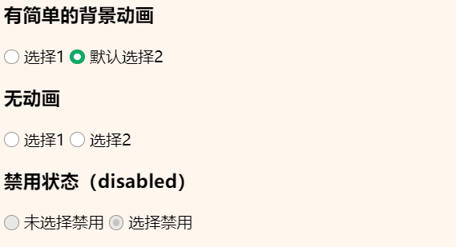

### Link

本文 [CodePen 预览](https://codepen.io/rodrick278/pen/wvzYwjr)

参考文章：

[用CSS3美化单选框 radio 、多选框 checkbox 和 switch开关按钮](https://www.css88.com/archives/9274)

### radio

- 效果

  

- HTML

```html
<h2>单选按钮</h2>
<h3>有简单的背景动画</h3>
<label class="bui-radios-label bui-radios-anim">
  <input type="radio" name="selector1" /><i class="bui-radios"></i> 选择1
</label>
<label class="bui-radios-label bui-radios-anim">
  <input type="radio" checked name="selector1" /><i class="bui-radios"></i> 默认选择2
</label>

<h3>无动画</h3>
<label class="bui-radios-label">
  <input type="radio" name="selector2" /><i class="bui-radios"></i> 选择1
</label>
<label class="bui-radios-label">
  <input type="radio" name="selector2" /><i class="bui-radios"></i> 选择2
</label>

<h3>禁用状态（disabled）</h3>
<label class="bui-radios-label">
  <input type="radio" disabled name="selector3" /><i class="bui-radios"></i> 未选择禁用
</label>
<label class="bui-radios-label">
  <input type="radio" checked disabled name="selector3" /><i class="bui-radios"></i> 选择禁用
</label>
```

- CSS

```css
/* radio */
label.bui-radios-label input {
  visibility: hidden;
  position: absolute;
  opacity: 0;
}

label.bui-radios-label .bui-radios {
  display: inline-block;
  position: relative;
  border: 1px solid #979797;
  border-radius: 50%;
  width: 13px;
  height: 13px;
  background: #fff;
  vertical-align: -2px;
}

label.bui-radios-label input:checked + .bui-radios:after {
  position: absolute;
  left: 3px;
  top: 3px;
  border-radius: 50%;
  width: 7px;
  height: 7px;
  background-color: #fff;
  content: "";
}

label.bui-radios-label input:checked + .bui-radios {
  border: 1px solid #00b066;
  background: #00b066;
}

label.bui-radios-label input:disabled + .bui-radios {
  border: solid 1px #979797;
  background-color: #e8e8e8;
}

label.bui-radios-label input:disabled:checked + .bui-radios:after {
  background-color: #c1c1c1;
}

label.bui-radios-label.bui-radios-anim .bui-radios {
  transition: background-color ease-out .3s;

  -webkit-transition: background-color ease-out .3s;
}
```

### checkbox

- 效果

  

- HTML

```html
<h2>复选按钮</h2>
<h3>有简单的背景动画</h3>
<label class="bui-checkbox-label  bui-checkbox-anim">
  <input type="checkbox" checked="" name="sex" /><i class="bui-checkbox"></i> 男
</label>
<label class="bui-checkbox-label  bui-checkbox-anim">
  <input type="checkbox" name="sex" /><i class="bui-checkbox"></i> 女
</label>
<h3>无动画</h3>
<label class="bui-checkbox-label">
  <input type="checkbox" checked="" name="sex" /><i class="bui-checkbox"></i> 男
</label>
<label class="bui-checkbox-label">
  <input type="checkbox" name="sex" /><i class="bui-checkbox"></i> 女
</label>
<h3>禁用状态（disabled）</h3>
<label class="bui-checkbox-label">
  <input type="checkbox" disabled="" name="sex" /><i class="bui-checkbox"></i> 不男不女
</label>
<label class="bui-checkbox-label">
  <input type="checkbox" checked="" disabled="" name="ddd" /><i class="bui-checkbox"></i> 不男不女
</label>
```

- CSS

```CSS
/* checkbox */
label.bui-checkbox-label input {
  visibility: hidden;
  position: absolute;
  opacity: 0;
}
label.bui-checkbox-label .bui-checkbox {
  display: inline-block;
  position: relative;
  border: 1px solid #979797;
  border-radius: 2px;
  width: 13px;
  height: 13px;
  background: #fff;
  vertical-align: -2px;
}
label.bui-checkbox-label input:checked + .bui-checkbox:after {
  position: absolute;
  left: 0;
  top: 1px;
  width: 13px;
  height: 13px;
  line-height: 13px;
  font-size: 13px;
  color: #fff;
  content: "\2714";
}
label.bui-checkbox-label input:checked + .bui-checkbox {
  border: 1px solid #00b066;
  background: #00b066;
}
label.bui-checkbox-label input:disabled + .bui-checkbox {
  border: solid 1px #979797;
  background-color: #e8e8e8;
}
label.bui-checkbox-label input:disabled:checked + .bui-checkbox:after {
  color: #c1c1c1;
}
label.bui-checkbox-label.bui-checkbox-anim .bui-checkbox {
  transition: background-color ease-out .3s;

  -webkit-transition: background-color ease-out .3s;
}
```

### switch

- 效果

  

- HTML

```HTML
<h2>开关按钮</h2>
<h3>一般简单的背景动画</h3>
<label class="bui-switch-label bui-switch-anim">
  <input type="checkbox" name="s" /><i class="bui-switch"></i>
</label>
<label class="bui-switch-label bui-switch-anim">
  <input type="checkbox" checked="" name="s" /><i class="bui-switch"></i>
</label>
<h3>简单的背景动画</h3>
<label class="bui-switch-label bui-switch-animbg">
  <input type="checkbox" name="s" /><i class="bui-switch"></i>
</label>
<label class="bui-switch-label bui-switch-animbg">
  <input type="checkbox" checked="" name="s" /><i class="bui-switch"></i>
</label>
<h3>无动画</h3>
<label class="bui-switch-label ">
  <input type="checkbox" name="s" /><i class="bui-switch"></i>
</label>
<label class="bui-switch-label ">
  <input type="checkbox" checked="" name="s" /><i class="bui-switch"></i>
</label>
<h3>禁用状态（disabled）</h3>
<label class="bui-switch-label">
  <input type="checkbox" disabled="" name="s" /><i class="bui-switch"></i>
</label>
<label class="bui-switch-label">
  <input type="checkbox" checked="" disabled="" name="s" /><i class="bui-switch"></i>
</label>
```

- CSS

```CSS
/* switch */
/* 隐藏 checkbox */
label.bui-switch-label input {
  visibility: hidden;
  position: absolute;
  opacity: 0;
}
/* 选中：底板 */
label.bui-switch-label input:checked {
  border-color: #64bd63;
  background-color: #64bd63;
  box-shadow: #64bd63 0 0 0 16px inset;
}
/* 选中：圆圈 */
label.bui-switch-label input:checked:before {
  left: 37px;
}
/* 禁用：圆圈 */
label.bui-switch-label input:disabled + .bui-switch:before {
  background-color: #c1c1c1;
}
/* 禁用+已选：圆圈 */
label.bui-switch-label input:disabled:checked + .bui-switch:before {
  background-color: #c1c1c1;
}
/* 禁用+未选：底板 */
label.bui-switch-label input:disabled + .bui-switch {
  border: solid 1px #dfdfdf;
  background-color: #e8e8e8;
}
/* 禁用+已选：底板 */
label.bui-switch-label input:disabled:checked + .bui-switch {
  border: solid 1px #dfdfdf;
  background-color: #e8e8e8;
  box-shadow: #e8e8e8 0 0 0 16px inset;
}

/* 这个是底板 */
label.bui-switch-label .bui-switch {
  display: inline-block;
  position: relative;
  border: 1px solid #dfdfdf;
  border-radius: 20px;
  width: 50px;
  height: 25px;
  outline: none;
  background-color: #fdfdfd;
  background-clip: content-box;
  box-shadow: #dfdfdf 0 0 0 0 inset;
  user-select: none;

  -webkit-appearance: none;
  -webkit-user-select: none;
  -moz-user-select: none;
  -ms-user-select: none;
}
/* before 是内部圆圈 */
label.bui-switch-label .bui-switch:before {
  position: absolute;
  left: 1px;
  top: 1px;
  border-radius: 20px;
  width: 23px;
  height: 23px;
  background-color: #fff;
  box-shadow: 0 1px 3px rgba(0, 0, 0, .4);
  content: "";
}
/* 选中：底板样式 */
label.bui-switch-label input:checked + .bui-switch {
  border-color: #64bd63;
  background-color: #64bd63;
  box-shadow: #64bd63 0 0 0 16px inset;
}
/* 选中：圆圈位置 */
label.bui-switch-label input:checked + .bui-switch:before {
  left: 27px;
}
/* 下面都是动画 */
/* 选<->不选：圆圈动画 控制left */
label.bui-switch-label.bui-switch-anim .bui-switch:before {
  transition: left .3s;

  -webkit-transition: left .3s;
}
/* 选<->不选：背景变化 只控制选中变绿 */
label.bui-switch-label.bui-switch-anim input:checked + .bui-switch {
  transition: border ease 4s, box-shadow ease 4s, background-color ease 12s;

  -webkit-transition: border ease .4s, box-shadow ease .4s, background-color ease 1.2s;
}

/* 纯变化背景 */
/* 圆圈变化 */
label.bui-switch-label.bui-switch-animbg .bui-switch:before {
  transition: left .3s;

  -webkit-transition: left .3s;
}
/* 选<->不选：背景变化 只控制选中变绿 */
label.bui-switch-label.bui-switch-animbg input:checked + .bui-switch {
  background-color: #64bd63;
  box-shadow: #dfdfdf 0 0 0 0 inset;
  transition: border-color .4s, background-color ease .4s;

  -webkit-transition: border-color .4s, background-color ease .4s;
}
```

