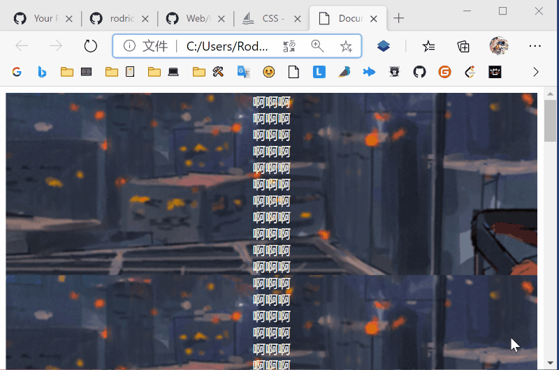

[CodePen 预览](https://codepen.io/rodrick278/pen/KKgGLqX) 

## 效果


## 实现

- HTML

  ```HTML
  <body>
    <div class="word">CONTENT 1</div>
    <div class="img1"></div>
    <div class="word">CONTENT 2</div>
    <div class="img2"></div>
    <div class="word">CONTENT 3</div>
    <div class="img3"></div>
    <div class="word">END</div>
  </body>
  ```

- CSS

  ```CSS
  * {
    margin: 0;
    padding: 0;
  }
  :root {
    --bg1: url("https://gitee.com/rodrick278/img/raw/master/img/123945-1496983185ad61.jpg");
    --bg2: url("https://gitee.com/rodrick278/img/raw/master/img/192524-153260432471a0.jpg");
    --bg3: url("https://gitee.com/rodrick278/img/raw/master/img/183201-1542018721c534.jpg");
  }
  div {
    height: 100vh;
    background-color: #666;
    line-height: 100vh;
    text-align: center;
    font-size:50px;
    color: #fff;
  }
  .img1 {
    background-image: var(--bg1);
    background-position: center center;
    background-size: cover;
    background-attachment: fixed;
  }
  .img2 {
    background-image: var(--bg2);
    background-position: center center;
    background-size: cover;
    background-attachment: fixed;
  }
  .img3 {
    background-image: var(--bg3);
    background-position: center center;
    background-size: cover;
    background-attachment: fixed;
  }
  ```

## 原理

这里主要运用了 `background-attachment: fixed;` 

在 **01-CSS基础/03-CSS背景属性**中我们说过：

`background-attachment` 设置背景图片是否跟着滚动条一起移动。 属性值可以是：

- `fixed` 不随文档和内容滚动。
- `scroll`（默认属性）随文档整体移动， 而不是随着它的内容滚动。
- `local` 既跟随文档滚动，又跟随内容滚动。

整体效果：



 

