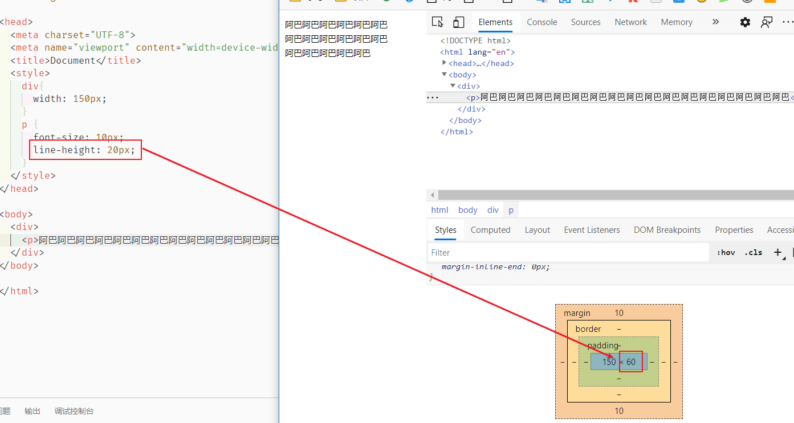
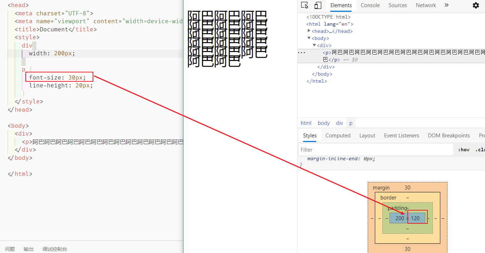
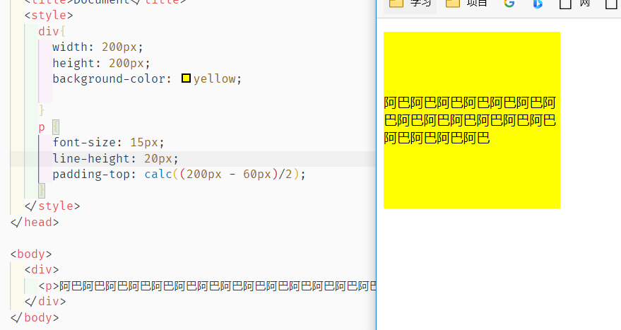
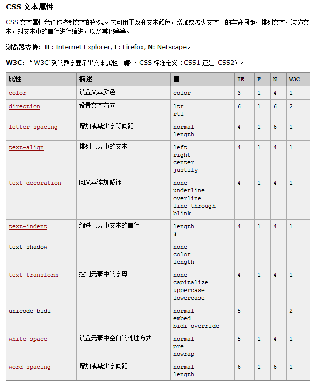
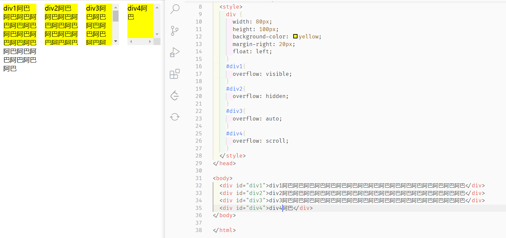
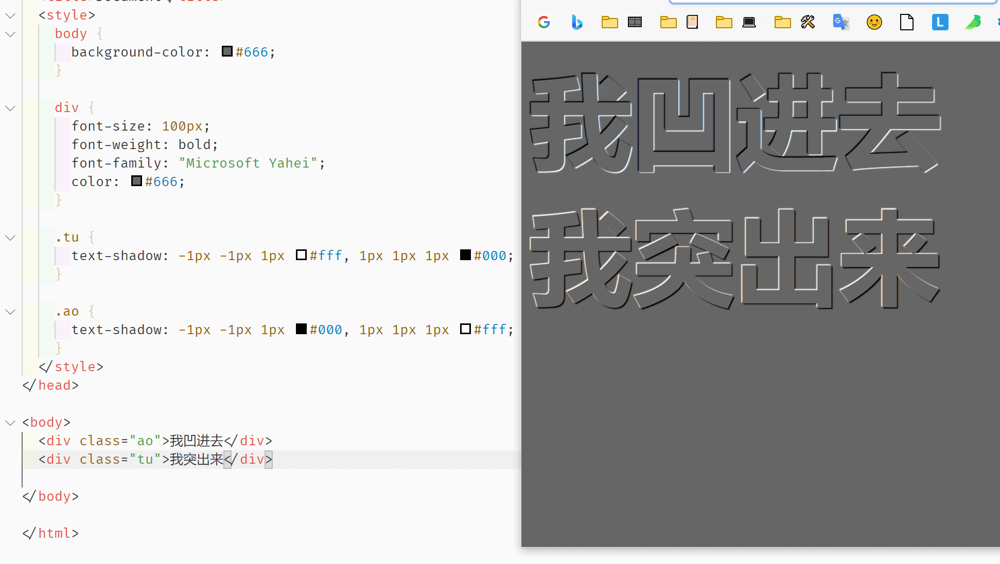
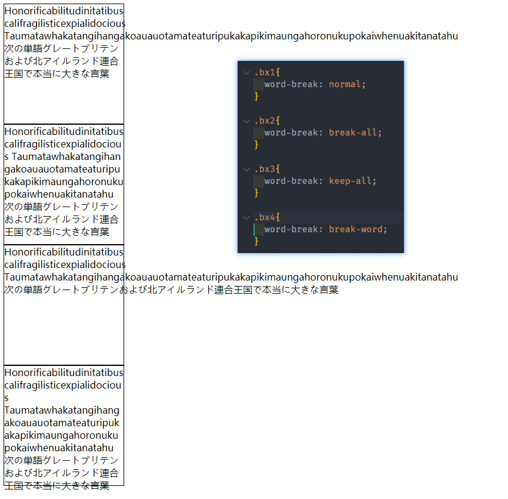

# 02-CSS字体与文本

## 字体单位

### 绝对单位

1 `in`=2.54`cm`=25.4`mm`=72`pt`=6`pc`。

各种单位的含义：

- `in`：英寸Inches (1 英寸 = 2.54 厘米)
- `cm`：厘米Centimeters
- `mm`：毫米Millimeters
- `pt`：点Points，或者叫英镑 (1点 = 1/72英寸)
- `pc`：皮卡Picas (1 皮卡 = 12 点)

### 相对单位

- `px`：像素
- `em`：印刷单位相当于12个点 
- `%`：百分比，相对周围的文字的大小

## 行概念

常见的字体属性：

```css
p {
	font-size: 50px; 				/*字体大小*/
	line-height: 30px;      /*行高*/
  font-family: 幼圆,黑体; 	/*字体类型：如果没有幼圆就显示黑体，没有黑体就显示默认*/
  font-style: italic;			/*italic表示斜体，normal表示不倾斜*/
	font-weight: bold;			/*粗体*/
	font-variant: small-caps;  /*小写变大写*/
}
```

### 行高

`line-height` 用于控制行内高度。盒子模型的 `padding` 是作用于行上的。



我们的行高为 20px ，在这里被分为了三行，所有我们总行高就是 60px

当字体大于行高的时候，总行高还是根据我们设定的行高进行计算：



为了严格保证字在行里面居中，我们的工程师有一个约定： **行高、字号，一般都是偶数**。这样可以保证，它们的差一定偶数，就能够被2整除。

### 让文本垂直居中

单行文本的时候，只需要`行高=盒子高` 就可以了

多行文本的时候，可以进行计算`padding` ：（盒子高度 - 总行高）/2




另外还有 flex 等便捷方式，后面再介绍	

### vertical-align

[`vertical-align`](https://developer.mozilla.org/zh-CN/docs/Web/CSS/vertical-align)属性可用于指定**行内元素**（inline）、**行内块元素**（inline-block）、**表格的单元格**（table-cell）的垂直对齐方式。主要是用于图片、表格、文本的对齐。

## 其他属性

### 字体

- font-size  字号

- font-family  字体

- font  连写格式 `font:斜体 加粗 字号/行高 “字体”,”字体”` ，比如 `font:italic bold 12px/30px arial,sans-serif;`

  上述其他属性除了**字号和字体**，其他都可以省略

### 文本

常见属性：

- `letter-spacing: 0.5cm ;` 单个字母之间的间距
- `word-spacing: 1cm;` 单词之间的间距
- `text-decoration: none;` 字体修饰：none 去掉下划线、**underline 下划线**、line-through 中划线、overline 上划线
- `color:red;` 字体颜色
- `text-align: center;` 在当前容器中的对齐方式。属性值可以是：left、right、center（**在当前容器的中间**）、justify
- `text-transform: lowercase;` 单词的字体大小写。属性值可以是：`uppercase`（单词大写）、`lowercase`（单词小写）、`capitalize`（每个单词的首字母大写）

其他参见：



### overflow 超出内容

`overflow`属性的属性值可以是：

- `visible`：默认值。多余的内容不剪切也不添加滚动条，会全部显示出来。
- `hidden`：不显示超过对象尺寸的内容。
- `auto`：如果内容不超出，则不显示滚动条；如果内容超出，则显示滚动条。
- `scroll`：Windows 平台下，无论内容是否超出，总是显示滚动条。Mac 平台下，和 `auto` 属性相同。



### 鼠标 cursor

按需查看，没必要记

- `auto`：默认值。浏览器根据当前情况自动确定鼠标光标类型。
- `pointer` ：IE6.0，竖起一只手指的手形光标。就像通常用户将光标移到超链接上时那样。
- all-scroll :　 IE6.0 有上下左右四个箭头，中间有一个圆点的光标。用于标示页面可以向上下左右任何方向滚动。
- col-resize :　 IE6.0 有左右两个箭头，中间由竖线分隔开的光标。用于标示项目或标题栏可以被水平改变尺寸。
- crosshair :　 简单的十字线光标。
- default :　 客户端平台的默认光标。通常是一个箭头。
- hand :　 竖起一只手指的手形光标。就像通常用户将光标移到超链接上时那样。
- move :　 十字箭头光标。用于标示对象可被移动。
- help :　 带有问号标记的箭头。用于标示有帮助信息存在。
- no-drop :　 IE6.0 带有一个被斜线贯穿的圆圈的手形光标。用于标示被拖起的对象不允许在光标的当前位置被放下。
- not-allowed :　 IE6.0 禁止标记(一个被斜线贯穿的圆圈)光标。用于标示请求的操作不允许被执行。
- progress :　 IE6.0 带有沙漏标记的箭头光标。用于标示一个进程正在后台运行。
- row-resize :　 IE6.0 有上下两个箭头，中间由横线分隔开的光标。用于标示项目或标题栏可以被垂直改变尺寸。
- text :　 用于标示可编辑的水平文本的光标。通常是大写字母 I 的形状。
- vertical-text :　 IE6.0 用于标示可编辑的垂直文本的光标。通常是大写字母 I 旋转90度的形状。
- wait :　 用于标示程序忙用户需要等待的光标。通常是沙漏或手表的形状。
- *-resize :　 用于标示对象可被改变尺寸方向的箭头光标。

### 文本阴影

```css
text-shadow: 20px 27px 22px pink;
```

参数解释：水平位移 垂直位移 模糊程度 阴影颜色。

- 利用多阴影制作凹凸效果

  ```html
   <style>
      body {
        background-color: #666;
      }
  
      div {
        font-size: 100px;
        font-weight: bold;
        font-family: "Microsoft Yahei";
        color: #666;
      }
  
      .tu {
        text-shadow: -1px -1px 1px #fff, 1px 1px 1px #000;
      }
  
      .ao {
        text-shadow: -1px -1px 1px #000, 1px 1px 1px #fff;
      }
    </style>
  </head>
  
  <body>
    <div class="ao">我凹进去</div>
    <div class="tu">我突出来</div>
  
  </body>
  ```

  

### 文本溢出

```css
text-overflow: clip|ellipsis|string;
text-overflow: 直接修剪文本|用省略号代替修剪文本|用指定字符串代替修剪文本;
```

使用：

注意使用这个属性必须配合存在溢出特性的情况才行，比如这里使用了 `white-space:nowrap;` 和 `overflow:hidden;`

```css
div.test
{
  white-space:nowrap; 
  width:16em; 
  overflow:hidden; 
  text-overflow: ellipsis
}
```

###  文本换行

#### word-break

语法：`word-break: normal|break-all|keep-all|break-word;`

- normal

使用默认的断行规则。

- break-all

对于**non-CJK (CJK 指中文/日文/韩文) 文本**，可在任意字符间断行。

- keep-all

CJK 文本不断行。 Non-CJK 文本表现同 `normal`。

- break-word

他的效果是`word-break: normal` 和 `overflow-wrap: anywhere` 的合，不论 [`overflow-wrap`](https://developer.mozilla.org/zh-CN/docs/Web/CSS/overflow-wrap)的值是多少。


**看个例子👇：**

对应这样的文本：

```
Honorificabilitudinitatibus califragilisticexpialidocious
Taumatawhakatangihangakoauauotamateaturipukakapikimaungahoronukupokaiwhenuakitanatahu
次の単語グレートブリテンおよび北アイルランド連合王国で本当に大きな言葉
```




####  overflow-wrap[以前叫 word-wrap]

语法：`overflow-wrap: normal|anywhere|break-word;`

- normal

行只能在正常的单词断点处中断。（例如两个单词之间的空格）。

- anywhere

管你单词到哪里，说断就断

- break-word

表示如果行内没有多余的地方容纳该单词到结尾，则那些正常的不能被分割的单词会被强制分割换行。

**anywhere 和 break-word 区别**

引用 [张旭鑫-CSS overflow-wrap新属性值anywhere是干嘛用的？](https://www.zhangxinxu.com/wordpress/2020/03/css-overflow-wrap-anywhere/) 的一个例子：

> 注：图二 'word-break' => 'break-word'

> 在正常状态下，`anywhere`和`break-word`的表现是一样的，即如果行中没有其他可接受的断点，则可以在任何点断开原本不可断开的字符串（如长单词或URL），并且在断点处不插入连字符。
>
> 用人话解释就是连续的英文字符如果可以不用断就不断，如果实在不行，就断开，因此相比break-all可能会留白。
>
> `anywhere`和`break-word`的不同之处在于，在`overflow-wrap:anywhere`计算最小内容尺寸的时候会考虑软换行，而`overflow-wrap:break-word`不会考虑软换行。


