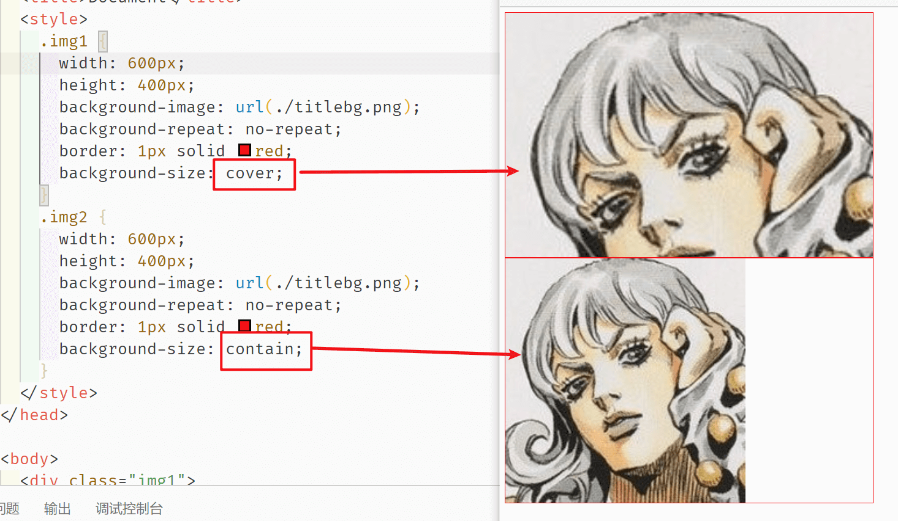

# 03-CSS背景属性

## 常用背景属性

### background-color

设置元素的背景颜色。有多种表示方法

- 英语单词：`background-color:red` 

- RGB：`background-color: rgb(255,0,0)`

- RGBA：`background-color: rgba(0, 0, 255, 0.3)`

- 十六进制：`background-color: #ff0000` 

  ```
  常用颜色
  #000   黑
  #fff   白
  #f00   红
  #222   深灰
  #333   灰
  #ccc   浅灰
  ```

> **Tip：关于背景色的填充范围**
>
> `background-color` 不论 `box-sizing` 是什么，**始终填充**的是 `content + padding +border` ，但是如果 `border` **是有颜色的，则会覆盖背景色**，将 `border` 的颜色设置成 `transparent` 则会发现其实是有背景色的。

### background-image

`background-image:url(images/2.gif);` 将图像设置为背景。

#### 线性渐变

```
background-image: linear-gradient(方向, 起始颜色, 终止颜色);

background-image: linear-gradient(to right, yellow, green);
```

这里的方向，可以 `to left`、`to right`、`to top`、`to bottom`、角度 `30deg`（指的是顺时针方向30°）

下面看一些常用效果

```html
<html lang="en">

<head>
  <meta charset="UTF-8">
  <meta name="viewport" content="width=device-width, initial-scale=1.0">
  <title>Document</title>
  <style>
    div {
      width: 500px;
      height: 100px;
      margin: 10px auto;
      border: 1px solid #000;
    }

    /* 语法：
            linear-gradient(方向，起始颜色，终止颜色);
            方向：to left   to right  to top   to bottom 　角度　30deg
            起始颜色
            终止颜色
        */
    div:nth-child(1) {
      background-image: linear-gradient(to right, yellow, green);
    }

    /* 不写方向，表示默认的方向是：从上往下 */
    div:nth-child(2) {
      background-image: linear-gradient(yellow, green);
    }

    /* 方向可以指定角度 */
    div:nth-child(3) {
      width: 100px;
      height: 100px;
      background-image: linear-gradient(135deg, yellow, green);
    }

    /* 0%的位置开始出现黄色，40%的位置开始出现红色的过度。70%的位置开始出现绿色的过度，100%的位置开始出现蓝色 */
    div:nth-child(4) {
      background-image: linear-gradient(to right,
          yellow 0%,
          red 40%,
          green 70%,
          blue 100%);

    }

    /* 颜色之间，出现突变 */
    div:nth-child(5) {
      background-image: linear-gradient(45deg,
          yellow 0%,
          yellow 25%,
          blue 25%,
          blue 50%,
          red 50%,
          red 75%,
          green 75%,
          green 100%);
    }

    div:nth-child(6) {
      background-image: linear-gradient(to right,
          #000 0%,
          #000 25%,
          #fff 25%,
          #fff 50%,
          #000 50%,
          #000 75%,
          #fff 75%,
          #fff 100%);

    }
  </style>
</head>

<body>
  <div></div>
  <div></div>
  <div></div>
  <div></div>
  <div></div>
  <div></div>
</body>

</html>
```


#### 径向渐变

```
background-image: radial-gradient(辐射的半径大小 at 中心的位置, 起始颜色, 终止颜色);

background-image: radial-gradient(100px at center,yellow ,green);
```

围绕中心点(at center)做渐变，半径是100px，从黄色到绿色做渐变

**中心点的位置**可以是：`at left right center bottom top` 。如果以像素为单位，则中心点参照的是盒子的左上角。

看看效果：

```css
/*
            径向渐变：
            radial-gradient（辐射的半径大小, 中心的位置，起始颜色，终止颜色）;
            中心点位置：at  left  right  center bottom  top
        */

    /*辐射半径为100px，中心点在中间*/
    div:nth-child(1) {
      background-image: radial-gradient(100px at center, yellow, green);
    }

    /*中心点在左上角*/
    div:nth-child(3) {
      background-image: radial-gradient(at left top, yellow, green);
    }

    div:nth-child(2) {
      background-image: radial-gradient(at 50px 50px, yellow, green);
    }

    /*设置不同的颜色渐变*/
    div:nth-child(4) {
      background-image: radial-gradient(100px at center,
          yellow 0%,
          green 30%,
          blue 60%,
          red 100%);
    }

    /*如果辐射半径的宽高不同，那就是椭圆*/
    div:nth-child(5) {
      background-image: radial-gradient(100px 50px at center, yellow, green);
    }
```


### background-repeat

设置背景图片是否重复及如何重复，默认平铺满。（重要）

- 默认：平铺满

- `no-repeat`不要平铺；
- `repeat-x`横向平铺；
- `repeat-y`纵向平铺。

### background-position

#### 像素定位

格式：`background-position:向右偏移量 向下偏移量;`

比如

```
 background-position: 50px 50px;
```


#### 单词定位

格式：`background-position:左右的词 上下的词;`

- 左右词：left、center、right
- 上下词：top、center、bottom

经常在做 banner 图的时候会用到这种效果：


### background-attachment

设置背景图片根据谁来进行滚动。 属性值可以是：

- `fixed` 不随文档和内容滚动。
- `scroll`（默认属性）随文档整体移动， 而不是随着它的内容滚动。
- `local` 既跟随文档滚动，又跟随内容滚动。

整体效果：


### background 将多个属性写在一起

```css
background:red url(1.jpg) no-repeat 100px 100px fixed;
```

等价于

```css
background-color:red;
background-image:url(1.jpg);
background-repeat:no-repeat;
background-position:100px 100px;
background-attachment:fixed;
```

## CSS3 新增属性

### background-origin 显示起点

代表背景从什么地方开始显示

```css
/* 从 padding-box 内边距开始显示背景图 */
background-origin: padding-box;           //默认值

/* 从 border-box 边框开始显示背景图  */
background-origin: border-box;

/* 从 content-box 内容区域开始显示背景图  */
background-origin: content-box;
```

### background-clip 背景裁切

格式举例：

`background-clip: content-box;` 超出的部分，将裁剪掉。属性值可以是：

- `border-box` 超出 border-box 的部分，将裁剪掉
- `padding-box` 超出 padding-box 的部分，将裁剪掉
- `content-box` 超出 content-box 的部分，将裁剪掉


### background-size 背景大小

设置背景尺寸

```css
/* 宽、高的具体数值 */
background-size: 500px 500px;

/* 宽高的百分比（相对于容器的大小） */
background-size: 50% 50%;   // 如果两个属性值相同，可以简写成：background-size: 50%;

background-size: 100% auto;  //这个属性可以自己试验一下。

/* cover：图片始终填充满容器，且保证长宽比不变。图片如果有超出部分，则超出部分会被隐藏。 */
background-size: cover;

/* contain：将图片完整地显示在容器中，且保证长宽比不变。可能会导致容器的部分区域为空白。  */
background-size: contain;
```

关于 `cover` `contain` 的区别：



## 同时设置多个背景

我们可以给一个盒子同时设置多个背景，用以逗号隔开即可。可用于自适应局。

```css
.box {
    height: 416px;
    border: 1px solid #000;
    margin: 100px auto;
    /* 给盒子加多个背景，按照背景语法格式书写，多个背景使用逗号隔开 */
    background: url(images/bg1.png) no-repeat left top,
    url(images/bg2.png) no-repeat right top,
    url(images/bg3.png) no-repeat right bottom,
    url(images/bg4.png) no-repeat left bottom,
    url(images/bg5.png) no-repeat center;
}
```

