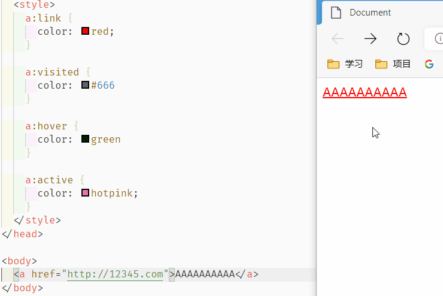
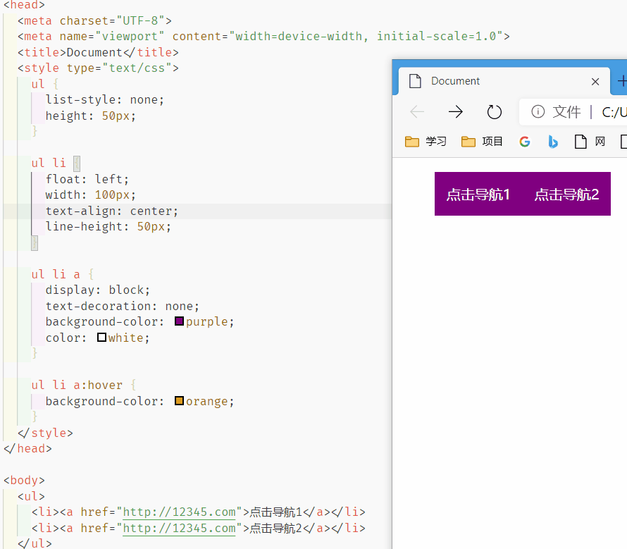
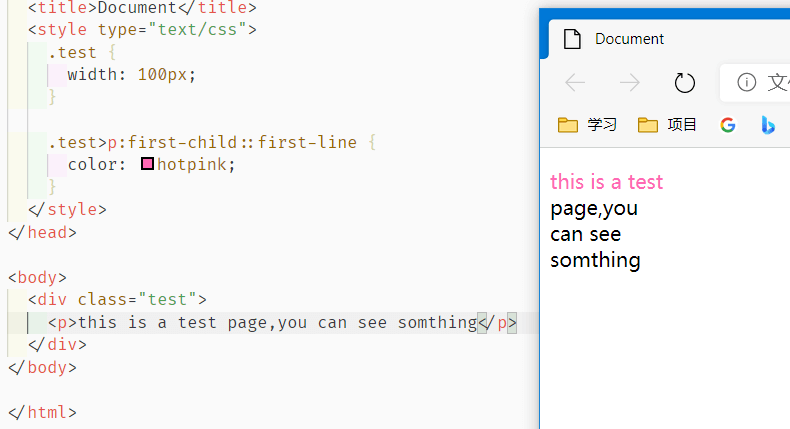
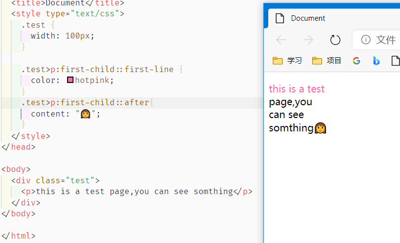
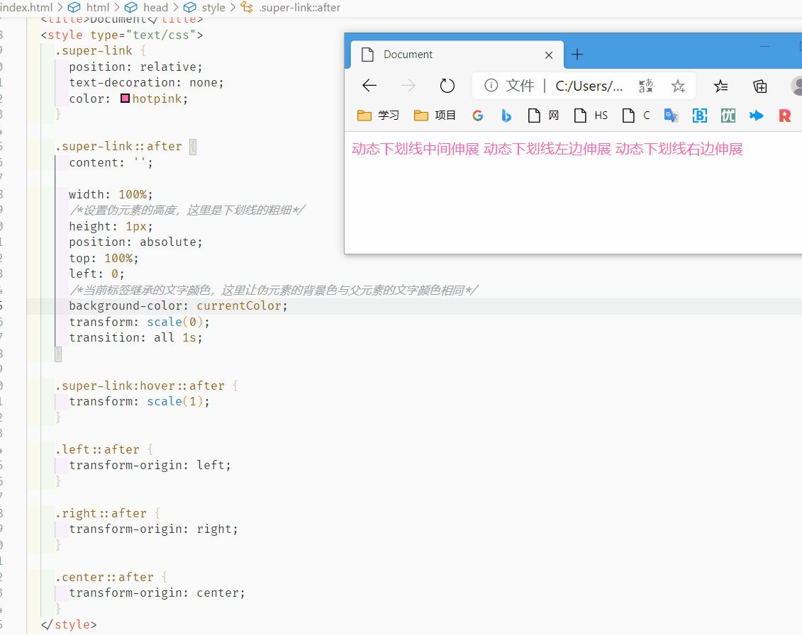

# 04-CSS伪类和伪元素

## 概念

[**伪类**](https://developer.mozilla.org/zh-CN/docs/Learn/CSS/Building_blocks/Selectors/Pseudo-classes_and_pseudo-elements)是选择器的一种，它用于选择处于特定状态的元素，比如当它们是这一类型的第一个元素时，或者是当鼠标指针悬浮在元素上面的时候。以冒号 `:` 开头

**伪元素**以类似方式表现，不过表现得是像你往标记文本中加入全新的HTML元素一样，而不是向现有的元素上应用类。伪元素开头为双冒号 `::`

在CSS1和CSS2中对伪类和伪选择器没有做出很明显的区别定义，而二者在语法是一样的，都是以`:`开头，这造成很多人会将某些伪元素误认为是伪类，如`:before`，`:after`；而在CSS3给出的定义中，二者区别更为明显，也更容易理解。

## 静态伪类和动态伪类

伪类选择器分为两种。

（1）**静态伪类**：只能用于**超链接**的样式。如下：

- `:link` 超链接点击之前
- `:visited` 链接被访问过之后

PS：以上两种样式，只能用于超链接。

（2）**动态伪类**：针对**所有标签**都适用的样式。如下：

- `:hover` “悬停”：鼠标放到标签上的时候
- `:active` “激活”： 鼠标点击标签，但是不松手时。
- `:focus` 是某个标签获得焦点时的样式（比如某个输入框获得焦点）
- ………………

## a 标签

### 四种伪类

a 标签有四个伪类：

- `:link` 点击链接之前
- `:visited` 已经点过的链接
- `:hover` 鼠标放在链接上时
- `:active` 鼠标点击按下但是鼠标还没抬起的时候



记住，在css中，这四种状态**必须按照固定的顺序写**，也就是所谓的“爱恨原则”（LoVe/HAte）：

> a:link 、a:visited 、a:hover 、a:active

### 和 a 标签样式合并

`:link` 和 `:visited` 一样的情况下也可以省略写法：把二者合并到 `a` 标签的样式里 👇



这里的这种写法：

```css
ul li a {
  display: block;
  text-decoration: none;
  background-color: purple;
  color: white;
}

ul li a:hover {
  background-color: orange;
}
```

等同于

```css
ul li a {
	display: block;
}
ul li a:link , ul li a:visited{
	text-decoration: none;
	background-color: purple;
	color:white;
}
ul li a:hover {
	background-color: orange;
}
```

## 其他伪类

### :focus

获得焦点的时候

```html
<style>
#txt:focus{
  color: hotpink;
 }
</style>
<!-- 输入框的字聚焦为紫色 -->
<input type="text" name="aa" id="txt">
```

### :first-child

第一个子元素

```html
<style>
.test>p:first-child {
  color: hotpink;
}
</style>
<!-- AA 为紫色 -->
<div class="test">
    <p>AA</p>
    <p>BB</p>
    <p>CC</p>
</div>
```

类似的，`last-child/nth-child(num)` 等等都是一样的使用

## 伪元素

一些早期的伪元素曾使用单冒号的语法，所以你可能会在代码或者示例中看到。现代的浏览器为了保持后向兼容，支持早期的带有单双冒号语法的伪元素。

### 举个例子  :first-child 结合 ::first-line

伪类与伪元素的结合，它代表第一子元素的第一行



### ::before 和 ::after

有一组特别的伪元素，它们和[`content`](https://developer.mozilla.org/en-US/docs/Web/CSS/content)属性一同使用，使用CSS将内容插入到你的文档中。



可以用这个特性做**动态下划线效果**：



代码如下，类似的修改高度还可以做出上划线、删除线的效果

```HTML
<!DOCTYPE html>
<html lang="en">

<head>
  <meta charset="UTF-8">
  <meta name="viewport" content="width=device-width, initial-scale=1.0">
  <title>Document</title>
  <style type="text/css">
    .super-link {
      /*父相子绝*/
      position: relative;
      text-decoration: none;
      color: hotpink;
    }

    .super-link::after {
      content: '';

      width: 100%;
      /*设置伪元素的高度，这里是下划线的粗细*/
      height: 1px;
      position: absolute;
      top: 100%;
      left: 0;
      /*当前标签继承的文字颜色，这里让伪元素的背景色与父元素的文字颜色相同*/
      background-color: currentColor;
      transform: scale(0);
      transition: all 1s;
    }

    .super-link:hover::after {
      transform: scale(1);
    }

    .left::after {
      transform-origin: left;
    }

    .right::after {
      transform-origin: right;
    }

    .center::after {
      transform-origin: center;
    }
  </style>
</head>

<body>
  <div class="test">
    <a href="#" class="super-link center">
      动态下划线中间伸展
    </a>
    <a href="#" class="super-link left">
      动态下划线左边伸展
    </a>
    <a href="#" class="super-link right">
      动态下划线右边伸展
    </a>
  </div>
</body>

</html>
```

## [备用查询表](https://developer.mozilla.org/zh-CN/docs/Learn/CSS/Building_blocks/Selectors/Pseudo-classes_and_pseudo-elements#%E5%8F%82%E8%80%83%E8%8A%82) 

### 伪类

| 选择器                                                       | 描述                                                         |
| :----------------------------------------------------------- | :----------------------------------------------------------- |
| [`:active`](https://developer.mozilla.org/zh-CN/docs/Web/CSS/:active) | 在用户激活（例如点击）元素的时候匹配。                       |
| [`:any-link`](https://developer.mozilla.org/zh-CN/docs/Web/CSS/:any-link) | 匹配一个链接的`:link`和`:visited`状态。                      |
| [`:blank`](https://developer.mozilla.org/zh-CN/docs/Web/CSS/:blank) | 匹配空输入值的[``元素](https://developer.mozilla.org/en-US/docs/Web/HTML/Element/input)。 |
| [`:checked`](https://developer.mozilla.org/zh-CN/docs/Web/CSS/:checked) | 匹配处于选中状态的单选或者复选框。                           |
| [`:current`](https://developer.mozilla.org/zh-CN/docs/Web/CSS/:current) | 匹配正在展示的元素，或者其上级元素。                         |
| [`:default`](https://developer.mozilla.org/zh-CN/docs/Web/CSS/:default) | 匹配一组相似的元素中默认的一个或者更多的UI元素。             |
| [`:dir`](https://developer.mozilla.org/zh-CN/docs/Web/CSS/:dir) | 基于其方向性（HTML`dir`属性或者CSS`direction`属性的值）匹配一个元素。 |
| [`:disabled`](https://developer.mozilla.org/zh-CN/docs/Web/CSS/:disabled) | 匹配处于关闭状态的用户界面元素                               |
| [`:empty`](https://developer.mozilla.org/zh-CN/docs/Web/CSS/:empty) | 匹配除了可能存在的空格外，没有子元素的元素。                 |
| [`:enabled`](https://developer.mozilla.org/zh-CN/docs/Web/CSS/:enabled) | 匹配处于开启状态的用户界面元素。                             |
| [`:first`](https://developer.mozilla.org/zh-CN/docs/Web/CSS/:first) | 匹配[分页媒体](https://developer.mozilla.org/en-US/docs/Web/CSS/Paged_Media)的第一页。 |
| [`:first-child`](https://developer.mozilla.org/zh-CN/docs/Web/CSS/:first-child) | 匹配兄弟元素中的第一个元素。                                 |
| [`:first-of-type`](https://developer.mozilla.org/zh-CN/docs/Web/CSS/:first-of-type) | 匹配兄弟元素中第一个某种类型的元素。                         |
| [`:focus`](https://developer.mozilla.org/zh-CN/docs/Web/CSS/:focus) | 当一个元素有焦点的时候匹配。                                 |
| [`:focus-visible`](https://developer.mozilla.org/zh-CN/docs/Web/CSS/:focus-visible) | 当元素有焦点，且焦点对用户可见的时候匹配。                   |
| [`:focus-within`](https://developer.mozilla.org/zh-CN/docs/Web/CSS/:focus-within) | 匹配有焦点的元素，以及子代元素有焦点的元素。                 |
| [`:future`](https://developer.mozilla.org/zh-CN/docs/Web/CSS/:future) | 匹配当前元素之后的元素。                                     |
| [`:hover`](https://developer.mozilla.org/zh-CN/docs/Web/CSS/:hover) | 当用户悬浮到一个元素之上的时候匹配。                         |
| [`:indeterminate`](https://developer.mozilla.org/zh-CN/docs/Web/CSS/:indeterminate) | 匹配未定态值的UI元素，通常为[复选框](https://developer.mozilla.org/en-US/docs/Web/HTML/Element/input/checkbox)。 |
| [`:in-range`](https://developer.mozilla.org/zh-CN/docs/Web/CSS/:in-range) | 用一个区间匹配元素，当值处于区间之内时匹配。                 |
| [`:invalid`](https://developer.mozilla.org/zh-CN/docs/Web/CSS/:invalid) | 匹配诸如`<input>`的位于不可用状态的元素。                    |
| [`:lang`](https://developer.mozilla.org/zh-CN/docs/Web/CSS/:lang) | 基于语言（HTML[lang](https://developer.mozilla.org/zh-CN/docs/Web/HTML/Global_attributes/lang)属性的值）匹配元素。 |
| [`:last-child`](https://developer.mozilla.org/zh-CN/docs/Web/CSS/:last-child) | 匹配兄弟元素中最末的那个元素。                               |
| [`:last-of-type`](https://developer.mozilla.org/zh-CN/docs/Web/CSS/:last-of-type) | 匹配兄弟元素中最后一个某种类型的元素。                       |
| [`:left`](https://developer.mozilla.org/zh-CN/docs/Web/CSS/:left) | 在[分页媒体](https://developer.mozilla.org/zh-CN/docs/Web/CSS/CSS_Pages)中，匹配左手边的页。 |
| [`:link`](https://developer.mozilla.org/zh-CN/docs/Web/CSS/:link) | 匹配未曾访问的链接。                                         |
| [`:local-link`](https://developer.mozilla.org/zh-CN/docs/Web/CSS/:local-link) | 匹配指向和当前文档同一网站页面的链接。                       |
| [`:is()`](https://developer.mozilla.org/zh-CN/docs/Web/CSS/:is) | 匹配传入的选择器列表中的任何选择器。                         |
| [`:not`](https://developer.mozilla.org/zh-CN/docs/Web/CSS/:not) | 匹配作为值传入自身的选择器未匹配的物件。                     |
| [`:nth-child`](https://developer.mozilla.org/zh-CN/docs/Web/CSS/:nth-child) | 匹配一列兄弟元素中的元素——兄弟元素按照an+b形式的式子进行匹配（比如2n+1匹配元素1、3、5、7等。即所有的奇数个）。 |
| [`:nth-of-type`](https://developer.mozilla.org/zh-CN/docs/Web/CSS/:nth-of-type) | 匹配某种类型的一列兄弟元素（比如，`<p>`元素）——兄弟元素按照an+b形式的式子进行匹配（比如2n+1匹配元素1、3、5、7等。即所有的奇数个）。 |
| [`:nth-last-child`](https://developer.mozilla.org/zh-CN/docs/Web/CSS/:nth-last-child) | 匹配一列兄弟元素，从后往前倒数。兄弟元素按照an+b形式的式子进行匹配（比如2n+1匹配按照顺序来的最后一个元素，然后往前两个，再往前两个，诸如此类。从后往前数的所有奇数个）。 |
| [`:nth-last-of-type`](https://developer.mozilla.org/zh-CN/docs/Web/CSS/:nth-last-of-type) | 匹配某种类型的一列兄弟元素（比如，`<p>`元素），从后往前倒数。兄弟元素按照an+b形式的式子进行匹配（比如2n+1匹配按照顺序来的最后一个元素，然后往前两个，再往前两个，诸如此类。从后往前数的所有奇数个）。 |
| [`:only-child`](https://developer.mozilla.org/zh-CN/docs/Web/CSS/:only-child) | 匹配没有兄弟元素的元素。                                     |
| [`:only-of-type`](https://developer.mozilla.org/zh-CN/docs/Web/CSS/:only-of-type) | 匹配兄弟元素中某类型仅有的元素。                             |
| [`:optional`](https://developer.mozilla.org/zh-CN/docs/Web/CSS/:optional) | 匹配不是必填的form元素。                                     |
| [`:out-of-range`](https://developer.mozilla.org/zh-CN/docs/Web/CSS/:out-of-range) | 按区间匹配元素，当值不在区间内的的时候匹配。                 |
| [`:past`](https://developer.mozilla.org/zh-CN/docs/Web/CSS/:past) | 匹配当前元素之前的元素。                                     |
| [`:placeholder-shown`](https://developer.mozilla.org/zh-CN/docs/Web/CSS/:placeholder-shown) | 匹配显示占位文字的input元素。                                |
| [`:playing`](https://developer.mozilla.org/zh-CN/docs/Web/CSS/:playing) | 匹配代表音频、视频或者相似的能“播放”或者“暂停”的资源的，且正在“播放”的元素。 |
| [`:paused`](https://developer.mozilla.org/zh-CN/docs/Web/CSS/:paused) | 匹配代表音频、视频或者相似的能“播放”或者“暂停”的资源的，且正在“暂停”的元素。 |
| [`:read-only`](https://developer.mozilla.org/zh-CN/docs/Web/CSS/:read-only) | 匹配用户不可更改的元素。                                     |
| [`:read-write`](https://developer.mozilla.org/zh-CN/docs/Web/CSS/:read-write) | 匹配用户可更改的元素。                                       |
| [`:required`](https://developer.mozilla.org/zh-CN/docs/Web/CSS/:required) | 匹配必填的form元素。                                         |
| [`:right`](https://developer.mozilla.org/zh-CN/docs/Web/CSS/:right) | 在[分页媒体](https://developer.mozilla.org/zh-CN/docs/Web/CSS/CSS_Pages)中，匹配右手边的页。 |
| [`:root`](https://developer.mozilla.org/zh-CN/docs/Web/CSS/:root) | 匹配文档的根元素。                                           |
| [`:scope`](https://developer.mozilla.org/zh-CN/docs/Web/CSS/:scope) | 匹配任何为参考点元素的的元素。                               |
| [`:valid`](https://developer.mozilla.org/zh-CN/docs/Web/CSS/:valid) | 匹配诸如`<input>`元素的处于可用状态的元素。                  |
| [`:target`](https://developer.mozilla.org/zh-CN/docs/Web/CSS/:target) | 匹配当前URL目标的元素（例如如果它有一个匹配当前[URL分段](https://en.wikipedia.org/wiki/Fragment_identifier)的元素）。 |
| [`:visited`](https://developer.mozilla.org/zh-CN/docs/Web/CSS/:visited) | 匹配已访问链接。                                             |

### 伪元素

| 选择器                                                       | 描述                                                 |
| :----------------------------------------------------------- | :--------------------------------------------------- |
| [`::after`](https://developer.mozilla.org/zh-CN/docs/Web/CSS/::after) | 匹配出现在原有元素的实际内容之后的一个可样式化元素。 |
| [`::before`](https://developer.mozilla.org/zh-CN/docs/Web/CSS/::before) | 匹配出现在原有元素的实际内容之前的一个可样式化元素。 |
| [`::first-letter`](https://developer.mozilla.org/zh-CN/docs/Web/CSS/::first-letter) | 匹配元素的第一个字母。                               |
| [`::first-line`](https://developer.mozilla.org/zh-CN/docs/Web/CSS/::first-line) | 匹配包含此伪元素的元素的第一行。                     |
| [`::grammar-error`](https://developer.mozilla.org/zh-CN/docs/Web/CSS/::grammar-error) | 匹配文档中包含了浏览器标记的语法错误的那部分。       |
| [`::selection`](https://developer.mozilla.org/zh-CN/docs/Web/CSS/::selection) | 匹配文档中被选择的那部分。                           |
| [`::spelling-error`](https://developer.mozilla.org/zh-CN/docs/Web/CSS/::spelling-error) | 匹配文档中包含了浏览器标记的拼写错误的那部分。       |