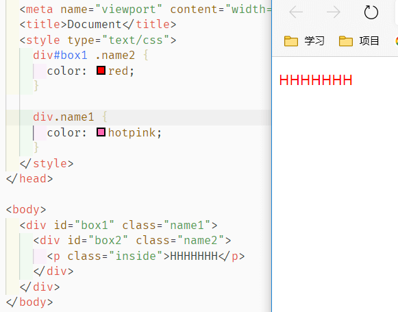
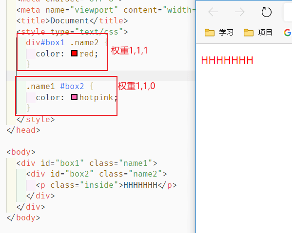
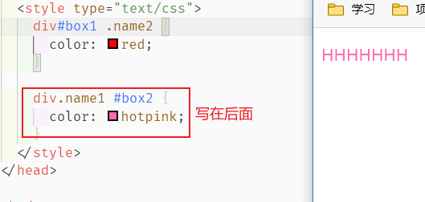
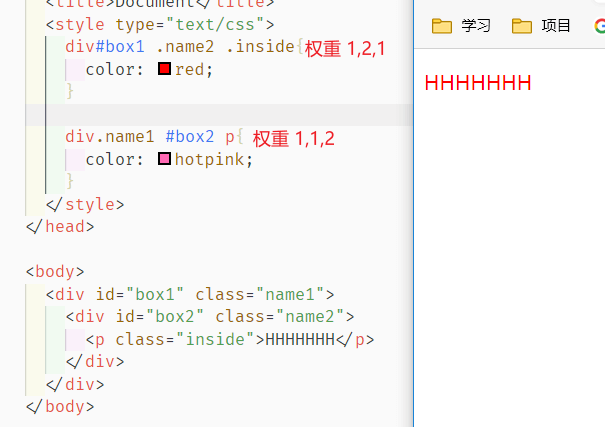
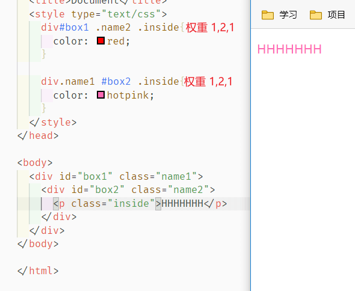
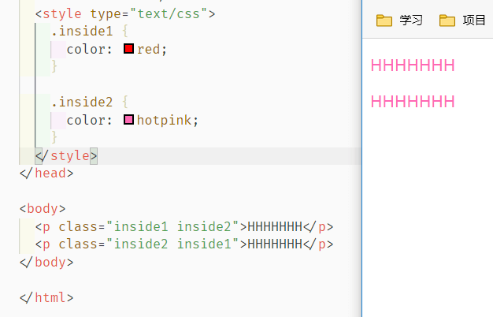
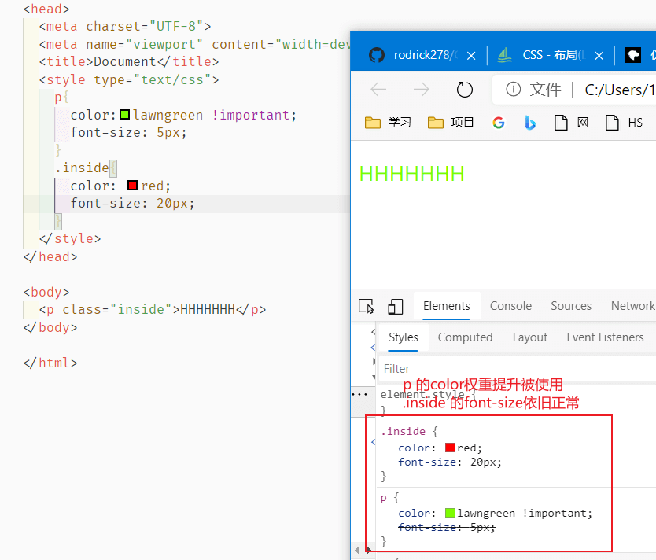
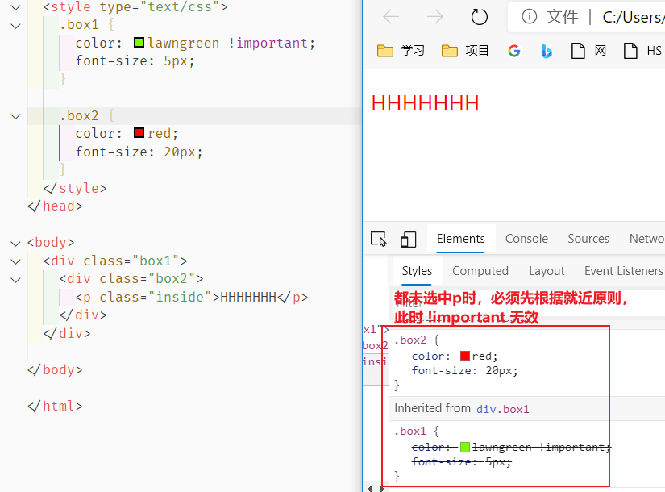
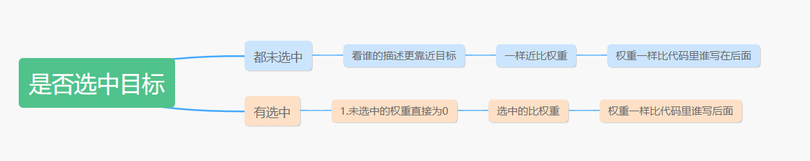

# 05-CSS样式的层叠与继承

## 	继承性

继承性直接上结论：

- 关于文字样式的属性，都具有继承性。这些属性包括：color、 text-开头的、line-开头的、font-开头的。
- 关于盒子、定位、布局的属性，都不能继承。

## 层叠性

在我们有多个选择器指向同一元素同样属性的时候，CSS 会根据自己的逻辑判断权重等，具体逻辑如下

### 0. 权重计算⭐

对于相同方式的样式表，其选择器排序的 **优先级** 为：

**ID选择器 > 类选择器 > 标签选择器**

下面用一些例子说明权重关系：

```CSS
/* 1个id 1个class 1个标签，权重为 1,1,1 */
#box1 .name1 p{
  color:red
}

/* 2个id 0个class 1个标签，权重为 1,0,1 */
#box1 #box1 p{
  color:red
}

/* 0个id 2个class 2个标签，权重为 0,2,2 */
div.name1 .name2 p{
  color:red
}
```

不考虑存在进位的情况，255个标签=1个class，不太现实

### 1. 判断：是否选中目标

#### 1.1 都未选中

**1.1.1** 二者都没选中 ，**根据描述看谁靠近目标元素**，前者距离 p 元素更近，所以为红色



**1.1.2** 二者都没选中 ，且**根据描述距离 p 元素一样近，则看权重**，选择权重高



**1.1.3**  **距离一样权重也一样，看谁写在后面**




#### 1.2 一个选中一个未选中

**1.2.0 一个选中一个未选中，未选中的权重直接算0，只要判断选中的情况**

**1.2.1** **先比权重，选权重大的**



**1.2.2 权重一样，选写在后面的**



## 补充深入

### 1. 携带多 class

代码就近原则



### 2. ! important

```
k:v !important;
```

1. `!important` 用来提高**指定属性**的**权重**（注意，不是整个组`{}`内的权重，而是单个属性的权重）

   

2. 他仅作用于权重，**不影响就近原则**

   

## 总结


