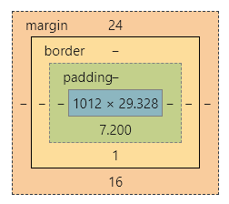
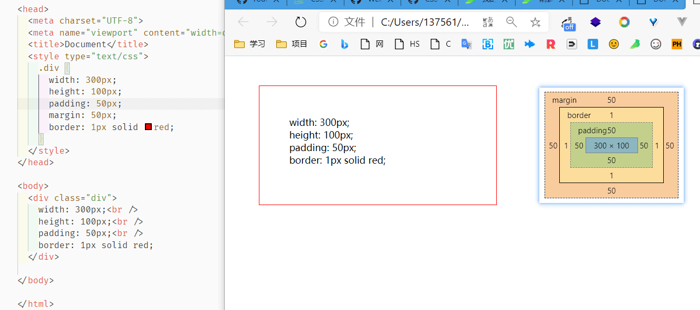
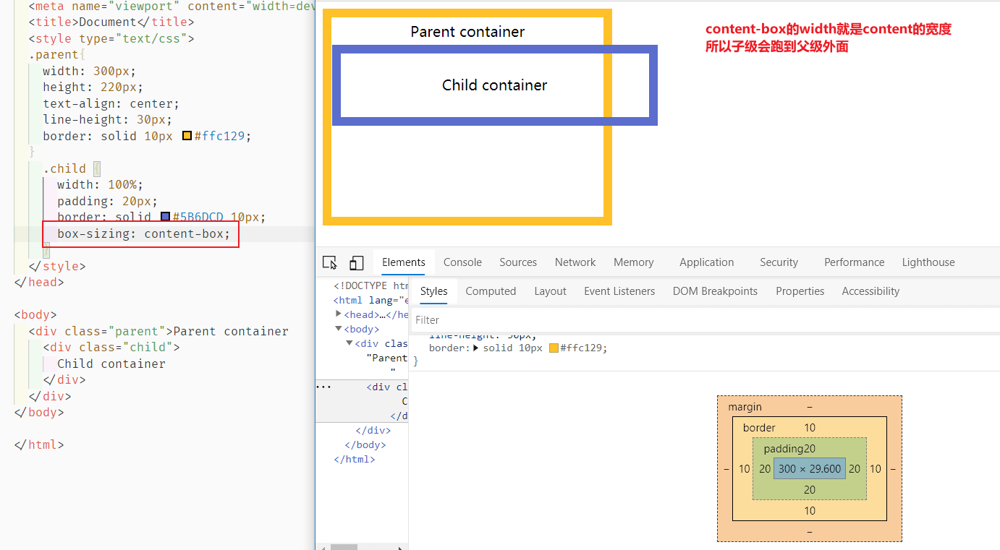
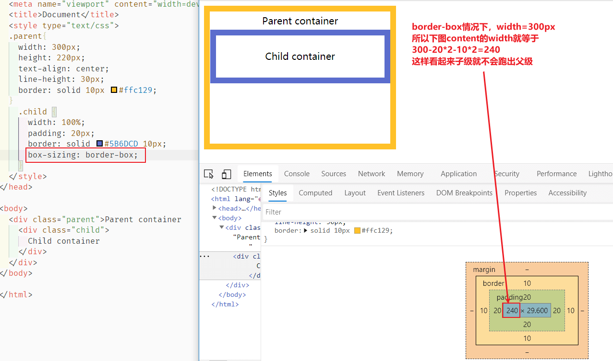

# 06-CSS盒模型

## 区域概念

浏览器 F12 开发者工具中可以看到每个元素都有这样的模型：



一个盒子中主要的属性就5个：width、height、padding、border、margin。如下：

- width 和 height：**内容**的宽度、高度（不是盒子的宽度、高度）。
- padding：内边距。
- border：边框。
- margin：外边距。

## box-sizing 属性对 width 和 height 的影响

在 CSS2 中我们有如下代码

```css
.div {
      width: 300px;
      height: 100px;
      padding: 50px;
      margin: 50px;
      border: 1px solid red;
    }
```

此时的盒子是这样👇



我们可以看到，`width` 属性是内部 `content` 的宽度，而盒子的总宽度是 `300 + 50*2 + 1*2 +50*2 = 502`，高度同样算法。


CSS3 中加入了 `box-sizing` 属性，他有两个主要属性

- `box-sizing: content-box;`  会将 `width` 属性指为 `content` 的宽度，`height` 同理，效果和上面的图一样
- `box-sizing: border-box; `   会将 `width` 属性设置为 `content + padding-left&right + border-left&right  ` ，也就意味着 `content` 的宽度是会随着其他属性（width、padding、border）变化而变化的

> 不论怎么设置 box-sizing，都和 margin 无关

看下下面的图对比：

- content-box

  

- border-box

  

## padding

padding 就是内边距，且 **盒子的背景颜色对它是有作用的！并且颜色一定和 content 的一致** 

### 四个方向写法

小属性的写法：

```css
	padding-top: 30px;
	padding-right: 20px;
	padding-bottom: 40px;
	padding-left: 100px;
```

综合属性的写法：(上、右、下、左)（顺时针方向，用空格隔开。margin的道理也是一样的）

```css
padding:30px 20px 40px 100px;
padding:30px 20px 40px;  左边自动等于右边的20px
padding:30px 20px;	左边等于20px 下面等于30px
```

### 小属性层叠大属性

这样写小属性是有效的，左边会变为30px

```css
padding: 20px;
padding-left: 30px;
```

这样写小属性是无效的，会被后面的大属性改回20px

```css
padding-left: 30px;
padding: 20px;
```

## border

### 拆分写法

1. 按照要素写：小属性后面跟多个值对应的也是上、右、下、左

```css
border-width:10px 20px;
border-style:solid dashed dotted;
border-color:red green blue yellow;
```

2. 按方向写

```css
border-top:10px solid red;
border-right:10px solid red;
border-bottom:10px solid red;
border-left:10px solid red
```

3. 按要素+方向

```css
border-top-width:10px;
border-top-style:solid;
border-top-color:red;
border-right-width:10px;
border-right-style:solid;
border-right-color:red;
border-bottom-width:10px;
border-bottom-style:solid;
border-bottom-color:red;
border-left-width:10px;
border-left-style:solid;
border-left-color:red;
```

### 不拆分写法，分别代表线宽、样式、颜色

没有什么顺序和个数的规定，随便怎么写都可以，不写的值会使用默认值，分别是 `1px none #000`👇

```css
border: solid #5B6DCD 10px;
border: 10px solid #5B6DCD ;
border: #5B6DCD solid 10px;
border: #5B6DCD solid ;
border: solid 10px ;
```

### 小属性层叠大属性

类似 padding 写法：

```css
border:10px solid red;
border-right-color:blue;
```

### 画个三角形

- 等边三角形

  原理就是给一个宽高为0的 div ，然后设置1. 实线 2. 颜色为透明  3. 边框宽度>0，再将显示边设置颜色，对立边设置宽度为0

```css
.child {
  width: 0;
  height: 0;
  border: 50px solid transparent;
  border-top-color:red;
  border-bottom: 0px;
}
```

- 直角三角形

  原理是通过改变非对立边的像素值来控制

```css
.child {
  width: 0;
  height: 0;
  border-top: 50px solid red;
  border-left: 30px solid transparent;
  border-right: 30px solid transparent;
}
```

### 边框圆角：`border-radius` 

边框的每个圆角，本质上是一个圆，圆有**水平半径**和**垂直半径**：如果二者相等，就是圆；如果二者不等， 就是椭圆。

单个属性的写法：

```css
	border-top-left-radius: 60px 120px;        //参数解释：水平半径   垂直半径

	border-top-right-radius: 60px 120px;

	border-bottom-left-radius: 60px 120px;

	border-bottom-right-radius: 60px 120px;
```

复合写法：

```css
	border-radius: 60px/120px;             //参数：水平半径/垂直半径

	border-radius: 20px 60px 100px 140px;  //从左上开始，顺时针赋值。如果当前角没有值，取对角的值

	border-radius: 20px 60px;
```

最简洁的写法：（四个角的半径都相同时）

```css
	border-radius: 60px;
```

### 边框阴影：`box-shadow`

```css
	box-shadow: 水平偏移 垂直偏移 模糊程度 阴影大小 阴影颜色 inset(将外部阴影 (outset) 改为内部阴影)

	box-shadow: 15px 21px 48px -2px #666 inset;
	/* 多个阴影逗号分隔 */
	box-shadow: 10px 10px 5px red,10px 10px 5px #888888 inset;
```

