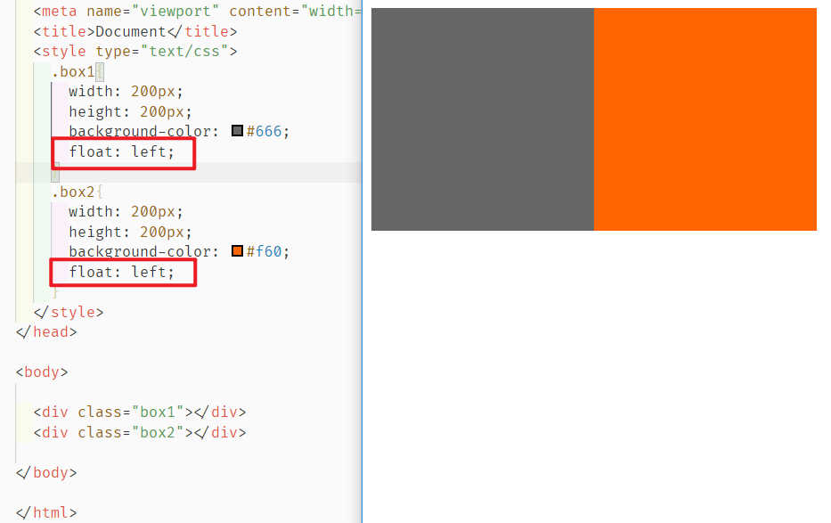

# 07-CSS文档流

## 行内元素与块级元素

### 概念

**行内元素**：

- 与其他行内元素并排；
- **不能设置宽、高**。默认的宽度，就是文字的宽度。

**块级元素**：

- 霸占一行，不能与其他任何元素并列；
- 能接受宽、高。如果不设置宽度，那么宽度将默认变为父亲的100%。

### 分类

HTML知识中，标签可以分为：文本级、容器级：

- 文本级标签：**p**、span、a、b、i、u、em。
- 容器级标签：div、h系列、li、dt、dd。

在CSS的分类中，只有p元素比较特殊，其他的分类不变

- 块级元素：**p**、div、h系列、li、dt、dd。
- 行内元素：span、a、b、i、u、em。

### 互相转换

- **块级元素 -> 行内元素**： 设置 `display: inline;`

- **行内元素 -> 块级元素**：设置 `display: block;` 

- **二者兼具**：设置 `display: inline-block;`   **行内且有宽高**

## 浮动布局

效果如下：



### 浮动的性质

#### 1. 脱离标准流

当一个元素 box1 使用了 `float` 那么他此时就**脱离了标准流的范围**，如图，此时 box2 变成了第一位，且**脱标之后可以设置宽高**（图中span）：


#### 2. 浮动元素紧贴

**在标准流中，无论多少个空格、换行、tab，都会折叠为一个空格。**而浮动的元素是紧贴的，且在一行不够显示的时候，浮动元素会自己找地方换位，**换位后并不一定紧贴，也不一定会换到下一行开始位置！**👇


#### 3. 字围绕


虽然图中 box1 占据了 box2 的位置，但是 box2 的字不会被挡住，而是浮动在 box1 的周围。

#### 4. 收缩

收缩：一个浮动的元素，如果没有设置width，那么将自动收缩为内容的宽度（这点非常像行内元素）


### 父级不被浮动子级撑起的问题

如图，非浮动的情况下，父级如果没有高度会被子级高度撑起，而子级浮动时，父级高度会为0：


#### 造墙法

我们可以在上述情况下，在父级内加一个子级，并且给他添加属性：

```css
clear:both
```

**`clear`** CSS 属性指定一个元素**是否必须移动(清除浮动后)到在它之前的浮动元素下面**。


如图，给 ch1 添加 `clear` 后，相当于**指定他需要到浮动元素下面**，所以他就跑到了浮动的 child 下面，这样就会把父级 div 撑起，如果没有 `clear=both` 的话，ch1 会正常按照标准流位置存在👇：


#### 利用 `::after`

```css
.child {
  	float: left;
    background: blue;
    width: 100px;
    height: 40px;

}

.parent::after {
    display: block;
    clear: both;
    content: '';
}
```


## 文档流中的 margin

### margin 塌陷

上下盒子之间的间距，会采用较大的margin，这个被称之为 [**margin 塌陷**](https://developer.mozilla.org/zh-CN/docs/Web/CSS/margin#%E5%A4%96%E8%BE%B9%E8%B7%9D%E9%87%8D%E5%8F%A0)：


### 横向居中 margin:0 auto;

margin 的值可以设置为 `auto`，此时 margin 会按照自己的标准尽可能的大，所以当我们设置：`margin:0 auto`，左右 margin 会都尽可能大，于是会有居中效果：


但是直接设置 `margin:auto`，不会达到垂直+横向都居中的效果，但是我们可以通过“父相子绝”，且上下一致+左右一致如下👇，达到效果，

```css
 .box1 {
     height: 100px;
     width: 100px;
     background-color: red;
     position: relative;
}

.child {
    position: absolute;
    top: 0;
    bottom: 0;
    left: 0;
    right: 0;
    height: 20px;
    width: 20px;
    background-color: yellow;
    margin: auto;
}
```


### 父子间距不要用 margin 表示间隔

当父元素没有 `border` 的时候，子元素效果如下👇：


当父元素有 `border` 的时候，就正常了：


**margin这个属性，本质上描述的是兄弟和兄弟之间的距离； 最好不要用这个marign表达父子之间的距离。**

我们可以**使用父元素的 padding**，这样就不会出现问题。

### IE6的双倍margin的bug

当出现连续浮动的元素，携带与浮动方向相同的margin时，队首的元素，会双倍marign。

```
	<ul>
		<li></li>
		<li></li>
		<li></li>
	</ul>
```


解决方案：

使浮动的方向和margin的方向，相反。

所以，你就会发现，我们特别喜欢，浮动的方向和margin的方向相反。并且，前端开发工程师，把这个当做习惯了。

```
	float: left;
	margin-right: 40px;
```

## 定位

### 相对定位 relative

#### 概念

**相对于盒子本身在流中的位置做移动**

```css
position:relative;
top:10px;
left:10px
```

#### 特征

- relative 的盒子是不脱标的，可以想象为是他的影子，而他原来的位置还是在那里，别人也不会挤走他原来的位置

- 主要用来做两个用处

  - 微调元素
  - ⭐做绝对定位的参考，也就是”父相子绝“

  

### 绝对定位 absolute

- 绝对定位的盒子**脱标**，意味着不区分行内和块级元素，都可以设置宽高

#### ⭐绝对定位的参考点

1. 如果是用 **`top` 描述**，那么参考点是 **文档的左上角！** ，而不是浏览器的左上角！

   

2. 如果用 **`bottom` 描述**，那么参考点就是**浏览器首屏窗口尺寸**（好好理解“首屏”二字），对应的页面的左下角：

   

#### 父相子绝

一个绝对定位的元素，如果**父辈元素中也出现了已定位**（无论是绝对定位、相对定位，还是固定定位）的元素，那么将以父辈这个元素，为参考点。**”父相子绝“**非常常用👇


这里要注意：

-  要听最近的已经定位的祖先元素的，不一定是父亲，可能是爷爷

- 不一定是相对定位，任何定位，都可以作为儿子的参考点，但是如果子绝、父绝，没有一个盒子在标准流里面了，所以页面就不稳固，没有任何实战用途。“**父相子绝**”有意义：这样可以保证父亲没有脱标，儿子脱标在父亲的范围里面移动。

- “父相子绝”的时候，如果父级有 padding，且子级没设置 top left 等，那么父级 padding 有效，反之无效👇

  

#### 父相子绝中的居中显示

我们有一个设定公式：

注意计算的是 **盒子高宽度**，他在 `box-sizing` 不同时代表的不一样

```css
top:50%;
left:50%;
margin-top:负的盒子高度/2;
margin-left:负的盒子宽度/2
```


### 固定定位 fixed

**相对浏览器窗口进行定位。无论页面如何滚动，这个盒子显示的位置不变**。

### 一些用途

- 返回顶部控件

  ```css
  .backtop{
  			position: fixed;
  			bottom: 100px;
  			right: 30px;
  			width: 60px;
  			height: 60px;
  			background-color: gray;
  			text-align: center;
  			line-height:30px;
  			color:white;
  			text-decoration: none;   /*去掉超链接的下划线*/
  		}
  ```

- 顶部导航条

  需要注意的是，假设顶部导航条的高度是 60px，那么，为了防止其他的内容被导航条覆盖，我们要**给 `body` 标签设置 60px 的 `padding-top` **。

#### z-index

表示谁压着谁。数值大的压盖住数值小的。有如下特性：

（1）属性值大的位于上层，属性值小的位于下层。

（2）z-index值没有单位，就是一个正整数。默认的z-index值是0。

（3）**如果大家都没有z-index值，或者z-index值一样，那么在HTML代码里写在后面，谁就在上面能压住别人。定位了的元素，永远能够压住没有定位的元素**。

（4）只有定位了的元素，才能有z-index值。也就是说，不管相对定位、绝对定位、固定定位，都可以使用z-index值。**而浮动的元素不能用**。

（5）从父现象：父亲怂了，儿子再牛逼也没用。意思是，如果父亲1比父亲2大，那么，即使儿子1比儿子2小，儿子1也能在最上层。