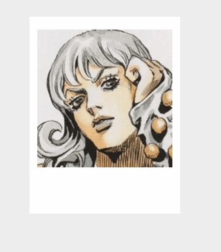
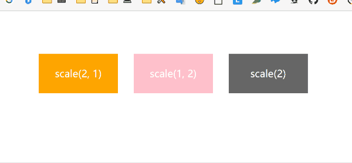
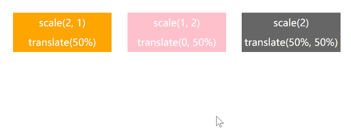
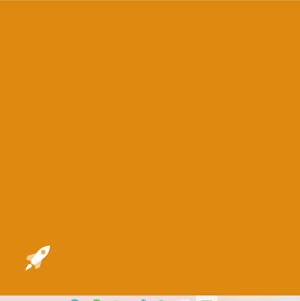
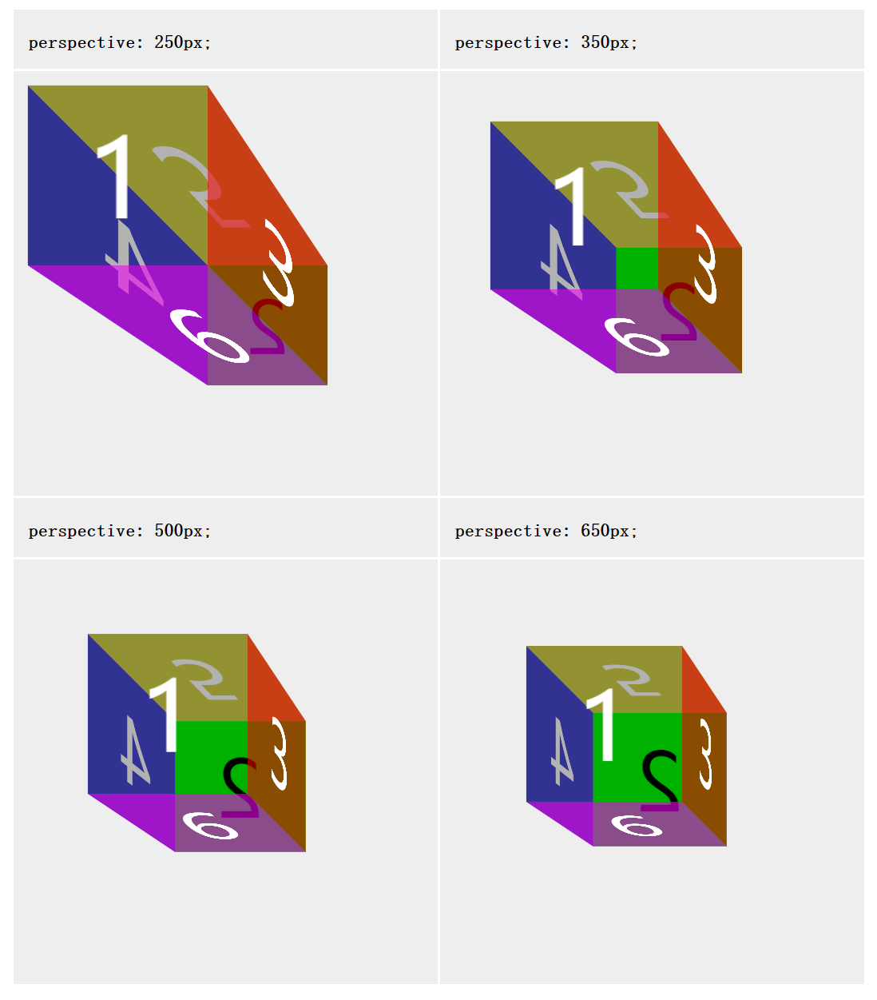
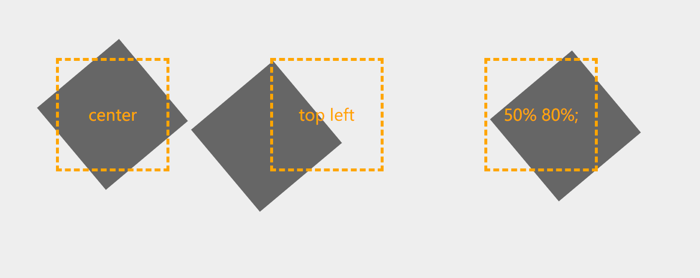
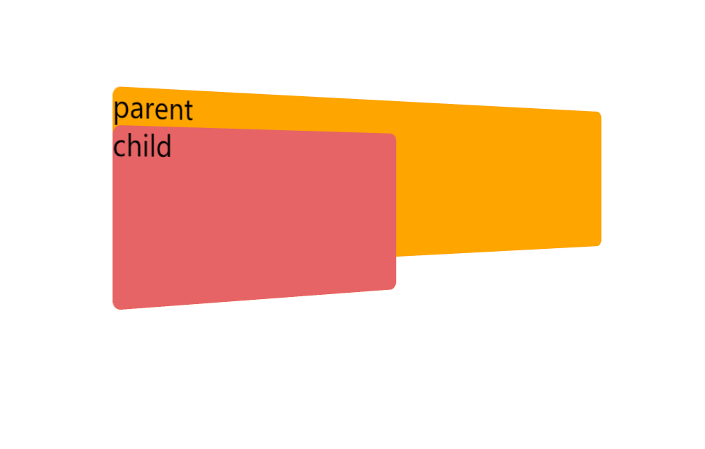
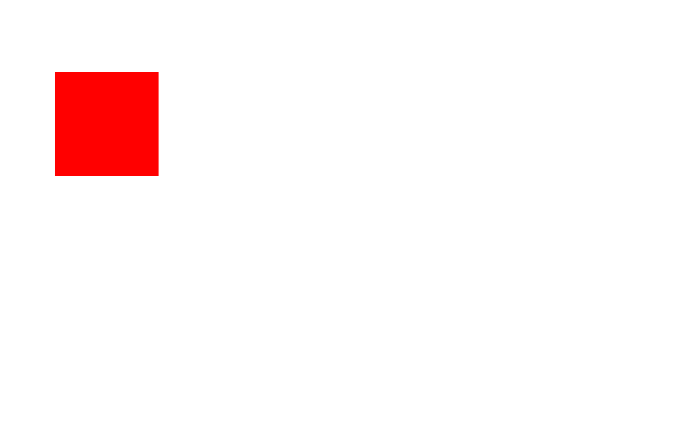
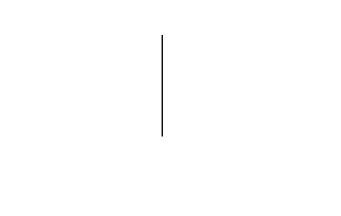

# 08-CSS动画

## 过渡：transition

transition 包括以下属性：

- `transition-property: all;` 如果希望所有的属性都发生过渡，就使用all。
- `transition-duration: 1s;` 过渡的持续时间。
- `transition-timing-function: linear;` 运动曲线。属性值可以是：
  - `linear` 线性
  - `ease` 减速
  - `ease-in` 加速
  - `ease-out` 减速
  - `ease-in-out` 先加速后减速
- `transition-delay: 1s;` 过渡延迟。多长时间后再执行这个过渡动画。

```css
transiton:all 1s linear 1s
```

一个常见的悬停效果



```html
<!DOCTYPE html>
<html lang="en">

<head>
  <meta charset="UTF-8">
  <title>CSS 过渡</title>
  <style>
    body {
      margin: 0;
      padding: 0;
      background-color: #eeeeee;
    }

    .content {
      width: 800px;
      height: 320px;
      padding-left: 20px;
      margin: 80px auto;
    }

    .item {
      width: 230px;
      height: 300px;
      text-align: center;
      margin-right: 20px;
      background-color: #FFF;
      position: relative;
      top: 0;
      overflow: hidden;
      /* 让溢出的内容隐藏起来。意思是让下方的橙色方形先躲起来 */
      transition: all .5s;
      /* 从最初到鼠标悬停时的过渡 */
    }

    .item img {
      margin-top: 20px;
    }

    .item .desc {
      position: absolute;
      left: 0;
      bottom: -70px;
      width: 100%;
      height: 70px;
      background-color: #ff6700;
      transition: all .5s;
    }

    /* 鼠标悬停时，让 item 整体往上移动5px，且加一点阴影 */
    .item:hover {
      top: -5px;
      box-shadow: 0 0 15px #AAA;
    }

    /* 鼠标悬停时，让下方的橙色方形现身 */
    .item:hover .desc {
      bottom: 0;
    }
  </style>
</head>

<body>
  <div class="content">
    <div class="item">
      
      <span class="desc"></span>
    </div>
  </div>
</body>

</html>
```

## 2D 转换

转换可以实现各种**位移、旋转、变形**的效果

CSS 中，通过 `transform` 实现 2D 或者 3D 转换。

### 缩放:  scale

```css
transform: scale(x, y); x：水平缩放倍数；y：垂直缩放倍数

transform: scale(2) 等比例放大2倍

transform: scale(2, 0.5);
```

**变形不会影响周围元素的位置：**



```html
<!DOCTYPE html>
<html lang="en">

<head>
  <meta charset="UTF-8">
  <title>CSS 过渡</title>
  <style>
    div {
      margin: 100px 20px;
      float: left;
      width: 200px;
      height: 100px;
      text-align: center;
      line-height: 100px;
      font-size: 25px;
      color: #fff;
    }

    div:nth-child(1) {
      margin-left: 100px;
      background-color: orange;
      transition: all .5s;
    }

    div:nth-child(2) {
      background-color: pink;
      transition: all .5s;
    }

    div:nth-child(3) {
      background-color: #666;
      transition: all .5s;
    }

    div:nth-child(1):hover {
      transform: scale(2, 1);
    }

    div:nth-child(2):hover {
      transform: scale(1, 2);
    }

    div:nth-child(3):hover {
      transform: scale(2);
    }
  </style>
</head>

<body>
  <div class="box1">scale(2, 1)</div>
  <div class="box2">scale(1, 2)</div>
  <div class="box3">scale(2)</div>
</body>

</html>
```

### 位移: translate

```css
transform: translate(水平位移, 垂直位移);
transform: translate(-50%); 仅水平位移
transform: translate(-50%, -50%);
```

在刚才的例子基础上做修改：



```css
div:nth-child(1):hover {
	transform: scale(2, 1) translate(50%);
}

div:nth-child(2):hover {
	transform: scale(1, 2) translate(0, 50%);
}

div:nth-child(3):hover {
	transform: scale(2) translate(-50%, 50%);
}
```

#### ⭐利用 translate 实现居中对齐

```css
div {
    width: 600px;
    height: 60px;
    position: absolute;       绝对定位的盒子
    left: 50%;               首先，让左边线居中
    top: 0;
    transform: translate(-50%);    然后，利用translate，往左走自己宽度的一半【推荐写法】
}
```

### 旋转: rotate

```css
transform: rotate(角度);

transform: rotate(45deg);
```

看个小火箭：



```html
<!DOCTYPE html>
<html>
<head lang="en">
    <meta charset="UTF-8">
    <title></title>
    <style>
        html,body{
            height:100%;
        }

        body{
            background-color: #DE8910;
        }
        .rocket{
            position: absolute;
            left:100px;
            top:600px;
            height: 120px;
            transform:translate(0 ,200px) rotate(45deg);
            transition:all 1s ease-in;
        }

        body:hover .rocket{
            transform:translate(500px,-500px) rotate(180deg);
        }
    </style>
</head>
<body>
    
</body>
</html>
```

## 3D 转换

### 旋转: rotateX、rotateY、rotateZ、rotate3d

分别代表围绕 X,Y,Z 轴做旋转。

```css
transform: rotateX(360deg);    //绕 X 轴旋转360度

transform: rotateY(360deg);    //绕 Y 轴旋转360度

transform: rotateZ(360deg);    //绕 Z 轴旋转360度
```

### 移动: translateX、translateY、translateZ

```css
transform: translateX(100px);    //沿着 X 轴移动

transform: translateY(360px);    //沿着 Y 轴移动

transform: translateZ(360px);    //沿着 Z 轴移动	
```

### 其他3d拓展

```css
transform: rotate3d(x,y,z,a) //x,y,z 旋转轴坐标方向的矢量(0-1之间)，a 旋转角度。正的角度值表示顺时针旋转，负值表示逆时针旋转。
transform: translate3d(tx, ty, tz) // tx,ty,tz 都是具体长度，代表移动矢量的坐标
transform: scale3d(sx, sy, sz) //sx,sy,sz 都是数字，代表缩放矢量的坐标
```

### 透视: perspective

**`perspective`** 指定了观察者与 z=0 平面的距离，使具有三维位置变换的元素产生透视效果。 z>0 的三维元素比正常大，而 z<0 时则比正常小，大小程度由该属性的值决定。

```html
<!DOCTYPE html>
<html>

<head lang="en">
  <meta charset="UTF-8">
  <title></title>
  <style>
   /* Shorthand classes for different perspective values */
.pers250 {
  perspective: 250px;
}

.pers350 {
  perspective: 350px;
}

.pers500 {
  perspective: 500px;
}

.pers650 {
  perspective: 650px;
}

/* Define the container div, the cube div, and a generic face */
.container {
  width: 200px;
  height: 200px;
  margin: 75px 0 0 75px;
  border: none;
}

.cube {
  width: 100%;
  height: 100%;
  backface-visibility: visible;
  perspective-origin: 150% 150%;
  transform-style: preserve-3d;
}

.face {
  display: block;
  position: absolute;
  width: 100px;
  height: 100px;
  border: none;
  line-height: 100px;
  font-family: sans-serif;
  font-size: 60px;
  color: white;
  text-align: center;
}

/* Define each face based on direction */
.front {
  background: rgba(0, 0, 0, 0.3);
  transform: translateZ(50px);
}

.back {
  background: rgba(0, 255, 0, 1);
  color: black;
  transform: rotateY(180deg) translateZ(50px);
}

.right {
  background: rgba(196, 0, 0, 0.7);
  transform: rotateY(90deg) translateZ(50px);
}

.left {
  background: rgba(0, 0, 196, 0.7);
  transform: rotateY(-90deg) translateZ(50px);
}

.top {
  background: rgba(196, 196, 0, 0.7);
  transform: rotateX(90deg) translateZ(50px);
}

.bottom {
  background: rgba(196, 0, 196, 0.7);
  transform: rotateX(-90deg) translateZ(50px);
}

/* Make the table a little nicer */
th, p, td {
  background-color: #EEEEEE;
  padding: 10px;
  font-family: sans-serif;
  text-align: left;
}
  </style>
</head>

<body>
  <table>
    <tbody>
      <tr>
        <th><code>perspective: 250px;</code>
        </th>
        <th><code>perspective: 350px;</code>
        </th>
      </tr>
      <tr>
        <td>
          <div class="container">
            <div class="cube pers250">
              <div class="face front">1</div>
              <div class="face back">2</div>
              <div class="face right">3</div>
              <div class="face left">4</div>
              <div class="face top">5</div>
              <div class="face bottom">6</div>
            </div>
          </div>
        </td>
        <td>
          <div class="container">
            <div class="cube pers350">
              <div class="face front">1</div>
              <div class="face back">2</div>
              <div class="face right">3</div>
              <div class="face left">4</div>
              <div class="face top">5</div>
              <div class="face bottom">6</div>
            </div>
          </div>
        </td>
      </tr>
      <tr>
        <th><code>perspective: 500px;</code>
        </th>
        <th><code>perspective: 650px;</code>
        </th>
      </tr>
      <tr>
        <td>
          <div class="container">
            <div class="cube pers500">
              <div class="face front">1</div>
              <div class="face back">2</div>
              <div class="face right">3</div>
              <div class="face left">4</div>
              <div class="face top">5</div>
              <div class="face bottom">6</div>
            </div>
          </div>
        </td>
        <td>
          <div class="container">
            <div class="cube pers650">
              <div class="face front">1</div>
              <div class="face back">2</div>
              <div class="face right">3</div>
              <div class="face left">4</div>
              <div class="face top">5</div>
              <div class="face bottom">6</div>
            </div>
          </div>
        </td>
      </tr>
    </tbody>
  </table>
</body>

</html>
```



## 变形属性

### 变形原点: transform-origin

```
transform-origin: bottom;
transform-origin: left 2px;
transform-origin: 2px 30% 10px;
```

- 一个值：
  - 必须是长度，百分比，或 `left`, `center`, `right`, `top`, `bottom`关键字中的一个。
- 两个值：
  - 其中一个必须是[长度，百分比，或`left`, `center`, `right`关键字中的一个。
  - 另一个必须是[长度，百分比，或`top`, `center`, `bottom`关键字中的一个。
- 三个值：
  - 前两个值和只有两个值时的用法相同。
  - 第三个值必须是长度。它始终代表Z轴偏移量

```html
<!DOCTYPE html>
<html>

<head lang="en">
  <meta charset="UTF-8">
  <title></title>
  <style>
    body{
      background-color: #eee;
    }
    div {
      width: 100px;
      height: 100px;
    }

    .boxout {
      position: relative;
      margin-left: 50px;
      margin-top: 50px;
      float: left;
      padding-left: 50px;
    }

    .bd {
      position: absolute;
      top: 0;
      left: 0;
      border: 3px dashed orange;
      color: orange;
      font-size: 15px;
      text-align: center;
      line-height: 100px;
    }

    .box1 {
      position: absolute;
      top: 3px;
      left: 3px;
      background-color: #666;
      transform-origin: center;
      transform: rotate(50deg);
    }

    .box2 {
      position: absolute;
      top: 3px;
      left: 3px;
      background-color: #666;
      transform-origin: top left;
      transform: rotate(50deg);
    }

    .box3 {
      position: absolute;
      top: 3px;
      left: 3px;
      background-color: #666;
      transform-origin: 50% 80%;
      transform: rotate(50deg);
    }
  </style>
</head>

<body>
  <div class="boxout">
    <div class="box1"></div>
    <div class="bd">center</div>
  </div>
  <div class="boxout">
    <div class="box2"></div>
    <div class="bd">top left</div>
  </div>
  <div class="boxout">
    <div class="box3"></div>
    <div class="bd">50% 80%;</div>
  </div>

</body>

</html>
```



### 3D or 平面: transform-style

属性 **`transform-style `**设置元素的子元素是位于 3D 空间中还是平面中。如果选择平面，元素的子元素将不会有 3D 的遮挡关系。

```css
transform-style: flat;
transform-style: preserve-3d;
```




```html
<!DOCTYPE html>
<html>

<head lang="en">
  <meta charset="UTF-8">
  <title></title>
  <style>
    .parent {
      margin: 100px 100px;
      background-color: orange;
      border-radius: 5px;
      width: 400px;
      height: 100px;
      transform: perspective(800px) rotateY(40deg);
      transform-style: preserve-3d;
    }

    .child {
      background-color: #e66465;
      border-radius: 5px;
      width: 200px;
      height: 100px;
      transition: all 1s;
      /* transform: rotate3d(1, 0, 1, 1deg); */
    }
    .child:hover {
      background-color: #e66465;
      border-radius: 5px;
      width: 200px;
      height: 100px;
      transform: rotate3d(1, 1, 1, 45deg);
    }
  </style>
</head>

<body>
  <div class="parent">parent
    <div class="child">child</div>
  </div>
</body>

</html>
```


#### 立方体

```html
<!DOCTYPE html>
<html>
<head lang="en">
    <meta charset="UTF-8">
    <title></title>
    <style>
        .box {
            width: 250px;
            height: 250px;
            border: 1px dashed red;
            margin: 100px auto;
            position: relative;
            border-radius: 50%;

            /* 让子盒子保持3d效果*/

            transform-style: preserve-3d;

            /*transform:rotateX(30deg) rotateY(-30deg);*/

            animation: gun 8s linear infinite;
        }

        .box > div {
            width: 100%;
            height: 100%;
            position: absolute;
            text-align: center;
            line-height: 250px;
            font-size: 60px;
            color: #daa520;
        }

        .left {
            background-color: rgba(255, 0, 0, 0.3);
            /* 变换中心*/
            transform-origin: left;
            /* 变换*/
            transform: rotateY(90deg) translateX(-125px);
        }

        .right {
            background: rgba(0, 0, 255, 0.3);
            transform-origin: right;
            /* 变换*/
            transform: rotateY(90deg) translateX(125px);
        }

        .forward {
            background: rgba(255, 255, 0, 0.3);
            transform: translateZ(125px);
        }

        .back {
            background: rgba(0, 255, 255, 0.3);
            transform: translateZ(-125px);
        }

        .up {
            background: rgba(255, 0, 255, 0.3);
            transform: rotateX(90deg) translateZ(125px);
        }

        .down {
            background: rgba(99, 66, 33, 0.3);
            transform: rotateX(-90deg) translateZ(125px);
        }

        @keyframes gun {
            0% {
                transform: rotateX(0deg) rotateY(0deg);
            }

            100% {
                transform: rotateX(360deg) rotateY(360deg);
            }
        }
    </style>
</head>
<body>
<div class="box">
    <div class="up">上</div>
    <div class="down">下</div>
    <div class="left">左</div>
    <div class="right">右</div>
    <div class="forward">前</div>
    <div class="back">后</div>
</div>
</body>
</html>
```

## 动画

动画是可通过设置**多个节点** 来精确控制一个或一组动画，常用来实现**复杂**的动画效果。

### 使用

1. 定义 `@keyframes` 动画
2. 将这段动画通过百分比，分割成多个节点；然后各节点中分别定义各属性
3. 在指定元素里，通过 `animation` 属性调用动画

```
 定义动画：
 @keyframes 动画名{
     from{ 初始状态 }
     to{ 结束状态 }
 }
 @keyframes 动画名{
     0%{}
     100%{}
 }

调用：
animation: 动画名称 持续时间 运动曲线 延迟执行  执行次数  是否反向 infinite 表示无限次
animation: move2 4s ease-in-out 1s 3 alternate;
animation: move2 4s;
```

看个例子：


```HTML
<!DOCTYPE html>
<html>
<head lang="en">
    <meta charset="UTF-8">
    <title></title>
    <style>
        .box {
            width: 100px;
            height: 100px;
            margin: 100px;
            background-color: red;

            /* 调用动画*/
            /* animation: 动画名称 持续时间 运动曲线 延迟执行  执行次数  是否反向 infinite 表示无限次*/
            animation: move2 4s ease-in-out 1s infinite alternate;
        }

        /* 方式一：定义一组动画*/
        @keyframes move1 {
            from {
                transform: translateX(0px) rotate(0deg);
            }
            to {
                transform: translateX(500px) rotate(260deg);
            }
        }

        /* 方式二：定义多组动画*/
        @keyframes move2 {
            0% {
                transform: translateX(0px) translateY(0px);
                background-color: red;
                border-radius: 0;
            }

            25% {
                transform: translateX(500px) translateY(0px);

            }

            /*动画执行到 50% 的时候，背景色变成绿色，形状变成圆形*/
            50% {
                /* 虽然两个方向都有translate，但其实只是Y轴上移动了200px。
                因为X轴的500px是相对最开始的原点来说的。可以理解成此时的 translateX 是保存了之前的位移 */
                transform: translateX(500px) translateY(200px);
                background-color: green;
                border-radius: 50%;
            }

            75% {
                transform: translateX(0px) translateY(200px);
            }

            /*动画执行到 100% 的时候，背景色还原为红色，形状还原为正方形*/
            100% {
                /*坐标归零，表示回到原点。*/
                transform: translateX(0px) translateY(0px);
                background-color: red;
                border-radius: 0;
            }
        }
    </style>
</head>
<body>
<div class="box">

</div>
</body>
</html>
```

### 分解

```
animation: name duration timing-function delay iteration-count direction;
```

| 值                                                           | 描述                                     |
| :----------------------------------------------------------- | :--------------------------------------- |
| *[animation-name](https://www.w3school.com.cn/cssref/pr_animation-name.asp)* | 规定需要绑定到选择器的 keyframe 名称。。 |
| *[animation-duration](https://www.w3school.com.cn/cssref/pr_animation-duration.asp)* | 规定完成动画所花费的时间，以秒或毫秒计。 |
| *[animation-timing-function](https://www.w3school.com.cn/cssref/pr_animation-timing-function.asp)* | 规定动画的速度曲线。                     |
| *[animation-delay](https://www.w3school.com.cn/cssref/pr_animation-delay.asp)* | 规定在动画开始之前的延迟。               |
| *[animation-iteration-count](https://www.w3school.com.cn/cssref/pr_animation-iteration-count.asp)* | 规定动画应该播放的次数。                 |
| *[animation-direction](https://www.w3school.com.cn/cssref/pr_animation-direction.asp)* | 规定是否应该轮流反向播放动画。           |

这里着重注意一下 `animation-timing-function` 可以设置 `step(n)` ，表示动画不会连续执行，而是每段动画分为 `n` 段执行

比如上面的代码改成：

```css
/* 调用动画*/
/* animation: 动画名称 持续时间 运动曲线 延迟执行  执行次数  是否反向 infinite 表示无限次*/
animation: move2 4s steps(5) 1s infinite alternate;
```

效果就是：



可以用来制作时钟效果，利用分60帧，60s跑完动画的效果

```html
<!DOCTYPE html>
<html>
<head lang="en">
    <meta charset="UTF-8">
    <title></title>
    <style>
        div {
            width: 3px;
            height: 200px;
            background-color: #000;
            margin: 100px auto;
            transform-origin: center bottom;    /* 旋转的中心点是底部 */
            animation: myClock 60s steps(60) infinite;
        }

        @keyframes myClock {
            0% {
                transform: rotate(0deg);
            }

            100% {
                transform: rotate(360deg);
            }
        }
    </style>
</head>
<body>
<div></div>
</body>
</html>
```

