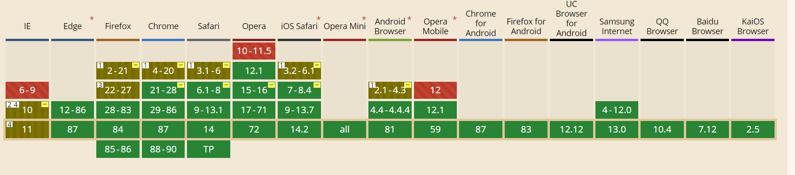
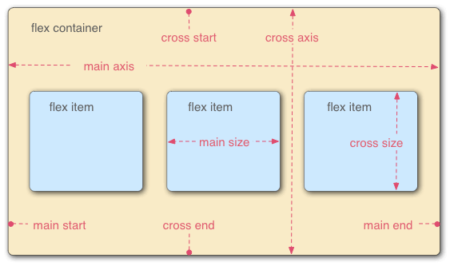
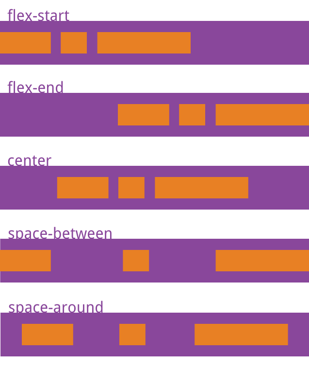
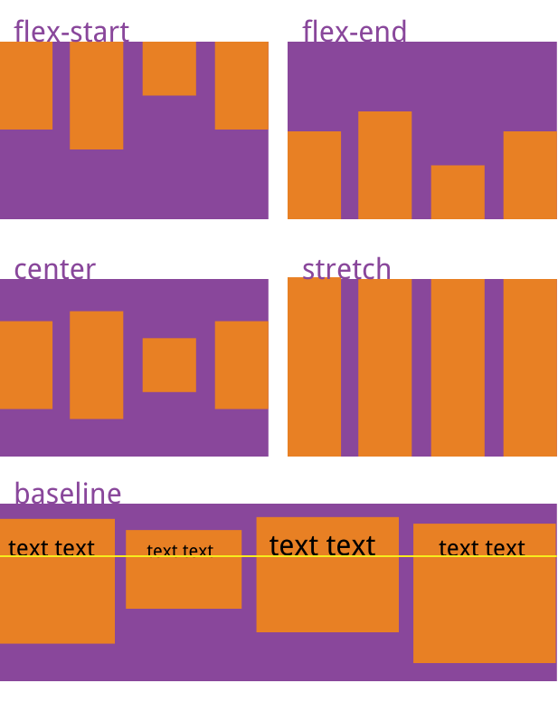

# 09-Flex弹性布局

## 概念

Flex 是 Flexible Box 的缩写，意为"弹性布局"，用来为盒状模型提供最大的灵活性

任何一个容器都可以指定为 Flex 布局（包括**行内元素**）

```css
.box{
  display: flex;
}
```



根据 [caniuse](https://caniuse.com/) 显示，大部分浏览器的兼容已经是没问题了，使用时建议补充前缀，如

```css
.box{
  display: -webkit-flex; /* Safari */
  display: flex;
}
```

采用 Flex 布局的元素，称为 Flex 容器（flex container），简称"容器"。**它的所有子元素自动成为容器成员**，称为 Flex 项目（flex item），简称"项目"。



**容器** 默认存在两根轴：水平的主轴（main axis）和垂直的交叉轴（cross axis）。主轴的开始位置（与边框的交叉点）叫做`main start`，结束位置叫做`main end`；交叉轴的开始位置叫做`cross start`，结束位置叫做`cross end`。

**项目** 默认沿主轴排列。单个项目占据的主轴空间叫做`main size`，占据的交叉轴空间叫做`cross size`。

## 1.【容器】属性

- [flex-direction](#11-flex-direction主轴方向) 
- [flex-wrap](#12-flex-wrap换行) 
- [flex-flow](#13-flex-flow轴向&换行简写) 
- [justify-content](#14-justify-content主轴对齐) 
- [align-items](#15-align-items交叉轴上对齐) 
- [align-content](#16-align-content多行对齐方式) 

### 1.1 flex-direction:主轴方向

```css
.box {
  flex-direction: row | row-reverse | column | column-reverse;
}
```

- `row`（默认值）：主轴为水平方向，起点在左端。
- `row-reverse`：主轴为水平方向，起点在右端。
- `column`：主轴为垂直方向，起点在上沿。
- `column-reverse`：主轴为垂直方向，起点在下沿。

### 1.2 flex-wrap:换行

默认情况下，项目都排在一条线（又称"轴线"）上。`flex-wrap`属性定义，如果一条轴线排不下，如何换行

- `nowrap`（默认）：不换行。

- `wrap`：换行，第一行在上方。

- `wrap-reverse`：换行，第一行在下方。

### 1.3 flex-flow:轴向&换行简写

```css
.box{
	flex-flow: row nowrap
}
```

### 1.4 justify-content:主轴对齐

`justify-content` 定义了项目在主轴上的对齐方式

```css
.box{
	justify-flow: flex-start | flex-end | center | space-between | space-around;
}
```

- `flex-start`（默认值）：左对齐
- `flex-end`：右对齐
- `center`： 居中
- `space-between`：两端对齐，项目之间的间隔都相等。
- `space-around`：每个项目两侧的间隔相等。所以，项目之间的间隔比项目与边框的间隔大一倍。



### 1.5 align-items:交叉轴上对齐

```css
.box{
	align-items: flex-start | flex-end | center | baseline | stretch;
}
```

- `flex-start`：交叉轴的起点对齐。
- `flex-end`：交叉轴的终点对齐。
- `center`：交叉轴的中点对齐。
- `baseline`: 项目的第一行文字的基线对齐。
- `stretch`（默认值）：如果项目未设置高度或设为auto，将占满整个容器的高度。



### 1.6 align-content:多行对齐方式

```css
.box{
    align-content: flex-start | flex-end | center | space-between | space-around | stretch
}
```

- `flex-start`：与交叉轴的起点对齐。
- `flex-end`：与交叉轴的终点对齐。
- `center`：与交叉轴的中点对齐。
- `space-between`：与交叉轴两端对齐，轴线之间的间隔平均分布。
- `space-around`：每根轴线两侧的间隔都相等。所以，轴线之间的间隔比轴线与边框的间隔大一倍。
- `stretch`（默认值）：轴线占满整个交叉轴。


## 2. 【项目】属性

### 2.1 order:排列顺序

`order` 属性定义项目的排列顺序。数值越小，排列越靠前，默认为0。

```css
.item {
  order: 1;
}
```

### 2.2 flex-grow:放大比例

`flex-grow` 定义项目的方法比例，默认是 `0` ，即使剩余空间，也不放大

```css
.item{
	flex-grow: 0;
}
```

如果所有项目的 `flex-grow` 属性都为1，则它们将等分剩余空间（如果有的话）。如果一个项目的 `flex-grow` 属性为2，其他项目都为1，则前者占据的剩余空间将比其他项多一倍。

### 2.3 flex-shrink:缩小比例

`flex-shrink` 定义项目缩小比例，默认为1，即空间不足项目将会缩小。

```css
.item{
    flex-shrink: 1
}
```

如果有一个项目的 `flex-shrink` 是0，那么空间不足时，他 **不会** 缩小。

### 2.4 flex-basis:占据空间

`flex-basis` 定义了在分配多余空间前，项目占据的主轴空间（main size）。浏览器根据这个属性，计算主轴是否有多余空间。它的默认值为`auto`，即项目的本来大小。

```css
.item{
    flex-basis: auto;
}
```

### 2.5 flex:综合缩写

`flex` 属性是 `flex-grow` , `flex-shrink`  和  `flex-basis` 的简写，默认值为 `0 1 auto` 。**后两个属性可选**。

```css
.item{
    flex: auto; 等于 1 1 auto
    flex: none; 等于 0 0 auto
}
```

### 2.6 align-self:单独的align-items属性

`align-self`属性允许单个项目有与其他项目不一样的对齐方式，可覆盖`align-items`属性。默认值为`auto`，表示继承父元素的`align-items`属性，如果没有父元素，则等同于`stretch`。

```css
.item {
  align-self: auto | flex-start | flex-end | center | baseline | stretch;
}
```

 ## 3. 相关资料

1. [Flex 布局教程 - 阮一峰](http://www.ruanyifeng.com/blog/2015/07/flex-grammar.html)
2. [Flex 青蛙游戏](https://flexboxfroggy.com/#zh-cn)