# 10-Grid网格布局

## 前言

网格布局（Grid）将网页划分成一个个网格，可以任意组合不同的网格，做出各种各样的布局。以前，只能通过复杂的 CSS 框架达到的效果，现在浏览器内置了。

但是他的兼容性相比 Flex 布局略显逊色。

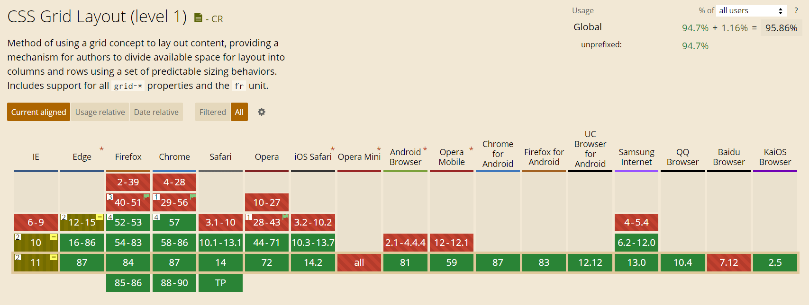

Flex 布局是轴线布局，只能指定"项目"针对轴线的位置，可以看作是**一维布局**。Grid 布局则是将容器划分成"行"和"列"，产生单元格，然后指定"项目所在"的单元格，可以看作是**二维布局**。Grid 布局远比 Flex 布局强大。

## 基本概念

### 1. 容器与项目

采用 Grid 布局的区域，称为 **容器**，内部采用网格定位的元素称为 **项目**。

```html
<div>
  <div><p>1</p></div>
  <div><p>2</p></div>
  <div><p>3</p></div>
</div>
```

上面代码中，最外层的 `<div>` 元素就是容器，内层的三个 `<div>` 元素就是项目。

**注意！**项目只能是容器内的顶层元素，不能是项目的子元素，这**很重要！**

### 2. 行列与单元格

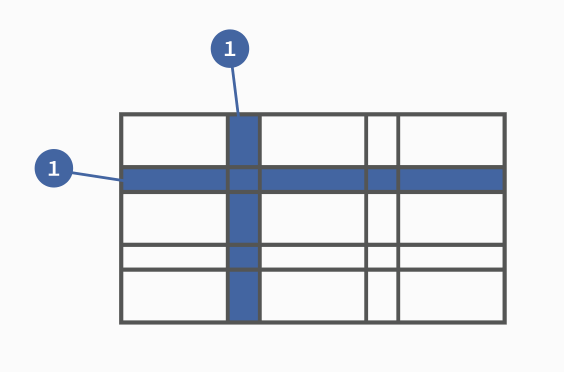

每个 Grid 内部都有**行列**的概念，如图所示。

行列交叉出的就是单元格。

### 3. 网格线

正常情况下，`n`行有`n + 1`根水平网格线，`m`列有`m + 1`根垂直网格线，比如三行就有四根水平网格线。

## 容器属性

### 1. display

我们使用 `grid` 来规定一个网格布局的容器

```css
.box {
    display: grid;
}
```

默认情况下，整个容器是 **块级元素**，可以通过 `inline-grid` 设置为行内元素

```css
.box {
    display: inline-grid;
}
```

> **注意！** Grid 容器内所有的项目的 `float`、`display: inline-block`、`display: table-cell`、`vertical-align` 和 `column-*` 等设置都将失效。

### 2. grid-template-columns/grid-template-rows 列宽/行高

```css
#container {
    display: grid;
    grid-template-columns: 50px 50px 50px ;
    grid-template-rows: 50px 50px 50px;
}
```

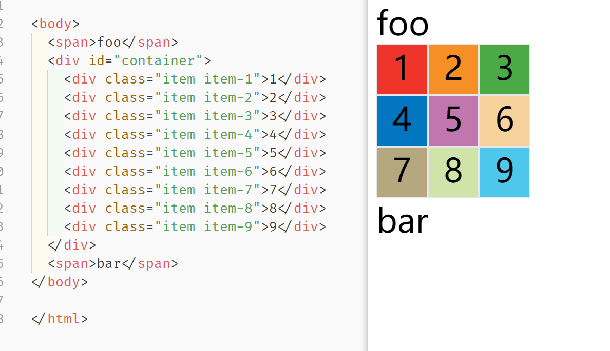

百分比也可以：

```css
.container {
  display: grid;
  grid-template-columns: 33.33% 33.33% 33.33%;
  grid-template-rows: 33.33% 33.33% 33.33%;
}
```


#### 2.1 repeat

如果很多行列的情况下这样写很麻烦，于是可以使用 `repeat` 

有两种模式：

1. 重复单个值
2. 重复多个值

```css
#container {
    display: grid;
    grid-template-columns:repeat(3,100px 50px);
    grid-template-rows: repeat(2,50px)
}
```

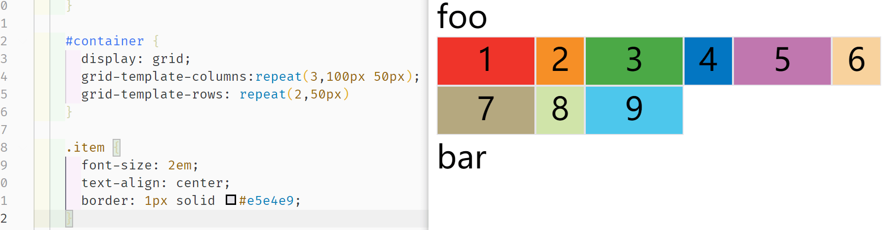

当然这样写也可以：

```css
grid-template-columns:repeat(2,100px) repeat(2,50px);
```

代表：1、2列宽 100px，3、4列是 50px

#### 2.2 auto-fill 关键字 自动填充

有时，单元格的大小是固定的，但是容器的大小不确定。如果希望每一行（或每一列）容纳尽可能多的单元格，这时可以使用 `auto-fill ` 关键字表示自动填充

```css
#container {
    display: grid;
    /* 100px 宽度填充到填不下再换行 */
    grid-template-columns:repeat(auto-fill,100px);
    grid-template-rows: repeat(2,50px)
}
```

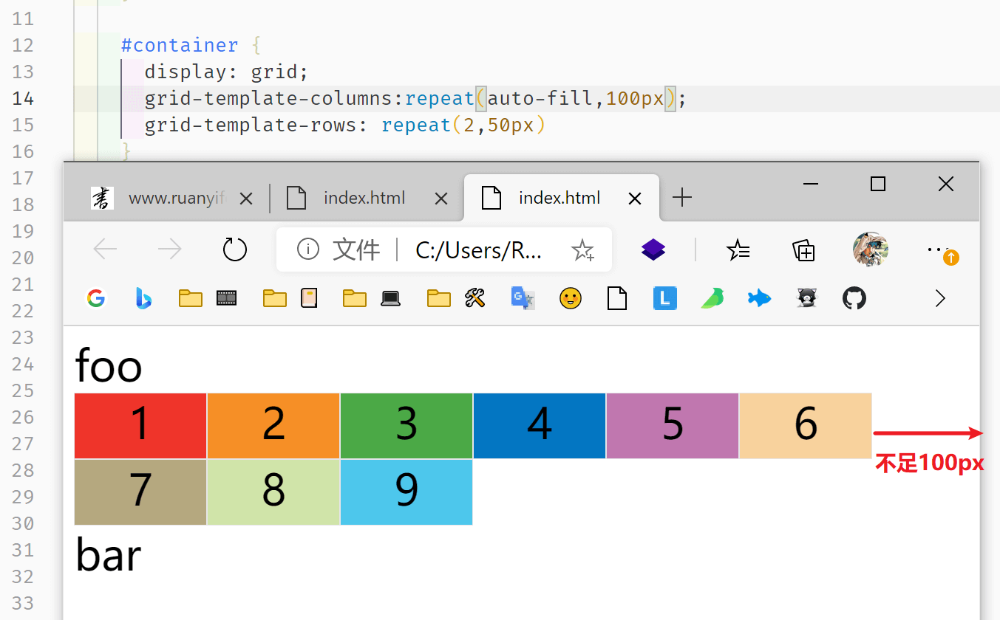

#### 2.3 fr 关键字 相对宽高

`fr` 可以表示相对宽高，`2fr` 就代表是 `1fr` 的两倍，可以结合绝对长度一起使用：

```css
#container {
    display: grid;
    grid-template-columns:300px 1fr 2fr;
    grid-template-rows: repeat(2,50px)
}
```

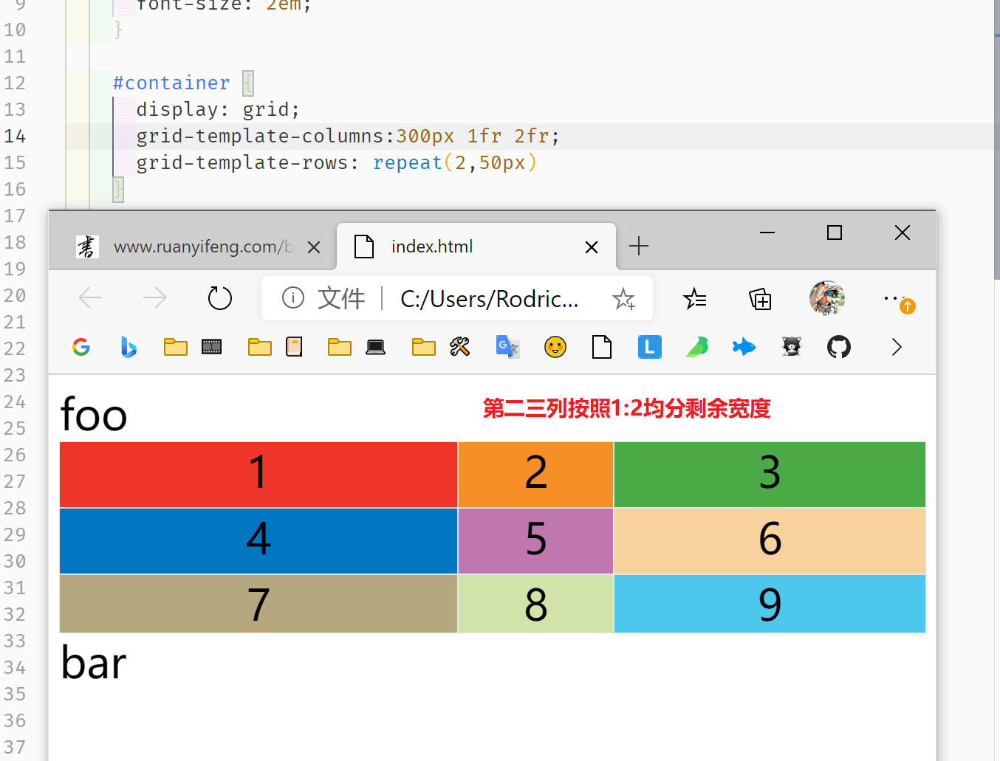

图上第一列宽度固定，2、3 列按照比例 `1:2` 分宽度。

#### 2.4 minmax() 函数 长度范围

`minmax()` 产生一个长度范围，接受两个值作为最小值和最大值。

```css
grid-template-columns:repeat(2,100px) minmax(500px,1fr);
```

#### 2.5 auto 关键字

`auto` 关键字表示由浏览器自己决定长度。

```css
/* 2、3列会被均分 */
grid-template-columns:100px auto auto;
```

#### 2.6 [name] 网格线命名

可以使用 `[name]` 来给网格线命名，方便后续引用：

```css
#container {
    display: grid;
    grid-template-columns:[c1]100px[c2]auto[c3]auto;
    grid-template-rows: [r1]50px[r2]50px[r3]50px
}
```

### 3. row-gap/column-gap/gap 间隔

`row-gap`属性设置行与行的间隔（行间距），`column-gap`属性设置列与列的间隔（列间距）。

`gap` 是二者的缩写，等于 `gap: <row-gap> <column-gap>;`：

```css
#container {
    display: grid;
    grid-template-columns: repeat(3, 50px);
    grid-template-rows: repeat(3, 50px);
    column-gap: 10px;
    row-gap: 20px;
    /* gap: 20px 10px; 下图写错了*/
}
```

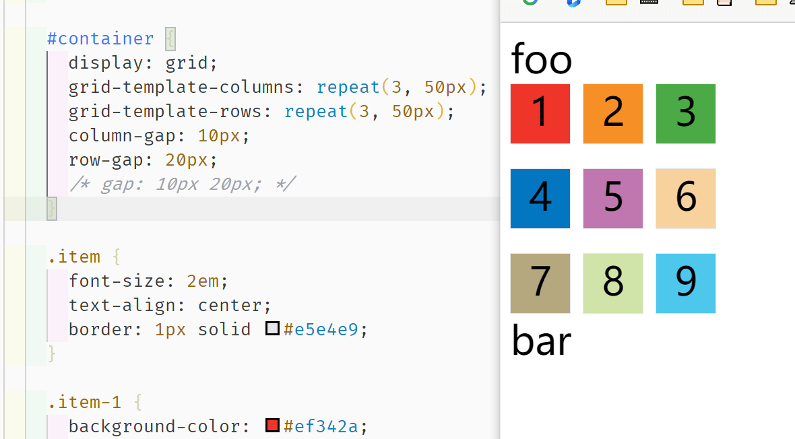

如果是 `gap: 10px;` 代表行列宽都是 10px。

### 4. grid-template-areas 区域

网格布局允许指定"区域"（area），一个区域由单个或多个单元格组成。`grid-template-areas`属性用于定义区域。

```css
.container {
  display: grid;
  grid-template-columns: 100px 100px 100px;
  grid-template-rows: 100px 100px 100px;
  grid-template-areas: "header header header"
                       "main main sidebar"
                       "footer footer footer";
}
```

对于不需要利用到的区域，用 `.` 表示，表示没有用到该单元格，或者该单元格不属于任何区域

```css
grid-template-areas:"a . b"
										"c . d"
										"e . f";
```

**区域的命名会影响网格线**，每个区域的起始网格线，会自动命名为 `区域名-start` ，终止网格线自动命名为 `区域名-end` 。

比如上面 `header` 区域，起始的水平&垂直网格线就叫 `header-start` ，结束位置的水平&垂直网格线叫 `header-end` 。

### 5. grid-auto-flow 排列顺序

`grid-auto-flow` 可以决定容器内项目的排列顺序，有如下值👇：

- `row`（默认）：先行后列
- `column` ： 先列后行
- `row dense` ：先行后列紧密的
- `column dense` ：先列后行紧密的

```css
#container {
  display: grid;
  grid-template-columns: 50px 50px 50px;
  grid-template-rows: 50px 50px 50px;
  grid-auto-flow: column;
}
```

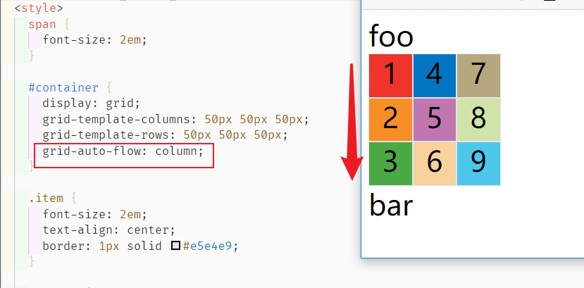

关于紧密的（dense）效果，如果我们进行了如下设置（这里用到的 `grid-column-start/end` 会控制“项目”的宽度，后续会说明），由于 块3 默认是跟在 块2 后面的，所以右上角会空一块出来：

```css
#container {
  display: grid;
  grid-template-columns: 50px 50px 50px;
  grid-template-rows: 50px 50px 50px ;
  grid-auto-flow: row;
}


.item-1 {
  background-color: #ef342a;
  grid-column-start: 1;
  grid-column-end: 3;
}

.item-2 {
  background-color: #f68f26;
  grid-column-start: 1;
  grid-column-end: 3;
}
```

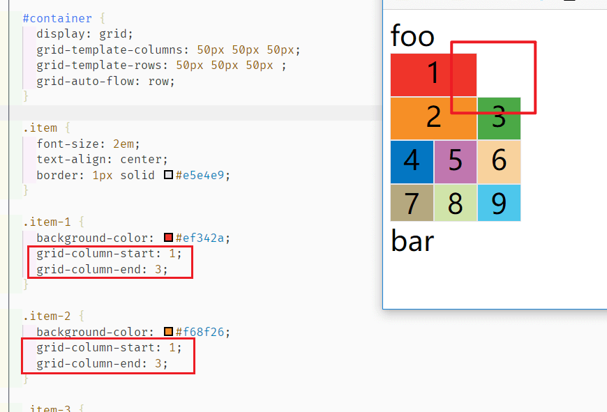

但是当我们设置了 `dense`，我们的 Grid 容器会尽可能紧密填满，尽量不出现空格👇

```css
 #container {
   display: grid;
   grid-template-columns: 50px 50px 50px;
   grid-template-rows: 50px 50px 50px ;
   grid-auto-flow: row dense;
}
```

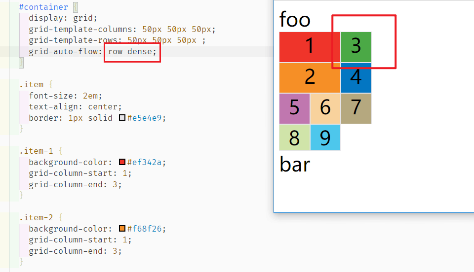

### 6. justify-items/align-items/place-items 单元格内容水平垂直位置

`just-items` 决定单元格内容的水平位置，`align-items` 决定单元格内容的垂直位置。

`place-items` 是合并简写：

```css
.container {
  justify-items: start | end | center | stretch;
  align-items: start | end | center | stretch;
  place-items: <align-items> <justify-items>;
  place-items: center; /* 代表二者都是 center */
}
```

- start：对齐单元格的起始边缘。
- end：对齐单元格的结束边缘。
- center：单元格内部居中。
- stretch（默认值）：拉伸，占满单元格的整个宽度（默认值）。

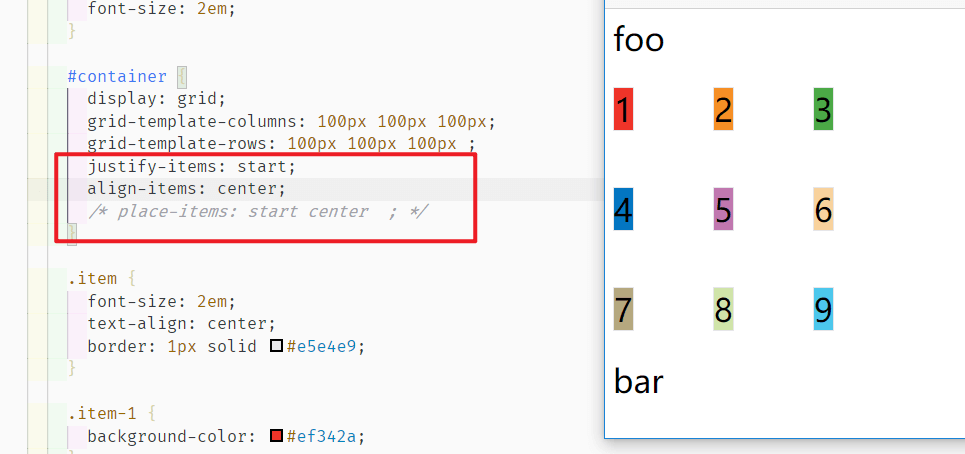

### 7. justify-content/align-content/place-content 整体内容区域水平垂直位置

上面说的 `xx-items` 是单元格内的位置，这里的 `xx-content` 是 **整个内容区域在容器** 中的位置，不明白的话看下面的图就清楚了👇

```css
.container {
  justify-content: start | end | center | stretch | space-around | space-between | space-evenly;
  align-content: start | end | center | stretch | space-around | space-between | space-evenly;  
  place-content: <align-content> <justify-content>;
  place-content: center /* 代表二者一致都是 center */
}
```

- start - 对齐容器的起始边框。

- end - 对齐容器的结束边框。

- center - 容器内部居中。

- stretch - **项目大小没有指定时**，拉伸占据整个网格容器。

- space-around - 每个项目两侧的间隔相等。所以，项目之间的间隔比项目与容器边框的间隔大一倍。

  

- space-between - 项目与项目的间隔相等，项目与容器边框之间没有间隔。

  

- space-evenly - 项目与项目的间隔相等，项目与容器边框之间也是同样长度的间隔。

  

  上面图片来源：[阮一峰老师的博客](http://www.ruanyifeng.com/blog/2019/03/grid-layout-tutorial.html)

  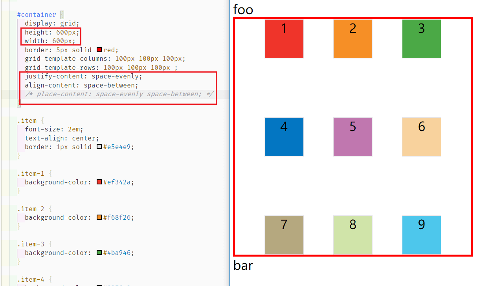

### 8. grow-auto-columns/grow-auto-rows 控制以外网格

假设我们设置：

```css
#container {
  display: grid;
  grid-template-columns: 100px 100px 100px;
  grid-template-rows: 100px 100px 100px ;
}
```

这样只有三行三列，如果我设置了某个格子在第四或者第五行，那么这种超出我们设置范围的单元格可以用 `grow-auto-columns/rows` 来控制：

```css
#container {
  display: grid;
  grid-template-columns: 100px 100px 100px;
  grid-template-rows: 100px 100px 100px;
  grid-auto-rows: 50px;
}
.item-8 {
  background-color: #d0e4a9;
  grid-row-start: 4;
  grid-column-start: 2;
}

.item-9 {
  background-color: #4dc7ec;
  grid-row-start: 5;
  grid-column-start: 3;
}
```

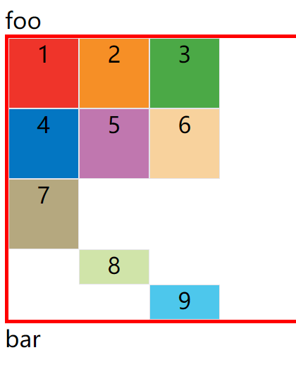

### 9. grid-template/grid 不建议使用的缩写

`grid-template` 属性是 `grid-template-columns` 、 `grid-template-rows` 和 `grid-template-areas` 这三个属性的合并简写形式。

`grid` 属性是 `grid-template-rows` 、`grid-template-columns` 、`grid-template-areas` 、 `grid-auto-rows `、`grid-auto-columns `、`grid-auto-flow` 这六个属性的合并简写形式。

不用强记，可读性也不佳。

## 项目属性

### 1. grid-column-start/end & grid-row-start/end 网格线定位

- `grid-column-start` 属性：左边框所在的垂直网格线
- `grid-column-end` 属性：右边框所在的垂直网格线
- `grid-row-start` 属性：上边框所在的水平网格线
- `grid-row-end` 属性：下边框所在的水平网格线

**使用方法**有三种：

1. **数字**

   ```css
   .item-1 {
   	grid-column-start: 2;
   	grid-column-end: 4;
   }
   ```

   看一个和 `grid-auto-flow` & `grid-auto-rows` 的结合使用效果👇：

   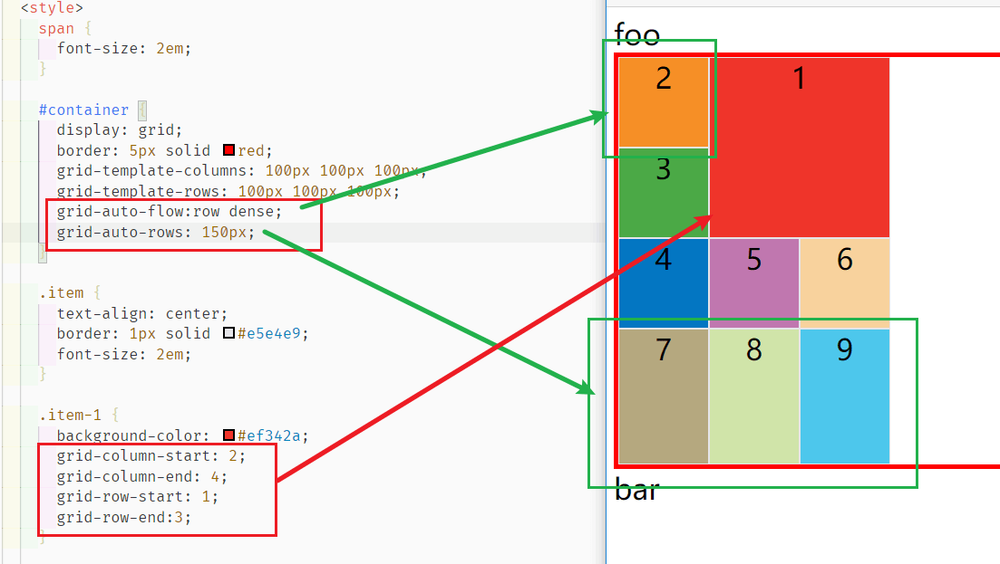

2. **网格线**

   ```css
   .item-1 {
     grid-column-start: header-start;
     grid-column-end: header-end;
   }
   ```

   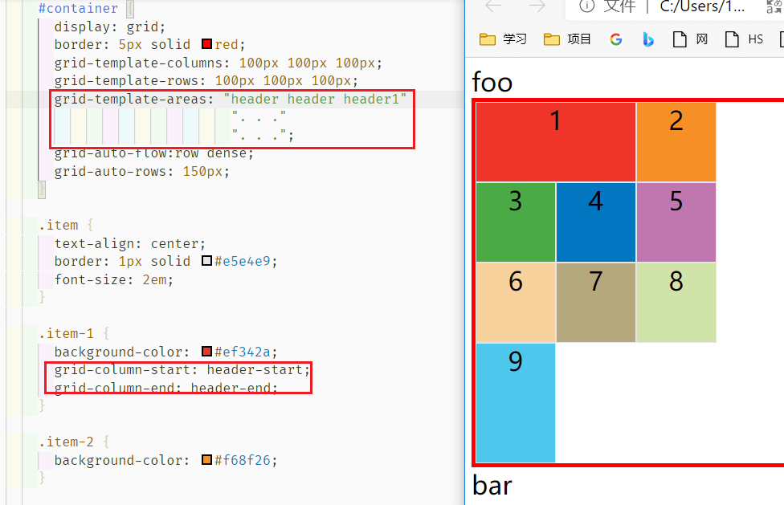

3. **`span` 关键字**

   这四个属性的值还可以使用 `span` 关键字，表示"跨越"，即左右边框（上下边框）之间跨越多少个网格。

   ```css
   .item-1 {
     grid-column-start: span 2;
     grid-row-start: span 2;
   }
   ```

   ​	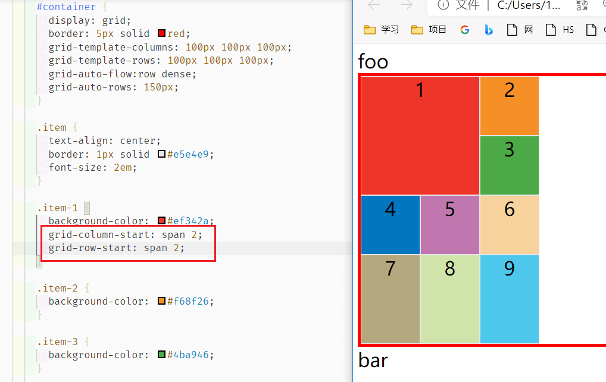

   **注意，** `grid-column-start: span 2;` 和 `grid-column-end: span 2;` 完全是一样的，因为 `span` 只表示跨越 

### 2. grid-column/grid-row 缩写

```css
.item {
  grid-column: <start-line> / <end-line>;
  grid-row: <start-line> / <end-line>;
}
/* 实例 */
.item-1 {
  grid-column: 1 / 3;
  grid-row: 1 / 2;
}
/* 等同于 */
.item-1 {
  grid-column-start: 1;
  grid-column-end: 3;
  grid-row-start: 1;
  grid-row-end: 2;
}
```

也可以结合数字和 `span` 一起使用，可以根据 end 反推或者根据 start 正推👇：

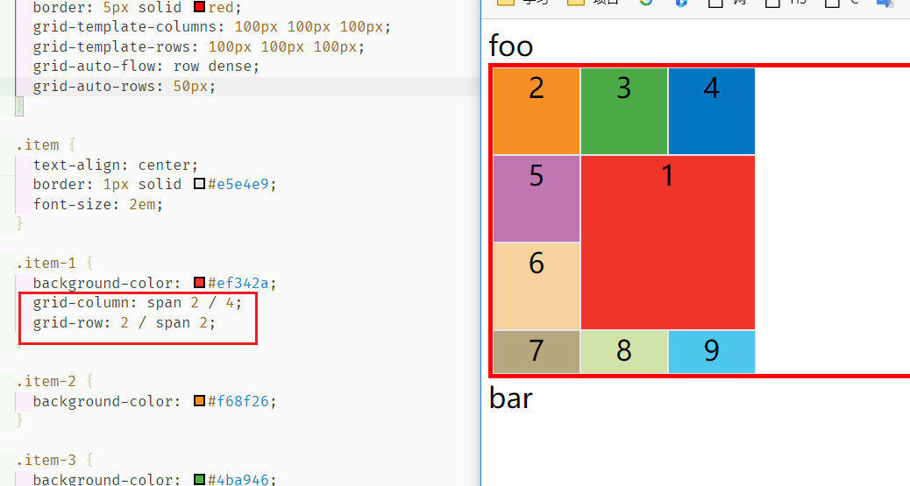

### 3. grid-area 区域定位

`grid-area` 属性指定项目放在哪一个区域。

有两种使用方法

1. 直接按**名字**指定

   ```css
   .item-1 {
     grid-area: e;
   }
   ```

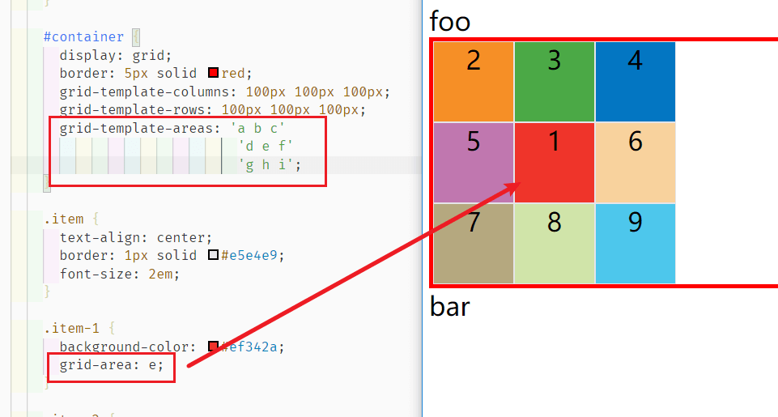

2. `grid-area` 属性还可用作 `grid-row-start`、`grid-column-start`、`grid-row-end`、`grid-column-end` 的合并简写形式，直接指定项目的位置。

   ```css
   .item {
     grid-area: <row-start> / <column-start> / <row-end> / <column-end>;
   }
   ```

   如下写法和上面效果一样👇：

   ```css
    .item-1 {
      grid-area: 2/2/3/3;
   }
   ```

### 4. justify-self/align-self/place-self 针对单个项目的位置调整

这三者的用法和 [`justify-items/align-items/place-item`](#6-justify-itemsalign-itemsplace-items-单元格内容水平垂直位置) 完全一致，区别只是针对单个项目。

```css
.item {
  justify-self: start | end | center | stretch;
  align-self: start | end | center | stretch;
  place-self: <align-self> <justify-self>;
}
```

- start：对齐单元格的起始边缘。
- end：对齐单元格的结束边缘。
- center：单元格内部居中。
- stretch：拉伸，占满单元格的整个宽度（默认值）。