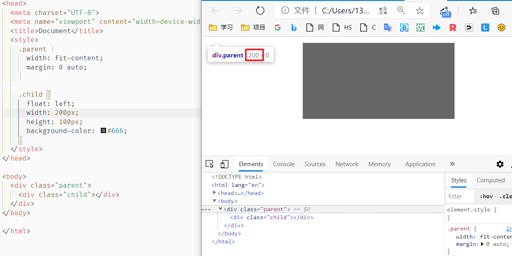

# 居中问题

## 一、水平居中

### 1. 行内元素

```css
.item {
  text-align: center
}
```

### 2. 块级元素

- 子元素

  ```css
  .child {
    margin: 0 auto;
  }
  ```

- float 子元素

  ```css
  .parent {
      width: fit-content;
      margin: 0 auto;
  }
  
  .child {
      float: left;
  }
  ```

  [` width: fit-content;`](https://developer.mozilla.org/en-US/docs/Web/CSS/fit-content) 可以让父元素的宽度正好包裹住子元素的宽度



### 3. Flex Box

```css
.parent {
  display: flex;
  justify-content: center;
}
```

### 4. 绝对定位

- transform

  ```css
  .box {
    width: 100px;
  	position: absolute;
    left: 50%;
    transform: translate(-50%,0);
  }
  ```

  父相子绝 + 左边 50% + 左移自身一半宽度

- left: 50%

  ```css
  .son {
      position: absolute;
      width: 宽度;
      left: 50%;
      margin-left: -0.5*宽度
  }
  ```

- left/right: 0

  ```css
  .son {
      position: absolute;
      width: 宽度;
      left: 0;
      right: 0;
      margin: 0 auto;
  }
  
  ```


## 二、垂直居中

### 1. 行内元素

```css
.parent {
    height: 高度;
}

.son {
    line-height: 高度;
}

```

满足两个条件：① 子元素行高 = 父元素行高  ② 单行文本

### 2. 行内块级+after伪元素

参考张旭鑫大神的[文章](https://www.zhangxinxu.com/wordpress/2010/09/after%E4%BC%AA%E7%B1%BBcontent%E5%86%85%E5%AE%B9%E7%94%9F%E6%88%90%E5%B8%B8%E8%A7%81%E5%BA%94%E7%94%A8%E4%B8%BE%E4%BE%8B/)

```css
.parent {
    width: 300px;
    height: 300px;
    border: 1px solid red;
    text-align: center;
}

.child {
    background: blue;
    width: 100px;
    height: 40px;
    display: inline-block;
    vertical-align: middle;
}

.parent::after {
    content: '';
    height: 100%;
    display: inline-block;
    vertical-align: middle;
}
```

### 3. table

```css
.parent {
  display: table;
}
.son {
  display: table-cell;
  vertical-align: middle;
}
```

### 4. Flex Box

```css
.box {
  display: flex;
  align-items: center;
}
```

### 5. 绝对定位

```css
.son {
    position: absolute;
    top: 50%;
    transform: translate(0, -50%);
}
```

### 6. 父相子绝 + margin: auto

```css
 .box1 {
     height: 100px;
     width: 100px;
     position: relative;
}

.child {
    position: absolute;
    top: 0;
    bottom: 0;
    left: 0;
    right: 0;
    margin: auto;
}
```

这里是水平垂直都居中，好用，推荐！[相关链接](https://www.zhangxinxu.com/wordpress/2013/11/margin-auto-absolute-%E7%BB%9D%E5%AF%B9%E5%AE%9A%E4%BD%8D-%E6%B0%B4%E5%B9%B3%E5%9E%82%E7%9B%B4%E5%B1%85%E4%B8%AD/)

