# 常用布局

## 前言

本文中一些符号代表的意思：

- 👍 **推荐**写法，兼容性好，写法方便易于理解
- 👌 存在一些问题，兼容性不好 or 适用于特定场合 or 写法冗余
- 👎 会存在一些常用要求无法实现或者难以实现的问题，弊大于利

## 一、两列布局

### 1.1 左列定宽，右列自适应

效果：

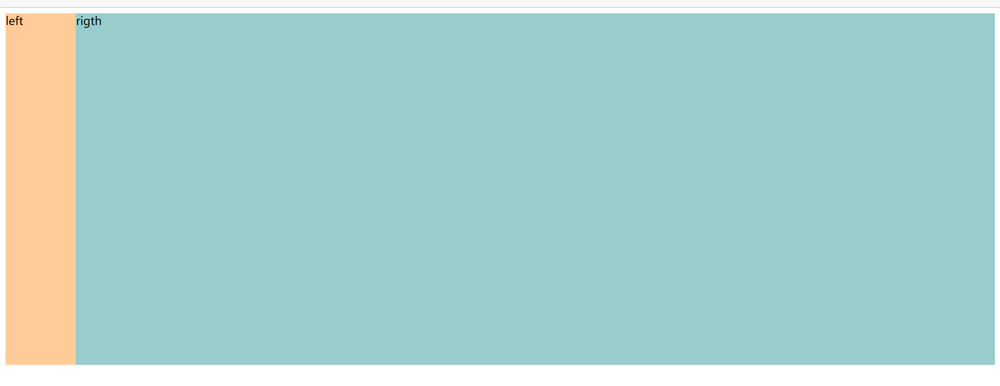

#### ① float+margin👍

.right 的 `margin-left` 等于 .left 的宽，为了不被 .left 挡住

```html
<style>
  .left {
    background-color: #ffcc99;
    width: 100px;
    height: 500px;
    float: left;
  }

  .right {
    background-color: #99cccc;
    height: 500px;
    margin-left: 100px;
  }
</style>
<body>
  <div class="left">left</div>
  <div class="right">rigth</div>
</body>
```

#### ② float+margin(fix)👎

相比于上面的方法多了一些代码，理解麻烦，不推荐。

```html
<style>
  .left {
    background-color: #ffcc99;
    width: 100px;
    height: 500px;
    float: left;
  }

  .right-fix {
    float: right;
    width: 100%;
    margin-left: -100px; /*正值大于或等于left的宽度,才能上移一行*/
  }

  .right {
    background-color: #99cccc; /*为了不遮挡left*/
    margin-left: 100px;
    height: 500px;
  }
</style>
<body>
  <div class="left">left</div>
  <div class="right-fix">
    <div class="right">right</div>
  </div>
</body>
```

#### ③ float+overflow👍

利用了 [BFC 特性](https://www.zhangxinxu.com/wordpress/2015/02/css-deep-understand-flow-bfc-column-two-auto-layout/) 

缺点是 right BFC 以后，设置间隔方式

1. 给 right 设置 `margin-left` 的时候记得大于 left 
2. 直接给 left 设置 `margin-right` 

```html
<style>
  .left {
    background-color: #ffcc99;
    width: 100px;
    height: 500px;
    float: left;
  }


  .right {
    background-color: #99cccc;
    height: 500px;
    overflow: hidden;
  }
</style>

<body>
  <div class="left">left</div>
  <div class="right">right</div>
</body>
```

#### ④ 利用 table👎

margin 会无效，不算优选

```html
<style>
  #parent{
    width: 100%;
    display: table;
    height: 500px;
  }
  #left {
    width: 100px;
    background-color: #f00;
  }
  #right {background-color: #0f0;}
  /*利用单元格自动分配宽度*/
  #left,#right{display: table-cell;}
</style>

<body>
  <div id="parent">
    <div id="left">左列定宽</div>
    <div id="right">右列自适应</div>
</div>
</body>
```

#### ⑤ position👍

易于理解，但是脱离文档流

```html
<style>
  #parent {
    position: relative;

  }

  #left {
    position: absolute;
    left: 0;
    top: 0;
    background-color: #ffcc99;
    width: 100px;
    height: 500px;
  }


  #right {
    position: absolute;
    top: 0;
    left: 100px;
    right: 0;
    background-color: #99cccc;
    height: 500px;
  }
</style>

<body>
  <div id="parent">
    <div id="left">左列定宽</div>
    <div id="right">右列自适应</div>
  </div>
</body>
```

#### ⑥ Flex👌

[兼容性](https://caniuse.com/?search=flex)一般

```html
<style>
  #parent {
    display: flex;
    width: 100%;
  }

  #left {
    background-color: #ffcc99;
    width: 100px;
    height: 500px;
  }


  #right {
    flex:1;
    background-color: #99cccc;
    height: 500px;
  }
</style>

<body>
  <div id="parent">
    <div id="left">左列定宽</div>
    <div id="right">右列自适应</div>
  </div>
</body>
```

#### ⑦ Grid👌

[兼容性](https://caniuse.com/?search=grid)一般

```html
<style>
  #parent {
    display: grid;
    grid-template-columns: 100px auto; /* auto 换成 1fr 也行 */
    grid-template-rows: 500px 500px;
  }

  #left {
    background-color: #ffcc99;
  }

  #right {
    background-color: #99cccc;
  }
</style>

<body>
  <div id="parent">
    <div id="left">左列定宽</div>
    <div id="right">右列自适应</div>
  </div>
</body>
```

### 1.2 左列自适应，右列定宽

效果：

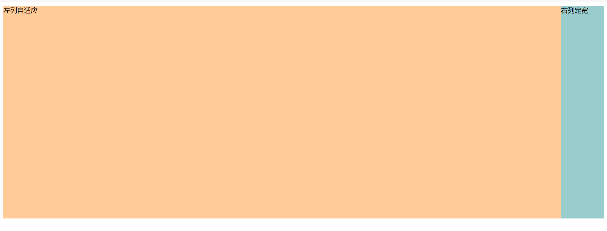

#### ① float+margin👌

略微难理解，margin或padding的值要对应好；浮动脱离文档流，需要手动清除浮动，否则会产生高度塌陷。

注意几个要点：

1. 一个左浮动一个右浮动
2. left 加负值 `margin-left` 空出足够空位达到让 right 上浮目的
3. parent 加正的 `padding-left` 或者 `margin-left` 把 left “挤回来” 

```html
<style>
  #parent {
    padding-left: 100px;
  }

  #left {
    float: left;
    background-color: #ffcc99;
    width: 100%;
    height: 500px;
    margin-left: -100px;
  }

  #right {
    float: right;
    width: 100px;
    height: 500px;
    background-color: #99cccc;
  }
</style>

<body>
  <div id="parent">
   	<div id="left">左列自适应</div>
    <div id="right">右列定宽</div>
  </div>
</body>
```

#### ② float+overflow👍

**将 right 书写在 left 前**，两栏的间距用 right 的 `margin-left` 控制

```html
<style>
  #left {
    background-color: #ffcc99;
    height: 500px;
    overflow: hidden;
  }

  #right {
    float: right;
    width: 100px;
    height: 500px;
    background-color: #99cccc;
    margin-left: 10px; /*两栏的间距用 right 的 `margin-left` 控制*/
  }
</style>

<body>
  <!-- 左右换位 -->
  <div id="right">右列定宽</div>
  <div id="left">左列自适应</div>
</body>
```

#### ③ table👎

margin 会无效，不算优选

```html
<style>
  #parent{
    width: 100%;
    height: 500px;
    display: table;
  }
  #left {
    background-color: #f00;
    display: table-cell;
  }
  #right {
    width: 100px;
    background-color: #0f0;
    display: table-cell;
  }
</style>

<body>
<div id="parent">
    <div id="left">左列自适应</div>
    <div id="right">右列定宽</div>
</div>
</body>
```

#### ④ position👍

脱离文档流

```html
<style>
  #parent {
    position: relative;
  }

  #left {
    position: absolute;
    top: 0;
    left: 0;
    right: 100px;
    background-color: #ffcc99;
    height: 500px;
  }

  #right {
    position: absolute;
    top:0;
    right: 0;
    width: 100px;
    height: 500px;
    background-color: #99cccc;
  }
</style>

<body>
  <div id="parent">
    <div id="left">左列自适应</div>
    <div id="right">右列定宽</div>
  </div>
</body>
```

#### ⑤ Flex👌

兼容性

```html
<style>
  #parent {
    display: flex;
  }

  #left {
    flex: 1;
    background-color: #ffcc99;
    height: 500px;
  }

  #right {
    width: 100px;
    height: 500px;
    background-color: #99cccc;
  }
</style>


<body>
  <div id="parent">
    <div id="left">左列自适应</div>
    <div id="right">右列定宽</div>
  </div>
</body>
```

#### ⑥ Grid👌

兼容性

```html
<style>
  #parent {
    display: grid;
    grid-template-columns: auto 100px; /*auto <=> 1fr 都可以*/
    grid-template-rows: 500px 500px;
  }

  #left {
    background-color: #ffcc99;
  }

  #right {
    background-color: #99cccc;
  }
</style>

<body>
  <div id="parent">
    <div id="left">左列自适应</div>
    <div id="right">右列定宽</div>
  </div>
</body>
```

### 1.3 一列根据内容撑开，一列自适应

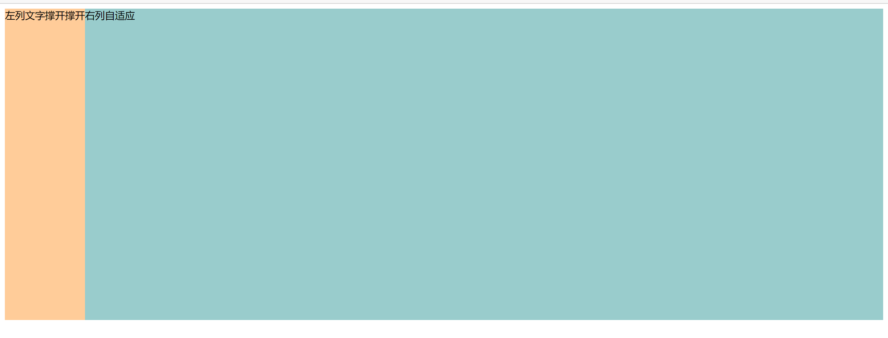

#### ① float+overflow👍

```html
<style>
  #left {
    float: left;
    height: 500px;
    background-color: #ffcc99;
  }

  #right {
    height: 500px;
    overflow: hidden;
    background-color: #99cccc;
  }
</style>

<body>
  <div id="left">左列文字撑开撑开</div>
  <div id="right">右列自适应</div>
</body>
```

#### ② Flex👌

```html
<style>
  #parent {
    display: flex;
  }

  #left {
    height: 500px;
    background-color: #ffcc99;
  }

  #right {
    flex: 1;
    height: 500px;
    background-color: #99cccc;
  }
</style>

<body>
  <div id="parent">
    <div id="left">左列文字撑开撑开</div>
    <div id="right">右列自适应</div>
  </div>
</body>
```

#### ③ Grid👌

```html
<style>
  #parent {
    display: grid;
    grid-template-columns: auto 1fr; /*写成 1fr auto 就是右撑开左自适应*/
    grid-template-rows: 500px 500px;
  }

  #left {
    background-color: #ffcc99;
  }

  #right {
    background-color: #99cccc;
  }
</style>

<body>
  <div id="parent">
    <div id="left">左列文字撑开撑开</div>
    <div id="right">右列自适应</div>
  </div>
</body>
```

### 总结

这种布局常用推荐使用**浮动**去做，配合 `overflow:hidden;` 触发 BFC，非常好用，兼容性也 ok，但是设置栏间隔的时候要注意值的大小和分情况设在 left 还是 right。

**父相子绝**来脱离文档流做也可以，兼容性也不错，代码也没多少。

**移动端**推荐直接上 Flex ，能用就用。

table 不推荐，虽然兼容性好但是其他不感知 `margin` 之类的比较讨厌。

## 二、三列布局

### 2.1 两列定宽,一列自适应

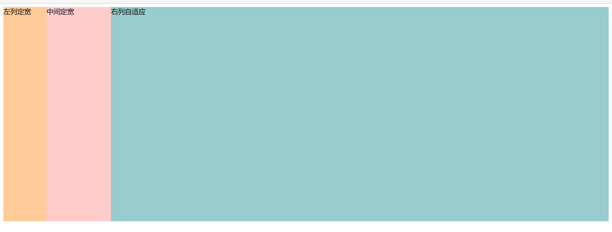

#### ① float+margin👍

```html
<style>
  #left {
    float: left;
    width: 100px;
    height: 500px;
    background-color: #ffcc99;
  }

  #center {
    float: left;
    width: 150px;
    height: 500px;
    background-color: #FFCCCC;
  }

  #right {
    height: 500px;
    margin-left: 250px;
    background-color: #99cccc;
  }
</style>
<body>
  <div id="left">左列定宽</div>
  <div id="center">中间定宽</div>
  <div id="right">右列自适应</div>
</body>
```

#### ② float+overflow👍

```html
<style>
  #left {
    float: left;
    width: 100px;
    height: 500px;
    background-color: #ffcc99;
  }

  #center {
    float: left;
    width: 150px;
    height: 500px;
    background-color: #FFCCCC;
  }

  #right {
    height: 500px;
    overflow: hidden;
    background-color: #99cccc;
  }
</style>

<body>
  <div id="left">左列定宽</div>
  <div id="center">中间定宽</div>
  <div id="right">右列自适应</div>
</body>
```

#### ③ position👌

需要根据 left center 的 `width` 准确计算 `left` 属性

```html
<style>
  #parent {
    position: relative;
  }

  #left {
    position: absolute;
    top: 0;
    left: 0;
    background-color: #ffcc99;
    width: 100px;
    height: 500px;
  }

  #center {
    position: absolute;
    top: 0;
    left: 100px;
    width: 150px;
    height: 500px;
    background-color: #FFCCCC;
  }

  #right {
    position: absolute;
    top: 0;
    left: 250px;
    right: 0;
    background-color: #99cccc;
    height: 500px;
  }
</style>

<body>
  <div id="parent">
    <div id="left">左列定宽</div>
    <div id="center">中间定宽</div>
    <div id="right">右列自适应</div>
  </div>
</body>
```

#### ④ table👎

```html
<style>
  #parent {
    width: 100%; 
    height: 520px; /*抵消上下间距10*2的高度影响*/
    margin: -10px 0;  /*抵消上下边间距10的位置影响*/
    display: table;
    /*左右两边间距无法消除,子元素改用padding设置盒子间距就没有这个问题*/
    border-spacing: 10px;  /*关键!!!设置间距*/
  }
  #left {
    display: table-cell;
    width: 100px;
    background-color: #f00;
  }
  #center {
    display: table-cell;
    width: 200px;
    background-color: #eeff2b;
  }
  #right {
    display: table-cell;
    background-color: #0f0;
  }
</style>

<body>
<div id="parent">
    <div id="left">左列定宽</div>
    <div id="center">中间定宽</div>
    <div id="right">右列自适应</div>
</div>
</body>
```

#### ⑤ Flex👌

```html
<style>
  #parent {
    display: flex;
  }

  #left {
    background-color: #ffcc99;
    width: 100px;
    height: 500px;
  }

  #center {
    width: 150px;
    height: 500px;
    background-color: #FFCCCC;
  }

  #right {
    flex:1;
    background-color: #99cccc;
    height: 500px;
  }
</style>

<body>
  <div id="parent">
    <div id="left">左列定宽</div>
    <div id="center">中间定宽</div>
    <div id="right">右列自适应</div>
  </div>
</body>
```

#### ⑥ Grid👌

不得不感慨一句，Grid 写这种的真的很简单，可惜兼容性……

```html
<style>
  #parent {
    display: grid;
    grid-template-columns: 100px 150px auto; /* auto <==> 1fr */
    grid-template-rows: repeat(3,500px);
  }

  #left {
    background-color: #ffcc99;
  }

  #center {
    background-color: #FFCCCC;
  }

  #right {
    background-color: #99cccc;
  }
</style>

<body>
  <div id="parent">
    <div id="left">左列定宽</div>
    <div id="center">中间定宽</div>
    <div id="right">右列自适应</div>
  </div>
</body>
```

### 2.2 两侧定宽,中间自适应

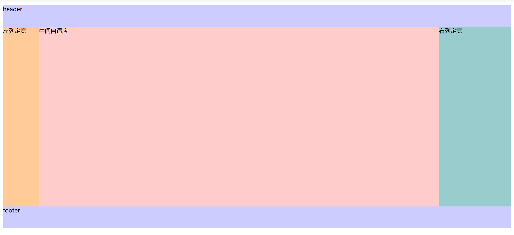

#### ① 双飞翼布局👍[高频考点⭐]

基本原理是 `#center`  是中外框和 parent 一样宽，然后中内框 `#inner_center` 用 `margin` 留空给 `#left` `#right`

html:

```html
<body>
  <div id="header">header</div>
  <div id="parent">
    <div id="center">
      <div id="inner_center">中间自适应</div>
    </div>
    <div id="left">左列定宽</div>
    <div id="right">右列定宽</div>
  </div>
  <div id="footer">footer</div>
</body>
```

css:

```css
#header {
  height: 60px;
  background-color: #CCCCFF;
}

#left {
  float: left;
  width: 100px;
  height: 500px;
  /* margin-left 给整个 #parent 的宽度，这样可以跑到最左边 */
  margin-left: -100%;
  background-color: #ffcc99;
}

#center {
  height: 500px;
  float: left;
  width: 100%;
}

#inner_center {
  height: 500px;
  /* 这里左右空出位置留给 left right 数字大于实际宽度就可以产生间距！*/
  margin: 0 200px 0 100px;
  background-color: #FFCCCC;
}

#right {
  float: left;
  width: 200px;
  height: 500px;
  /* margin-left 给整个 #right 自身的宽度，这样可以跑到最右边边 */
  margin-left: -200px;
  background-color: #99cccc;
}

#footer {
  clear: both;
  height: 60px;
  background-color: #CCCCFF;
}
```

这里需要着重理解一下 left 和 right 的 `margin-left` 的作用，顺便也可以更好地理解 float 布局里 `margin` 的影响，看一下注释掉这两个 `margin-left` 的样子 就明白了：

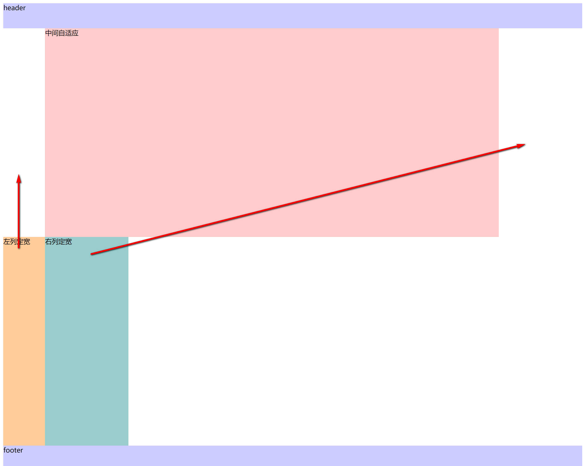

目的就是为了把 left 和 right 挪到 #inner_center 给他们预留的位置而已。

#### ② 圣杯布局👎

基本原理是 `#parent` 直接左右留空，`#center` 直接占满宽度，`#left` 和 `#right` 用相对定位把自己“挤”到目标位置。

html:

```html
<body>
  <div id="header">header</div>
  <div id="parent">
    <div id="center">中间自适应</div>
    <div id="left">左列定宽</div>
    <div id="right">右列定宽</div>
  </div>
  <div id="footer">footer</div>
</body>
```

css:

```css
#header {
  height: 60px;
  background-color: #CCCCFF;
}

#parent {
  height: 500px;
  /*为了使#center摆正,左右padding分别等于左右盒子的宽,可以结合左右盒子相对定位的left调整间距！*/
  padding: 0 200px 0 100px;
}

#left {
  float: left;
  /* 相对定位和left将他向左移动 */
  position: relative;
  left: -100px;
  width: 100px;
  height: 500px;
  /* margin-left 给整个 #parent 的宽度，这样可以跑到最左边 */
  margin-left: -100%;
  background-color: #ffcc99;
}

#center {
  float: left;
  height: 500px;
  width: 100%;
  background-color: #FFCCCC;
}

#right {
  float: left;
  /* 相对定位和left将他向右移动 */
  position: relative;
  left:200px;
  width: 200px;
  height: 500px;
  /* margin-left 给整个 #right 自身的宽度，这样可以跑到最右边边 */
  margin-left: -200px;
  background-color: #99cccc;
}

#footer {
  clear: both;
  height: 60px;
  background-color: #CCCCFF;
}
```

这里放一个注释了 #left 和 #right 的 `left` 属性的图：

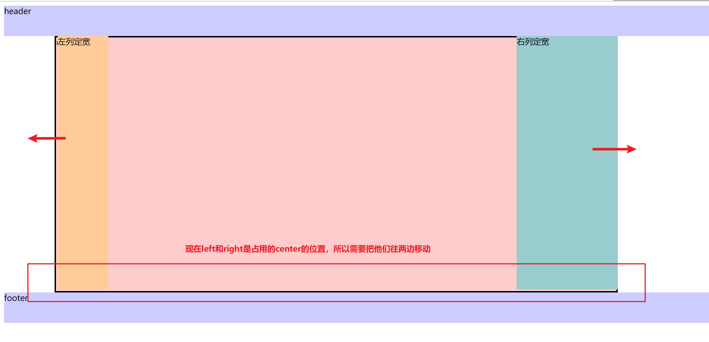

##### 圣杯布局的问题

当 center 小于 left 的时候，圣杯布局将会出现问题：

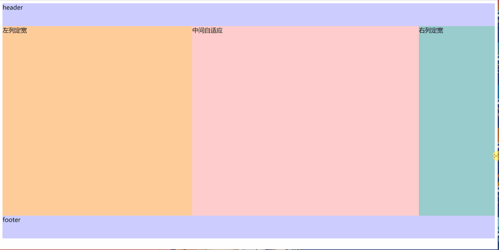

#### ③ Grid👌

html

```html
<body>
  <div id="parent">
    <div id="header"></div>
    <div id="center">中间自适应</div>
    <div id="left">左列定宽</div>
    <div id="right">右列定宽</div>
    <div id="footer"></div>
  </div>
</body>
```

css

```css
#parent {
  display: grid;
  grid-template-columns: 100px auto 200px; /*设定3列*/
  grid-template-rows: 60px 500px 60px; /*设定3行*/
  /*设置网格区域分布*/
  grid-template-areas: 
    "header header header" 
    "leftside main rightside" 
    "footer footer footer";
}
#header {
  grid-area: header; /*指定在哪个网格区域*/
  background-color: #CCCCFF;
}
#left {
  grid-area: leftside;
  background-color: #ffcc99;
}
#center {
  grid-area: main; /*指定在哪个网格区域*/
  margin: 0 15px; /*设置间隔*/
  background-color: #FFCCCC;
}
#right {
  grid-area: rightside; /*指定在哪个网格区域*/
  background-color: #99cccc;
}
#footer {
  grid-area: footer; /*指定在哪个网格区域*/
  background-color: #CCCCFF;
}
```

#### ④ Flex👌

html

```html
<body>
  <div id="all">
    <div id="header">header</div>
    <div id="parent">
      <div id="left">左列定宽</div>
      <div id="center">中间自适应</div>
      <div id="right">右列定宽</div>
    </div>
    <div id="footer">footer</div>
  </div>
</body>
```

css

```css
#all {
  display: flex;
  flex-direction: column;
}

#header {
  height: 60px;
  background-color: #CCCCFF;
}

#footer {
  height: 60px;
  background-color: #CCCCFF;
}

#parent {
  height: 500px;
  display: flex;
}

#left {
  width: 100px;
  background-color: #ffcc99;
}

#center {
  flex: 1;
  /*均分#parent剩余的部分*/
  background-color: #FFCCCC;
}

#right {
  width: 200px;
  background-color: #99cccc;
}
```

## 三、多列布局

### 3.1 多列等宽

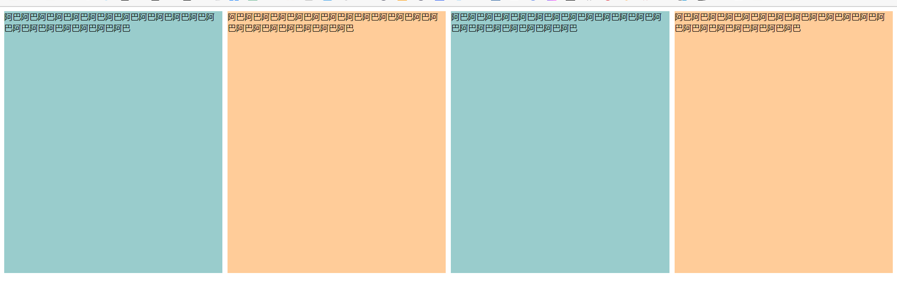

#### ① float👍

```html
<style>
  #parent{
    /* 抵消最左边的盒子的 padding-left */
    margin-left: -10px;
  }
  .column {
    float: left;
    /* 改变盒模型宽度影响 保持设置了 padding 也在一行内 */
    -webkit-box-sizing: border-box;
    -moz-box-sizing: border-box;
    box-sizing: border-box;
    /* background-clip 只是为了方便看效果，因为 padding 也是有背景色的 */
    background-clip: content-box;
    width: 25%;
    height: 500px;
    /* 不能用 margin-left，会把盒子挤下去，必须 padding 配合 border-box 使用 */
    padding-left: 10px;
  }

  .column:nth-child(2n) {
    background-color: #ffcc99;
  }

  .column:nth-child(2n-1) {
    background-color: #99cccc;
  }
</style>

<body>
  <div id="parent">
    <div class="column">阿巴阿巴阿巴阿巴阿巴阿巴阿巴阿巴阿巴阿巴阿巴阿巴阿巴阿巴阿巴阿巴阿巴阿巴阿巴阿巴</div>
    <div class="column">阿巴阿巴阿巴阿巴阿巴阿巴阿巴阿巴阿巴阿巴阿巴阿巴阿巴阿巴阿巴阿巴阿巴阿巴阿巴阿巴</div>
    <div class="column">阿巴阿巴阿巴阿巴阿巴阿巴阿巴阿巴阿巴阿巴阿巴阿巴阿巴阿巴阿巴阿巴阿巴阿巴阿巴阿巴</div>
    <div class="column">阿巴阿巴阿巴阿巴阿巴阿巴阿巴阿巴阿巴阿巴阿巴阿巴阿巴阿巴阿巴阿巴阿巴阿巴阿巴阿巴</div>
  </div>
</body>
```

#### ② table👌

```html
<style>
  #parent {
    height: 540px;  /*抵消上下边20*2间距的高度影响*/
    display: table;
    margin: -20px 0;  /*抵消上下边20*2间距的位置影响*/
    /*两边离页面间距无法消除,改用子元素设置padding来当成间隔就不会有这样的问题*/
    border-spacing: 20px;  /*设置间距*/
  }
  .column{display: table-cell;}
  .column:nth-child(odd){background-color: #f00;}
  .column:nth-child(even){background-color: #0f0;}
</style>

<body>
  <div id="parent">
    <div class="column">阿巴阿巴阿巴阿巴阿巴阿巴阿巴阿巴阿巴阿巴阿巴阿巴阿巴阿巴阿巴阿巴阿巴阿巴阿巴阿巴</div>
    <div class="column">阿巴阿巴阿巴阿巴阿巴阿巴阿巴阿巴阿巴阿巴阿巴阿巴阿巴阿巴阿巴阿巴阿巴阿巴阿巴阿巴</div>
    <div class="column">阿巴阿巴阿巴阿巴阿巴阿巴阿巴阿巴阿巴阿巴阿巴阿巴阿巴阿巴阿巴阿巴阿巴阿巴阿巴阿巴</div>
    <div class="column">阿巴阿巴阿巴阿巴阿巴阿巴阿巴阿巴阿巴阿巴阿巴阿巴阿巴阿巴阿巴阿巴阿巴阿巴阿巴阿巴</div>
  </div>
</body>
```

#### ③ Flex👌

```html
<style>
  #parent {
    display: flex;
    margin-left: -10px;
  }

  .column {
    flex: 1;
    width: 25%;
    height: 500px;
    margin-left: 10px;
  }

  .column:nth-child(2n) {
    background-color: #ffcc99;
  }

  .column:nth-child(2n-1) {
    background-color: #99cccc;
  }

</style>

<body>
  <div id="parent">
    <div class="column">阿巴阿巴阿巴阿巴阿巴阿巴阿巴阿巴阿巴阿巴阿巴阿巴阿巴阿巴阿巴阿巴阿巴阿巴阿巴阿巴</div>
    <div class="column">阿巴阿巴阿巴阿巴阿巴阿巴阿巴阿巴阿巴阿巴阿巴阿巴阿巴阿巴阿巴阿巴阿巴阿巴阿巴阿巴</div>
    <div class="column">阿巴阿巴阿巴阿巴阿巴阿巴阿巴阿巴阿巴阿巴阿巴阿巴阿巴阿巴阿巴阿巴阿巴阿巴阿巴阿巴</div>
    <div class="column">阿巴阿巴阿巴阿巴阿巴阿巴阿巴阿巴阿巴阿巴阿巴阿巴阿巴阿巴阿巴阿巴阿巴阿巴阿巴阿巴</div>
  </div>
</body>
```

#### ④ Grid 👌

再次感慨，Grid 写这种布局是真方便。。。

```html
<style>
  #parent {
    display: grid;
    grid-template-columns: repeat(4, 1fr);
    grid-template-rows: 500px;
    column-gap: 10px;
  }

  .column {}

  .column:nth-child(2n) {
    background-color: #ffcc99;
  }

  .column:nth-child(2n-1) {
    background-color: #99cccc;
  }
</style>

<body>
  <div id="parent">
    <div class="column">阿巴阿巴阿巴阿巴阿巴阿巴阿巴阿巴阿巴阿巴阿巴阿巴阿巴阿巴阿巴阿巴阿巴阿巴阿巴阿巴</div>
    <div class="column">阿巴阿巴阿巴阿巴阿巴阿巴阿巴阿巴阿巴阿巴阿巴阿巴阿巴阿巴阿巴阿巴阿巴阿巴阿巴阿巴</div>
    <div class="column">阿巴阿巴阿巴阿巴阿巴阿巴阿巴阿巴阿巴阿巴阿巴阿巴阿巴阿巴阿巴阿巴阿巴阿巴阿巴阿巴</div>
    <div class="column">阿巴阿巴阿巴阿巴阿巴阿巴阿巴阿巴阿巴阿巴阿巴阿巴阿巴阿巴阿巴阿巴阿巴阿巴阿巴阿巴</div>
  </div>
</body>
```

### 3.2 九宫格

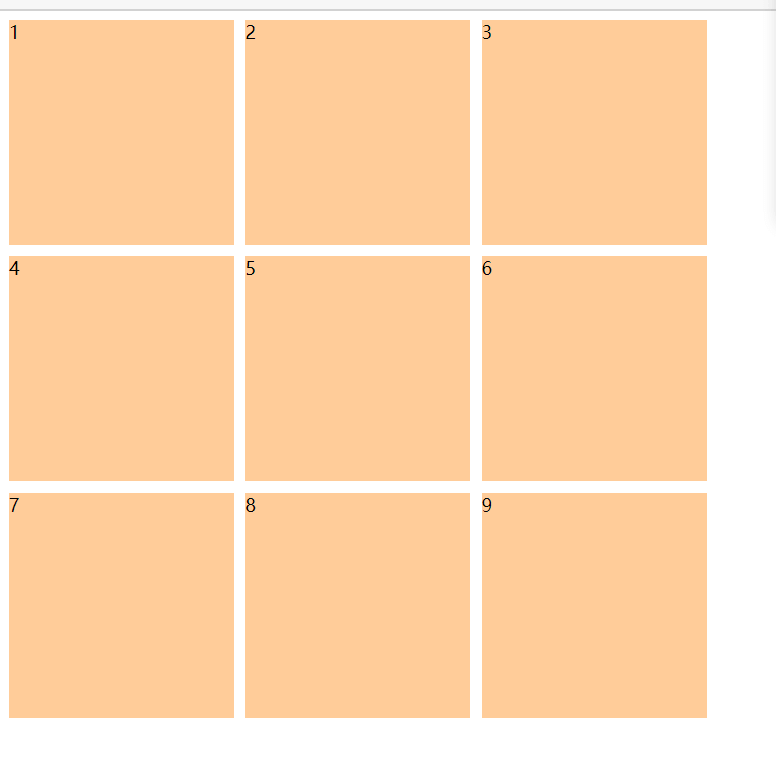

#### ① table👍

```html
<style>
  #parent {
    width: 1200px;
    height: 500px;
    margin: 0 auto;
    display: table;
  }
  .row {display: table-row;}
  .item {
    border: 1px solid #000;
    display: table-cell;
  }
</style>
<body>
<div id="parent">
    <div class="row">
        <div class="item">1</div>
        <div class="item">2</div>
        <div class="item">3</div>
    </div>
    <div class="row">
        <div class="item">4</div>
        <div class="item">5</div>
        <div class="item">6</div>
    </div>
    <div class="row">
        <div class="item">7</div>
        <div class="item">8</div>
        <div class="item">9</div>
    </div>
</div>
</body>
```

#### ② Flex👌

```html
<style>
  #parent {
    display: flex;
    flex-direction: column;
  }

  .row {
    display: flex;
    flex: 1;
  }

  .item {
    flex: none;
    height: 200px;
    width: 200px;
    background-color: #ffcc99;
    padding-right: 10px;
    padding-bottom: 10px;
    background-clip: content-box;
  }
</style>

<body>
  <div id="parent">
    <div class="row">
      <div class="item">1</div>
      <div class="item">2</div>
      <div class="item">3</div>
    </div>
    <div class="row">
      <div class="item">4</div>
      <div class="item">5</div>
      <div class="item">6</div>
    </div>
    <div class="row">
      <div class="item">7</div>
      <div class="item">8</div>
      <div class="item">9</div>
    </div>
  </div>
</body>
```

#### ③ Flex 换行（wrap）优化👍

这种方式不用三个套一行的方式，比较灵活，数量不限制，满足三个 child 自动换行。

html：

```html
<body>
  <div id="parent">
    <div class="child">
      <span>1</span>
    </div>
    <div class="child">
      <span>1</span>
    </div>
    <div class="child">
      <span>1</span>
    </div>
    <div class="child">
      <span>1</span>
    </div>
    <div class="child">
      <span>1</span>
    </div>
    <div class="child">
      <span>1</span>
    </div>
    <div class="child">
      <span>1</span>
    </div>
    <div class="child">
      <span>1</span>
    </div>
    <div class="child">
      <span>1</span>
    </div>
  </div>
</body>
```

CSS:

```css
#parent {
  width: 80%;
  margin: 0 auto;
  display: flex;
  /* 换行 */
  flex-wrap: wrap;
}

#parent>.child {
  /* 均分宽度 */
  width: calc(100% / 3);
  height: 100px;
  -webkit-box-sizing: border-box;
  -moz-box-sizing: border-box;
  /* 间距控制 */
  padding-right: 10px;
  padding-bottom: 10px;
  box-sizing: border-box;
  background-color: #ffcc99;
  background-clip: content-box;
}
```

#### ④ Grid👍

```html
<style>
  #parent {
    width: 80%;
    margin: 0 auto;
    display: grid;
    grid-template-columns: repeat(3, 1fr);
    grid-template-rows: repeat(3, 100px);
    /* 间距控制 */
    gap: 10px;
    /* 控制超出9x9范围格子的高度 */
    grid-auto-rows: 100px;
  }

  #parent>.child {
    background-color: #ffcc99;
  }
</style>

<body>
  <div id="parent">
    <div class="child">
      <span>1</span>
    </div>
    <div class="child">
      <span>1</span>
    </div>
    <div class="child">
      <span>1</span>
    </div>
    <div class="child">
      <span>1</span>
    </div>
    <div class="child">
      <span>1</span>
    </div>
    <div class="child">
      <span>1</span>
    </div>
    <div class="child">
      <span>1</span>
    </div>
    <div class="child">
      <span>1</span>
    </div>
    <div class="child">
      <span>1</span>
    </div>
    <div class="child">
      <span>1</span>
    </div>
  </div>
</body>
```

## 四、全屏布局

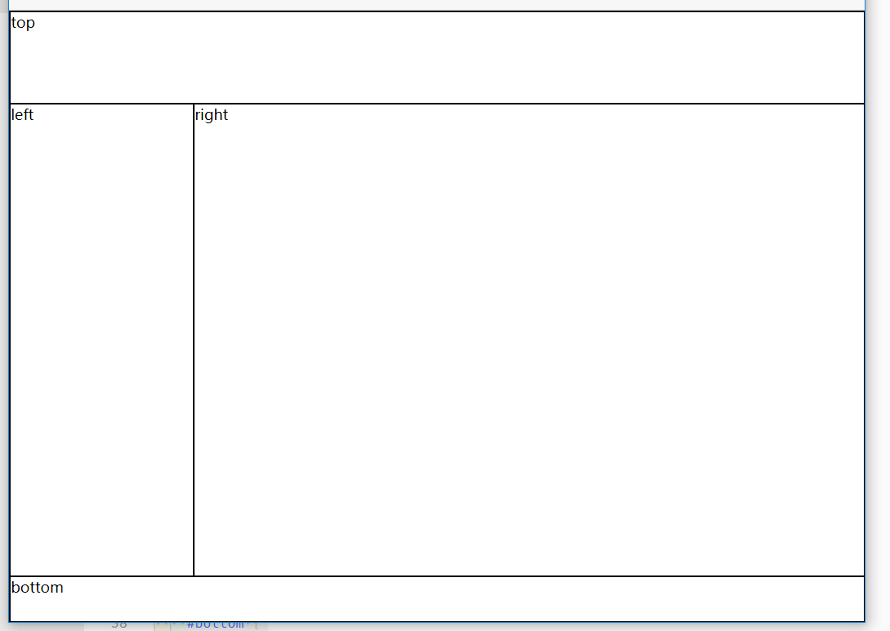

### ① position👍

代码较多，但是兼容 ok

```html
<style>
  html,
  body,
  #parent {
    height: 100%;
    overflow: hidden;
  }

  #parent>div {
    border: 1px solid #000;
  }

  #top {
    position: absolute;
    top: 0;
    left: 0;
    right: 0;
    height: 100px;
  }

  #left {
    position: absolute;
    top: 100px;
    /*值大于等于#top的高度*/
    left: 0;
    bottom: 50px;
    /*值大于等于#bottom的高度*/
    width: 200px;
  }

  #right {
    position: absolute;
    overflow: auto;
    left: 200px;
    /*值大于等于#left的宽度*/
    right: 0;
    top: 100px;
    /*值大于等于#top的高度*/
    bottom: 50px;
    /*值大于等于#bottom的高度*/
  }

  #bottom {
    position: absolute;
    left: 0;
    right: 0;
    bottom: 0;
    height: 50px;
  }

</style>

<body>
  <div id="parent">
    <div id="top">top</div>
    <div id="left">left</div>
    <div id="right">right</div>
    <div id="bottom">bottom</div>
  </div>
</body>
```

### ② Flex👌

```html
<style>
  * {
    margin: 0;
    padding: 0;
  }

  html,
  body,
  #parent {
    height: 100%;
  }
  div{
    border: 1px solid #000;
    box-sizing: border-box;
  }

  #parent {
    display: flex;
    flex-direction: column;
  }

  #top {
    height: 100px;
  }

  #bottom {
    height: 50px;
  }

  #middle {
    flex: 1;
    display: flex;
  }

  #left {
    width: 200px;
  }

  #right {
    flex: 1;
    overflow: auto;
  }
</style>

<body>
  <div id="parent">
    <div id="top">top</div>
    <div id="middle">
      <div id="left">left</div>
      <div id="right">right</div>
    </div>
    <div id="bottom">bottom</div>
  </div>
</body>
```

### ③ Grid👌

```html
<style>
  * {
    margin: 0;
    padding: 0;
  }

  html,
  body,
  #parent {
    height: 100%;
  }

  div {
    border: 1px solid #000;
    box-sizing: border-box;
  }

  #parent {
    display: grid;
    grid-template-columns: 200px 1fr;
    grid-template-rows: 100px 1fr 50px;
    grid-template-areas: "header header"
                          "left right"
                          "footer footer";
  }

  #top {
    grid-area: header;
  }

  #bottom {
    grid-area: footer;
  }

  #left {
    grid-area: left;
  }

  #right {
    grid-area: right;
  }
</style>

<body>
  <div id="parent">
    <div id="top">top</div>
    <div id="left">left</div>
    <div id="right">right</div>
    <div id="bottom">bottom</div>
  </div>
</body>
```


