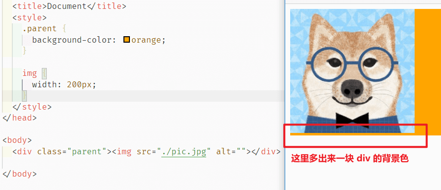
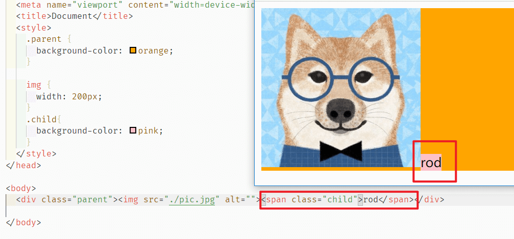
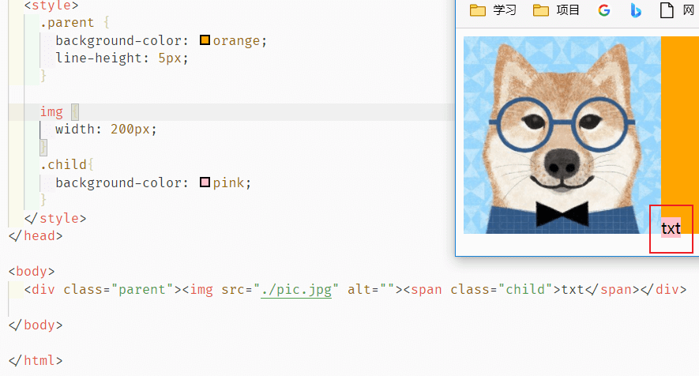

# 幽灵空白节点

## 一、问题现象

首先看一下什么是“幽灵空白节点”：



如图可见，我们的图片下面多出了一块 div 的区域，但是理论上 div 的高度由图片撑开，二者高度相等，那么这个多出来的一块原理是什么？

## 二、前提概念

在解决这个问题之前，需要了解几个概念：

### 2.1 vertical-align

首先，[`vertical-align`](https://developer.mozilla.org/zh-CN/docs/Web/CSS/vertical-align) 这个属性，用来指定行内元素（inline）、行内块级（inline-block）或表格单元格（table-cell）元素的垂直对齐方式。

也就是说，**它对于块级元素（block）是无效的**。

其次，他的默认值是 `baseline` ，也就是**元素的基线**。

### 2.2 内联盒子

**内联盒子** 概念张旭鑫博客里有[详细解释](https://www.zhangxinxu.com/wordpress/2010/01/css-float%e6%b5%ae%e5%8a%a8%e7%9a%84%e6%b7%b1%e5%85%a5%e7%a0%94%e7%a9%b6%e3%80%81%e8%af%a6%e8%a7%a3%e5%8f%8a%e6%8b%93%e5%b1%95%e4%b8%80/)，这里抽出重点概念：


图上的**行级盒子 **line boxes，是由好几个**行内元素** inline boxes 组成的，正常情况下他们是下边缘对齐的，但是为什么是**下边缘**呢？

CSS2的可视化格式模型文档中有一么一段话：

> The baseline of an ‘inline-block’ is the baseline of its last line box in the normal flow, unless it has either no in-flow line boxes or if its ‘overflow’ property has a computed value other than ‘visible’, in which case the baseline is the bottom margin edge.

中文翻译：

> ‘inline-block’的基线是正常流中最后一个line box的基线, 除非，这个line box里面既没有line boxes或者本身’overflow’属性的计算值而不是’visible’, 这种情况下基线是margin底边缘。

结合图片，首先每个内联元素是一定 **都有** `line-height`  和 `vertical-align`  的！这个 **==非常重要！==**  也就是说图内的这群行内元素，是以最后一个 `line box` 也就是“图片”这两字组成的盒子的基线（baseline）为对齐目标，也就是它的**下边缘**。

关于字符的基线为啥是下边缘，参考文章 [字母’x’在CSS世界中的角色和故事](https://www.zhangxinxu.com/wordpress/2015/06/about-letter-x-of-css/)

另外，有一些情况下**内联盒子高度会为0**：

W3C规范中提到：

> Line boxes are created as needed to hold inline-level content within an inline formatting context. Line boxes that contain no text, no preserved white space, no inline elements with non-zero margins, padding, or borders, and no other in-flow content (such as images, inline blocks or inline tables), and do not end with a preserved newline must be treated as zero-height line boxes for the purposes of determining the positions of any elements inside of them, and must be treated as not existing for any other purpose.

重点就是说：

如果一个line box里**没有文字、保留的空格、非0的margin或padding或border的inline元素、或其他in-flow内容（比如图片、inline-block或inline-table元素）**，且不以保留的换行符结束的话，就会被视作**高度为0的line box**。

## 三、如何解决幽灵空白节点

### 3.1 原理分析

根据上面的前提知识，我们来分析一下这个现象产生的原因：

**在HTML5文档声明下**，块级元素内部的行级内联元素会表现出一种行为：可以理解为在块级元素的内部（前后部分）会有看不见的**没有宽度与实体**的空白元素，你可以把他想象为一个**空字符串节点**，**这个假想又似乎存在的空白节点，称之为“幽灵空白节点”。**

那么这个空隙是怎么来的呢？我们把一开始的代码稍作更改：



这里我们用一个 `span` 来模拟这个幽灵空白节点，上面我们说可以把他想象为一个**空字符串节点**，这里我加上了文字 rod 来撑开它并且加上背景色，可以很明显的看见，粉色的 `span` 有一部分在相对图片位置之下！造成这个现象的原因至此也就破案了：

1. 内联的元素本身是有一定高度的（导致上下都多出来一些），这个高度的原因参考[维基百科](https://zh.wikipedia.org/zh/X%E5%AD%97%E9%AB%98)，这里只放一张图说明：

   

2. 在 [内联盒子](#22-内联盒子) 里我们说了，默认情况下，会以所有内联元素的最后一个元素的基线（baseline）为对齐目标，也就是它的下边缘，如图👇

   

   罪魁祸首就是 `vertical-align` 和 `line-height` 这两兄弟导致下面撑开了那么一段。

### 3.2 解决方案

知道了原理，解决就简单了：

#### ① 让 vertical-align 失效

图片是行内元素，而`vertical-align`对块状水平的元素无效，那么我们就把图片设置 `block`

```css
img {
  width: 200px;
  display: block
}
```


#### ② 使用其他 vertical-align 值

针对行内元素默认使用的是 `vertical-align:baseline`，我们只要把他改成任意其他属性就行，比方说`bottom`/`middle`/`top`都是可以的

```css
img {
  vertical-align: middle;
}
```

#### ③ 直接修改 line-height 值

通过修改块级元素的行高，让实际文字（也就是我们的幽灵节点）计算出的高度不足这个高度就可以。比方说，我们设置行高5像素

```css
.parent {
  line-height: 5px;
}
```




#### ④ line-height为相对单位，font-size间接控制

如果 `line-height` 是相对单位，例如 `line-height:1.6` 或者 `line-height:160%` 之类，也可以使用`font-size`间接控制，`font-size` 本质上还是改变 `line-height` 值

```css
.parent {
  /* 设置为适合(足够小)的大小就可以，不一定是0 */
  font-size: 0;
}
```

## 四、其他

参考文章：[CSS深入理解vertical-align和line-height的基友关系](https://www.zhangxinxu.com/wordpress/2015/08/css-deep-understand-vertical-align-and-line-height/)

利用 `vertical-align` 特性结合 `::after` 实现垂直居中对齐：[链接](专题总结-居中问题.md#2-行内块级after伪元素)

