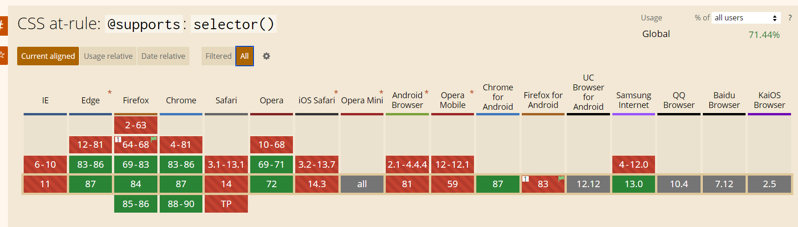
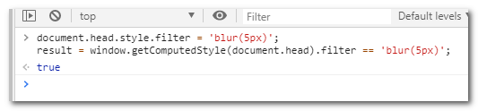
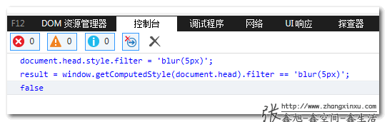
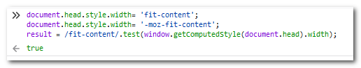
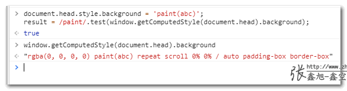

# 检测浏览器对CSS属性的支持

## 前言

经常会出现使用某些 CSS 属性的时候需要判断浏览器的支持情况的场景，这里介绍几种常见的方式

## @supports

[`@supports`](https://developer.mozilla.org/zh-CN/docs/Web/CSS/@supports) 是 CSS 语法，可以指定依赖于浏览器中的一个或多个特定的CSS功能的支持声明。这被称为*特性查询*。

- **声明语法**

  `@supports` at-rule 由一组样式声明和一条*支持条件*构成。支持条件由一条或多条使用 逻辑与（`and`）、逻辑或（`or`）、逻辑非（`not`）结合的名称-值对（name-value pair）组成。可以使用圆括号调整操作符的优先级。

```css
@supports (display: grid) {
  div {
    display: grid;
  }
}
```

```css
@supports not (display: grid) {
  div {
    float: right;
  }
}
```

```css
@supports (display: table-cell) and (display: list-item) {}
@supports (transform-style: preserve) or (-moz-transform-style: preserve) {}
```

注意下面这种**用括号控制优先层级的形式**：

```css
@supports (transform-style: preserve-3d) or ((-moz-transform-style: preserve-3d) or
          ((-o-transform-style: preserve-3d) or (-webkit-transform-style: preserve-3d))) {}
```

- **函数语法**

  `selector()`

  测试浏览器是否支持经过测试的选择器语法。如果浏览器支持[子组合器](https://developer.mozilla.org/en-US/docs/Web/CSS/Child_combinator)，则以下示例返回true：

  ```
  @supports selector(A > B) {}
  ```

- **兼容性**

  

  

## Js 中 CSS.supports 函数

[`CSS.supports()`](https://developer.mozilla.org/zh-CN/docs/Web/API/CSS/supports) 静态方法返回一个 Boolean 值，用来校验浏览器是否支持一个给定的CSS特性。

- **语法**

  ```js
  boolValue = CSS.supports(propertyName, value);
  boolValue = CSS.supports(supportCondition);
  ```

有两种不同的传值形式。第一种用来检验浏览器对于一对“属性-属性值”的支持：

- **propertyName**

  字符串。用来检测的CSS属性名。

- **value**

  字符串。用来检测的CSS属性值。

- **supportCondition**

  字符串。用来检测的CSS声明、表达式或者语法。

- **使用**

  ```js
  CSS.supports('display', 'grid');
  CSS.supports('display:grid');
  ```

- **兼容性**

  和 `@support` 一样

## JS 再实现

上面的方法有个问题，`supports` 这个玩意，本身在 Edge81 以下就不支持，那他就没法检测其他属性了。

这里再实现一个更加通用的方式，来源自 [JS检测CSS属性浏览器是否支持的多种方法 - 张旭鑫的博客](https://www.zhangxinxu.com/wordpress/2019/11/js-css-supports-detect/)：

### 原理

当浏览器不支持某个CSS属性的时候，就算你强制设置，获取的计算值也不会是你设置的属性值。

### 写法

```js
document.head.style.filter = 'blur(5px)';
result = window.getComputedStyle(document.head).filter == 'blur(5px)';
```

我们看下上面代码在实际浏览器中的表现，首先是支持的Chrome浏览器，`result`的值是`true`：



然后是不支持的IE11浏览器，`result`的值是`false`：



此方法原理很简单，兼容性也非常好，实现的关键点就是使用[getComputedStyle这个IE9+支持的DOM API方法](https://www.zhangxinxu.com/wordpress/2012/05/getcomputedstyle-js-getpropertyvalue-currentstyle/)，不能使用`dom.style.xxxx`直接获取。

如果是想要实现类似or或者and逻辑，例如带私有前缀那种，可以下面这样处理，正则匹配关键的部分：

```js
document.head.style.width= 'fit-content';
document.head.style.width= '-moz-fit-content';
result = /fit-content/.test(window.getComputedStyle(document.head).width);
```

例如Firefox浏览器下的结果：



### 兼容性

IE9+

### 注意点

`getComputedStyle()`方法返回的是**计算值**，很多时候和设置的属性值并不同。

例如设置行高为小数，在IE浏览器下返回就是px计算值。

又或者设置`background`属性值，结果返回的是background兄弟姐妹一大家子值：

```js
document.head.style.background = 'paint(abc)';
result = /paint/.test(window.getComputedStyle(document.head).background);
// result值是true
window.getComputedStyle(document.head).background
// "rgba(0, 0, 0, 0) paint(abc) repeat scroll 0% 0% / auto padding-box border-box"
```



需要使用模糊匹配才行。