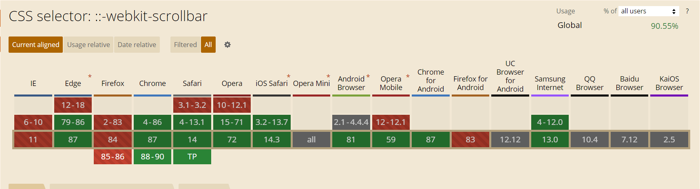
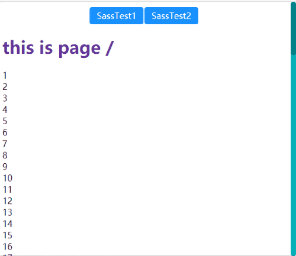

# 滚动条美化

## 兼容性

滚动条美化效果主要是使用 `::-webkit-scrollbar` 来进行修饰，看到这个前缀就知道，这个兼容性基本娱乐为主……



亲测火狐确实不行，只有 webkit 内核浏览器支持

## 属性

根据 [MDN](https://developer.mozilla.org/zh-CN/docs/Web/CSS/::-webkit-scrollbar) 描述，主要有以下属性：

- `::-webkit-scrollbar` — 整个滚动条.
- `::-webkit-scrollbar-button` — 滚动条上的按钮 (上下箭头).
- `::-webkit-scrollbar-thumb` — 滚动条上的滚动滑块.
- `::-webkit-scrollbar-track` — 滚动条轨道.
- `::-webkit-scrollbar-track-piece` — 滚动条没有滑块的轨道部分.
- `::-webkit-scrollbar-corner` — 当同时有垂直滚动条和水平滚动条时交汇的部分.
- `::-webkit-resizer` — 某些元素的corner部分的部分样式(例:textarea的可拖动按钮).

请注意：

**该特性是非标准的，请尽量不要在生产环境中使用它！**仅仅在支持 [WebKit](https://webkit.org/) 的浏览器 (例如, 谷歌Chrome, 苹果Safari)可以使用.

## 案例：

不多废话上代码：

```css
::-webkit-scrollbar {
  width: 10px;
  height: 1px;
}
::-webkit-scrollbar-track {
  background: #06b0b9;
  border-radius: 10px;
}
::-webkit-scrollbar-thumb {
  background: #028188;
  border-radius: 10px;
}
::-webkit-scrollbar-thumb:hover {
  background: #81dadf;
}
::-webkit-scrollbar-corner {
  background: #f6f6f6;
}
```

效果：

