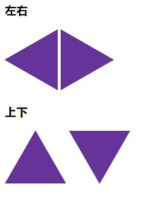

# 画个三角形

## 效果



## 实现

-  HTML

  ```html
  <body>
    <h3>左右</h3>
    <div class="tri left"></div>
    <div class="tri right"></div>
    <h3>上下</h3>
    <div class="tri top"></div>
    <div class="tri bottom"></div>
  </body>
  ```

  

- CSS

  ```CSS
  .tri {
  	border-style: solid;
  	width: 0;
    height: 0;
    display: inline-block;
  }
  .left {
  	border-width: 50px 86.6px 50px 0;
  	border-color: transparent rebeccapurple transparent transparent;
  }
  .right {
  	border-width: 50px 0 50px 86.6px;
  	border-color: transparent transparent transparent rebeccapurple;
  }
  .top{
    border-width:  0 50px 86.6px 50px;
  	border-color:  transparent transparent rebeccapurple transparent;
  }
  .bottom{
    border-width:  86.6px 50px 0 50px;
  	border-color: rebeccapurple transparent transparent transparent;
  }
  ```

## 原理

通过控制一个宽高为 0 的 div 的边框来产生效果。修改 `border-width` 来产生不同变化。